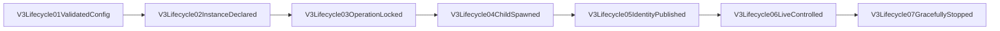

# V3 Managed Server Lifecycle

This review surface owns process control only. The RouteCodex V3 Runtime remains the sole request and
response business lifecycle.

## Truth and cache

- `instance.json` is the authoritative declaration: deterministic config identity, executable, and
  complete aggregate listener set.
- The instance ID is stable config identity. The executable path is exact launch provenance and may
  advance to a new release snapshot only after matching `stopped|failed` truth proves the previous
  release is terminal; active, missing-terminal, or otherwise different declarations remain
  non-transferable.
- `pid.cache` is transient and useful only together with the exact instance ID and start nonce.
- `control.json` points to an owner-only Unix socket and carries no secret.
- `status.json` is an observation of starting/running/stopping/stopped/failed, not authority to take
  over a port or process.

## Commands

The user-facing lifecycle commands are the old-style top-level shape:
`rccv3 start|status|restart|stop -c|--config <path>`. Without `-c`, they resolve
`~/.rcc/config.v3.toml`. They all call `routecodex-v3-lifecycle`.

`rccv3 start` is the foreground monitor path, matching old `rcc start`: it releases the configured
listener set, publishes the managed declaration, runs the server in the current process, and lets
the real runtime stdout/stderr stay visible in the current terminal. It must not print invented
`starting ...` lines or lifecycle status JSON and then exit.
Foreground `start` forces V3 server console on even if the config has `debug.log_console=false`;
startup emits `V3ServerStartup01ListenerSetPreflight`, and requests emit `V3Server03HttpRequestRaw`.
`rccv3 start --snap` additionally forces V3 debug snapshots on for that run.

`rccv3 server start|status|restart|stop` remains accepted as a hidden compatibility namespace.
`server run-managed-child` is hidden and only executes a declaration already published by the owner.
Hidden `rccv3 server start` keeps the background managed-child behavior for scripts; hidden
`rccv3 server start --foreground` uses the same foreground managed path as top-level `start`.

## Safety boundary

- `start` preserves the old `rcc start` takeover shape for configured listener ports: it first uses
  the exact Unix control challenge and the aggregate Server handle's graceful shutdown when the
  managed owner is reachable, then sends SIGTERM only to explicit PIDs that are still listening on
  the configured port set, and sends SIGKILL only if those PIDs do not release the ports.
- No broad kill exists: no `pkill`, `killall`, `xargs kill`, shell PID expansion, or unscoped
  process scan is allowed. A port occupant is never treated as this instance unless the instance
  declaration/control identity matches; forced release only frees the configured listener set.
- Resolved provider secrets remain at the Provider transport boundary and never enter lifecycle
  files, process arguments, logs, or evidence.
- SSE Transport, continuation, Anthropic Relay, Provider routing, and Error policy are outside this
  owner.

## Review checklist

- [x] Config loads through `V3ConfigStore::load_snapshot_with_source_identity` and publishes a deterministic Manifest plus source identity.
- [x] Instance declaration matches config digest, executable, and all listeners.
- [x] Operation lock is exclusive.
- [x] Duplicate start matches old `rcc start`: it gracefully stops the exact live owner and starts a
      fresh managed child with the same instance ID.
- [x] Top-level `rccv3 start` stays attached as a foreground monitor and streams real runtime
      startup/request console/debug output such as `V3ServerStartup01ListenerSetPreflight` and
      `V3Server03HttpRequestRaw`; status JSON is reserved for status/restart/stop.
- [x] Top-level lifecycle commands without `-c` resolve `~/.rcc/config.v3.toml`; `--snap` forces
      debug snapshots on for the started V3 process.
- [x] Restart is one aggregate operation, not a listener loop.
- [x] Wrong nonce/config/executable fail explicitly; occupied configured listener ports are released
      only through managed control, explicit listener PID SIGTERM, then explicit listener PID SIGKILL.
- [x] A stopped exact-config instance can start from the next release snapshot executable; an active
      or missing-terminal instance cannot be reaped or taken over.
- [x] State/argv/log/evidence scans contain no resolved secret.
- [x] Temporary CLI blackbox and live 5555 restart evidence both pass.
- [x] V2 5520/10000/4444 stay healthy throughout the V3 restart.
