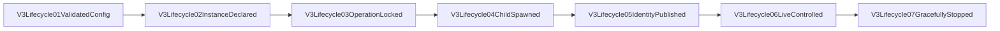
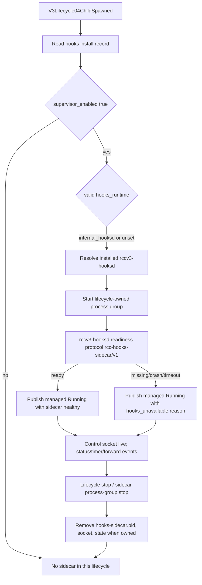

# V3 Managed Server Lifecycle

This review surface owns process control only. The RouteCodex V3 Runtime remains the sole request and
response business lifecycle.

```mermaid
flowchart LR
  A[V3Lifecycle01ValidatedConfig] --> B[V3Lifecycle02InstanceDeclared]
  B --> C[V3Lifecycle03OperationLocked]
  C --> D[V3Lifecycle04ChildSpawned]
  D --> E[V3Lifecycle05IdentityPublished]
  E --> F[V3Lifecycle06LiveControlled]
  F --> G[V3Lifecycle07GracefullyStopped]
```

## Hooks sidecar DAG (single source, single sink)

The V3 managed lifecycle and the optional hooks sidecar share one entry and one exit
inside the managed runtime process tree. The lifecycle is the only owner of the sidecar
process group, its control socket, and its stop/cleanup. `legacy_supervisor` is an explicit
install-record declaration and is not selected by default; an enabled record without
`hooks_runtime` or with `hooks_runtime: internal_hooksd` starts the installed
`rccv3-hooksd` binary with an instance-owned `hooks-sidecar.sock` and
`hooks-sidecar-state.json`. It never shares the legacy `127.0.0.1:8787` daemon or
`~/.codex/routecodex-hooks/codexapp.sock` unless the install record explicitly names the
legacy supervisor.

```mermaid
flowchart TB
  A[V3Lifecycle04ChildSpawned] --> B[Read hooks install record]
  B --> C{supervisor_enabled true}
  C -- no --> Z[No sidecar in this lifecycle]
  C -- yes --> D{valid hooks_runtime}
  D -- internal_hooksd or unset --> E[Resolve installed rccv3-hooksd]
  E --> F[Start lifecycle-owned process group]
  F --> G[rccv3-hooksd readiness protocol rcc-hooks-sidecar/v1]
  G -- ready --> H[Publish managed Running with sidecar healthy]
  G -- missing/crash/timeout --> I[Publish managed Running with hooks_unavailable:reason]
  H --> J[Control socket live; status/timer/forward events]
  I --> J
  J --> K[Lifecycle stop / sidecar process-group stop]
  K --> L[Remove hooks-sidecar.pid, socket, state when owned]
  L --> Z
```

### Current-state notes

- The active install record now selects `internal_hooksd`. The lifecycle therefore owns a
  sidecar process group independent of the external hooks supervisor daemon and its fixed
  `8787` endpoint.
- The previous `legacy_supervisor` path could collide with an already-running external
  supervisor or try to bind `codexapp.sock` owned by another process. Internal mode does
  not use the legacy supervisor wrapper, daemon config, or `codexapp.sock` path.
- A broken install record and a missing `rccv3-hooksd` fail closed with
  `hooks_unavailable:<reason>`; the managed server remains `running`.

## Truth and cache

- `instance.json` is the authoritative declaration: deterministic config identity, executable, and
  complete aggregate listener set.
- The instance ID is stable config identity. The executable path is exact launch provenance and may
  advance to a new release snapshot only after matching `stopped|failed` truth proves the previous
  release is terminal; active, missing-terminal, or otherwise different declarations remain
  non-transferable.
- `pid.cache` is transient and useful only together with the exact instance ID and start nonce.
- `control.json` points to an owner-only Unix socket and carries no secret.
- `restart.plan.json` is a nonce-bound transient control resource used only when restart must exec a
  different current binary or force snapshot flags; the re-entered child removes the consumed plan,
  and it is never provider/client payload.
- `status.json` is an observation of starting/running/stopping/stopped/failed, not authority to take
  over a port or process.

## Commands

The user-facing lifecycle commands are the old-style top-level shape:
`rccv3 start|status|restart|stop -c|--config <path>`. Without `-c`, they resolve
`~/.rcc/config.v3.toml`. They all call `routecodex-v3-lifecycle`.

`rccv3 start` is the foreground monitor path, matching old `rcc start`: it releases the configured
listener set, publishes the managed declaration, runs the server in the current process, and lets
the real runtime stdout/stderr stay visible in the current terminal. It must not print invented
`starting ...` lines or lifecycle status JSON and then exit.
Foreground `start` forces V3 server console on even if the config has `debug.log_console=false`;
startup prints the standard minimal human status line (`[RouteCodexV3] Server started on ...`),
and requests print the old-production monitor line with V3 colorization. The request monitor surface
uses the V2 shape: request start stays `▶ [endpoint] ... rawInputItems=... preparedInputItems=...`,
route selection is `[virtual-router-hit] ... req=<request> sid=<session> <route> -> <provider[key].wire_model> reason=<reason>`,
completion uses snake-case `finish_reason=...`, and usage uses
`[usage] req=<short> project=<path>:<port> route=<router-direct|router-relay>:<reason> model=<request-model>-><wire-model> ... time=i:<ms> e:<ms> t:<ms> finish_reason=...`.
Human server log files persist the same ANSI-colored lines as foreground stdout/stderr instead of
uncolored copies. The structured
`V3ServerStartup01ListenerSetPreflight` / `V3Server03HttpRequestRaw` node events remain debug/log
truth, not the foreground monitor UX.
`rccv3 start --snap` additionally forces V3 debug snapshots on for that run.

`rccv3 server start|status|restart|stop` remains accepted as a hidden compatibility namespace.
`server run-managed-child` is hidden and only executes a declaration already published by the owner.
Hidden `rccv3 server start` keeps the background managed-child behavior for scripts; hidden
`rccv3 server start --foreground` uses the same foreground managed path as top-level `start`.

## Safety boundary

- `start` preserves the old `rcc start` takeover shape for configured listener ports: it first uses
  the exact Unix control challenge and the aggregate Server handle's graceful shutdown when the
  managed owner is reachable, then tries a foreign managed listener port-scoped release for any
  overlapping configured ports, then sends SIGTERM only to explicit PIDs that are still listening on
  the configured port set, and sends SIGKILL only if those PIDs do not release the ports.
- No broad kill exists: no `pkill`, `killall`, `xargs kill`, shell PID expansion, or unscoped
  process scan is allowed. A port occupant is never treated as this instance unless the instance
  declaration/control identity matches; forced release only frees the configured listener set, and
  a foreign multi-port unmanaged PID is rejected instead of broad-killing sibling listeners.
- Resolved provider secrets remain at the Provider transport boundary and never enter lifecycle
  files, process arguments, logs, or evidence.
- SSE Transport, continuation, Anthropic Relay, Provider routing, and Error policy are outside this
  owner.

## Review checklist

- [x] Config loads through `V3ConfigStore::load_snapshot_with_source_identity` and publishes a deterministic Manifest plus source identity.
- [x] Instance declaration matches config digest, executable, and all listeners.
- [x] Operation lock is exclusive.
- [x] Duplicate start matches old `rcc start`: it gracefully stops the exact live owner and starts a
      fresh managed child with the same instance ID.
- [x] Top-level `rccv3 start` stays attached as a foreground monitor and streams real runtime
      startup/request console output such as `[RouteCodexV3] Server started on ...` and
      colorized `▶ [/v1/responses] ... rawInputItems=... preparedInputItems=...`,
      `[virtual-router-hit] ... sid=... -> provider[key].wire_model reason=...`, and
      `[usage] ... project=<path>:<port> route=... model=request->wire time=i/e/t finish_reason=...`;
      status JSON is
      reserved for status/restart/stop and raw debug JSON is kept out of the monitor surface.
- [x] Top-level lifecycle commands without `-c` resolve `~/.rcc/config.v3.toml`; `--snap` forces
      debug snapshots on for the started V3 process.
- [x] Restart is one aggregate in-place exec operation: the running PID is preserved, the current binary is re-entered through a nonce-bound restart plan when needed, the control nonce is refreshed, and it is not a listener loop.
- [x] Wrong nonce/config/executable fail explicitly; occupied configured listener ports are released
      first through managed control, then foreign managed port-scoped release, then explicit listener PID SIGTERM, then explicit listener PID SIGKILL.
- [x] A stopped exact-config instance can start from the next release snapshot executable; an active
      or missing-terminal instance cannot be reaped or taken over.
- [x] State/argv/log/evidence scans contain no resolved secret.
- [x] Temporary CLI blackbox and live 5555 restart evidence both pass.
- [x] V2 5520/10000/4444 stay healthy throughout the V3 restart.
