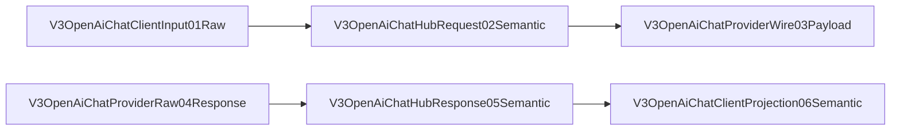

# V3 OpenAI Chat Codec Characterization

## 边界

本页只描述 native OpenAI Chat codec 的 characterization。它不注册 Hub hook，不连接 Server、Runtime kernel、Provider transport、continuation、Relay 或 SSE Transport Core。

## 合同

- JSON request/response 保留原 payload 语义。
- assistant tool call ID 必须非空且唯一；tool result 必须引用此前声明的 ID。
- 错误显式失败；不修复、不重排、不 fallback。
- SSE 输入是已分帧的单个 event JSON；不解析字节，不 materialize stream。
- RouteCodex 内部 side-channel 字段不可进入协议 payload。

## Review checklist

- [ ] focused Rust tests 通过
- [ ] source architecture gate 通过
- [ ] mutation red fixtures 全部拒绝
- [ ] map/manifest 节点 ID 一致
- [ ] 无 runtime wiring 或 hook registration
