# V3 Protocol Normalization Tool Governance Boundary

## Contract

Normalization maps adjacent protocols and validates shape only. Tool identity pairing, uniqueness checks, orphan tool output detection, servertool, stopless, apply_patch, hook governance, and continuation save/restore semantics belong to Chat Process govern nodes.

## Request chain

```mermaid
flowchart LR
  A[ServerReqInbound01ClientRaw] --> B[HubReqInbound02Standardized]
  B --> C[HubReqChatProcess03Governed]
  C --> D[VrRoute04SelectedTarget]
  D --> E[HubReqOutbound05ProviderSemantic]
  E --> F[ProviderReqCompat06ProviderCompat]
  F --> G[ProviderReqOutbound07TransportRequest]
```

## Response chain

```mermaid
flowchart LR
  A[ProviderRespInbound01Raw] --> B[ProviderRespCompat02ProviderCompat]
  B --> C[HubRespInbound03Parsed]
  C --> D[HubRespChatProcess04Governed]
  D --> E[HubRespContinuation05Committed]
  E --> F[HubRespOutbound06ClientSemantic]
  F --> G[ServerRespOutbound07ClientFrame]
```

## Known repaired violations

- OpenAI Chat request `messages[].tool_calls[].id` / `role:tool.tool_call_id` identity pairing moved from codec normalization to Req04 Chat Process governance.
- OpenAI Chat response tool call identity validation moved from codec inbound normalization to response Chat Process governance over canonical tool output.
- Gemini request `functionCall` / `functionResponse` pairing moved from codec normalization to Req04 Chat Process governance.

## Compat skeleton

- `ProviderReqCompat06ProviderCompat`: standard provider protocol to provider implementation micro-adjustment. No protocol remap, tool governance, fallback, silent repair, route, or model selection.
- `ProviderRespCompat02ProviderCompat`: provider-specific response to standard provider protocol compatibility. No harvest, apply_patch, servertool, stopless, side-channel injection, or fallback-to-success.

## Gates

- `npm run verify:v3-normalization-payload-logic-boundary`
- `npm run test:v3-normalization-payload-logic-boundary-red-fixtures`
- OpenAI Chat and Gemini codec characterization tests/gates
- Hub relay request/response governance tests
