# V3 Provider Action Gate

Canonical implementation plan:
`docs/goals/direct-relay-cross-request-error-storm-control-plan.md`.

```mermaid
flowchart TD
  Compat[ProviderReqCompat06ProviderCompat]
  Wire[V3ProviderReqOutbound08WirePayload]
  E01[V3Error01SourceRaised]
  E05[V3Error05ExecutionDecision]
  Witness[V3Error05RecoveryWitness]
  Gate[V3ProviderActionGateAdmission]
  Retry[V3ExecutionRetryOrReselect]
  TerminalAdmission[V3ProviderActionGateTerminalAdmission]
  TerminalCommit[V3ProviderActionGateTerminalCommitted]
  Permit[V3ProviderActionPermitInFlight]
  AbandonRequest[V3ProviderActionPermitAbandonRequested]
  Abandoned[V3ProviderActionPermitAbandoned]
  SuccessObserved[V3ProviderActionSuccessObserved]
  FailureObserved[V3ProviderActionFailureObserved]
  SuccessFinalize[V3ProviderActionSuccessFinalize]
  SuccessRecorded[V3ProviderActionSuccessRecorded]
  FailureRecorded[V3ProviderActionFailureRecorded]
  ProviderRaw[V3ProviderRespInbound01Raw]
  ProviderCodec[V3ProviderResponsesEventCodec]
  ProviderOutcome[V3ProviderResponsesTerminalOrFailureObserved]
  Success[V3 Provider Success]
  Terminal[V3 Terminal Exhaustion]
  Reevaluate[V3SelectionAndError05Reevaluation]

  Compat -->|v3-provider-action-gate-01| E05
  Wire -->|v3-provider-action-gate-02| E05
  E05 -->|v3-provider-action-gate-03| Witness
  Witness -->|v3-provider-action-gate-04| Gate
  E05 -->|v3-provider-action-gate-05| TerminalAdmission
  TerminalAdmission -->|v3-provider-action-gate-06| TerminalCommit
  Gate -->|v3-provider-action-gate-07| Retry
  Witness -->|v3-provider-action-gate-08| Gate
  Retry -->|v3-provider-action-gate-09| Gate
  Witness -->|v3-provider-action-gate-10| Gate
  Witness -->|v3-provider-action-gate-11| Gate
  Witness -->|v3-provider-action-gate-12| Gate
  Witness -->|v3-provider-action-gate-13| Gate
  E01 -->|v3-provider-action-gate-14| E05
  E01 -->|v3-provider-action-gate-15| E05
  E01 -->|v3-provider-action-gate-16| E05
  Gate -->|v3-provider-action-gate-19| Permit
  Gate -->|v3-provider-action-gate-20| Permit
  Gate -->|v3-provider-action-gate-21| Permit
  Gate -->|v3-provider-action-gate-22| Permit
  Gate -->|v3-provider-action-gate-23| Permit
  Permit -->|v3-provider-action-gate-24| AbandonRequest
  Permit -->|v3-provider-action-gate-25| AbandonRequest
  Permit -->|v3-provider-action-gate-26| AbandonRequest
  Permit -->|v3-provider-action-gate-27| AbandonRequest
  Permit -->|v3-provider-action-gate-28| AbandonRequest
  Permit -->|v3-provider-action-gate-29| AbandonRequest
  Permit -->|v3-provider-action-gate-30| AbandonRequest
  Permit -->|v3-provider-action-gate-31| AbandonRequest
  AbandonRequest -->|v3-provider-action-gate-32| Abandoned
  Permit -->|v3-provider-action-gate-33| SuccessObserved
  SuccessObserved -->|v3-provider-action-gate-34| SuccessRecorded
  Permit -->|v3-provider-action-gate-35| FailureObserved
  Abandoned -->|v3-provider-action-gate-36| FailureRecorded
  Permit -->|v3-provider-action-gate-37| SuccessObserved
  SuccessObserved -->|v3-provider-action-gate-38| SuccessRecorded
  Permit -->|v3-provider-action-gate-39| FailureObserved
  Abandoned -->|v3-provider-action-gate-40| FailureRecorded
  Permit -->|v3-provider-action-gate-41| SuccessObserved
  SuccessObserved -->|v3-provider-action-gate-42| SuccessRecorded
  Permit -->|v3-provider-action-gate-43| FailureObserved
  Abandoned -->|v3-provider-action-gate-44| FailureRecorded
  Permit -->|v3-provider-action-gate-45| SuccessRecorded
  Permit -->|v3-provider-action-gate-46| SuccessFinalize
  SuccessFinalize -->|v3-provider-action-gate-47| SuccessRecorded
  ProviderRaw -->|v3-provider-action-gate-48| ProviderCodec
  ProviderCodec -->|v3-provider-action-gate-49| ProviderOutcome
  ProviderRaw -->|v3-provider-action-gate-50| ProviderCodec
  ProviderCodec -->|v3-provider-action-gate-51| ProviderOutcome
  Success -->|reset scoped failure state| Gate
  Terminal -->|advance sustained generation| Gate
  Gate -->|typed terminal wake, no provider send| Reevaluate
```

The gate is a process-local control side channel keyed by server, routing group,
provider runtime identity, and normalized error family. It does not enter request,
response, metadata, continuation, snapshot, or persistent provider-health truth.

Review locks:

- First isolated provider failure waits at least 1 second.
- A second failure before success or an overlapping waiter promotes the scope to
  sustained mode and waits at least 5 seconds.
- Switching provider runtime identity or normalized error family inside the same active
  server/routing-group lane remains sustained and cannot restart the one-second floor.
- One generation admits exactly one retry or reselect action.
- Fresh normal requests do not consume an unrelated Error05 recovery lane. Only the
  current request's typed retry/reselect transition enables its next gate wait.
- Admission returns a Rust-owned `V3ProviderActionPermit`. Elapsed wall-clock time never
  releases an owned provider action, including a legal lazy SSE longer than five
  seconds.
- Provider success, provider failure, terminal commit, or permit drop/explicit abandon
  releases ownership. Abandon is health-neutral and starts a new sustained five-second
  floor without incrementing consecutive failures.
- A caller that observes provider failure releases its admitted permit before awaiting
  Error05 retry/reselect/terminal policy. Holding that permit across terminal admission
  is a self-deadlock because terminal admission cannot become the permit's own release
  signal.
- Provider success resets the matching state.
- When success releases a queued recovery waiter, the typed transition carries the
  exact retained key and new generation. Direct and every Relay runtime must re-arm
  that ticket and wait through the sustained five-second floor before provider send;
  success is not permission for the released waiter to bypass the gate.
- A same-group success from an unrelated provider runtime identity cannot reset an owned
  permit or its matching failure state.
- Missing gate state or notification-channel closure fails explicitly; neither can be
  wrapped as provider success.
- Streaming success is recorded only after protocol terminal evidence and clean EOF.
  For provider Responses SSE, only `response.completed` is semantic terminal truth;
  `response.done` is a client projection event and `[DONE]` is transport-only.
  Malformed events, premature EOF, provider stream errors, `response.failed`, and
  post-terminal parse failures record provider failure and leave the next action gated.
- Terminal exhaustion is not success: old waiters re-evaluate selection/Error05, and
  the next provider action remains serialized behind a new five-second generation.
  Error06 projection itself consumes the same gate admission: an isolated terminal
  provider error waits at least one second, sustained terminal projections remain
  five seconds apart, and a concurrent routing-group success cannot release a stale
  provider error directly to the client.
- A fresh non-continuation request bypasses an unrelated recovery lane. A pinned Direct
  continuation checks the existing exact-provider lane; when no failure state exists,
  that check returns immediately.
- Client disconnect is health-neutral and does not enter this gate.
- FIFO waiter tickets preserve deterministic order; cancelling one waiter removes only
  that ticket.
- Only a typed terminal Error05 exhaustion decision may construct Error06.
- Terminal admission waits through
  `record_failure_and_wait_for_terminal_projection`, then
  `commit_terminal_admission` atomically verifies the admitted generation and advances
  the lane group.
- Runtime does not pass that commit result as a typed witness into
  `terminal_projection_for`. The machine map therefore stops at
  `V3ProviderActionGateTerminalCommitted` and does not fabricate a
  `TerminalCommitted -> V3Error05TerminalDecision/Error06` edge. Typed Error05-to-Error06
  projection remains owned by `routecodex-v3-error`.
- Responses Relay `ProviderReqCompat06ProviderCompat` and
  `V3ProviderReqOutbound08WirePayload` failures enter
  `handle_v3_responses_relay_provider_failure`, then
  `run_v3_relay_provider_failure_policy`; they cannot return directly as provider-bound
  request errors or bypass typed Error05 admission.
- The machine gate requires the exact fifty-one-edge set, resolves every declared symbol in
  its declared source, verifies each caller body invokes its callee, and compares every
  map edge endpoint/status/symbol/source field with this lifecycle manifest.
- Traffic Governor saturation is a separate typed admission-backpressure lane. Its
  blocking acquire runs off the Node event loop and never enters provider health,
  Error05 retry/reselect, or provider 429 projection.
