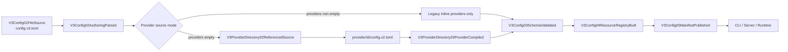

# V3 Provider Directory Config

**Feature:** `v3.provider_directory_config_compat`
**Owner:** `routecodex-v3-config` Provider directory compiler
**Manifest:** `docs/architecture/manifests/v3.provider_directory_config.mainline.yml`

## Review surface

## Ownership

| Resource | Owner | Rule |
| --- | --- | --- |
| Root routing/server authoring | `config.v3.toml` | No live Provider definitions in directory mode. |
| Provider authoring | `provider/<id>/config.v2.toml` | Exact referenced ids only. |
| Provider compilation | `routecodex-v3-config` | Single Rust owner before schema validation. |
| Runtime Provider truth | `V3Config05ManifestPublished` | Runtime never reads files or directories. |
| Lifecycle source identity | `V3ConfigStore` | Hash root plus referenced Provider sources. |

## Compatibility behavior

- Existing inline-only V3 fixtures remain an explicit legacy mode.
- Empty/absent root `providers` selects Provider directory mode.
- Partial inline/directory mixing fails.
- Provider directory files use the V2 Provider codec plus optional `[provider.v3]` policy fields.
- No parse error causes a source-mode fallback.

## Review checklist

- [ ] Root config has no `[providers.*]` sections in live directory mode.
- [ ] Every referenced provider resolves from one exact Provider file.
- [ ] Provider file identity matches directory and route reference.
- [ ] Source identity changes when a referenced Provider file changes.
- [ ] Runtime imports only the published manifest.
- [ ] Provider secrets and config do not enter normal request/response payloads.
- [ ] Missing/malformed/mixed source cases fail before server start.
