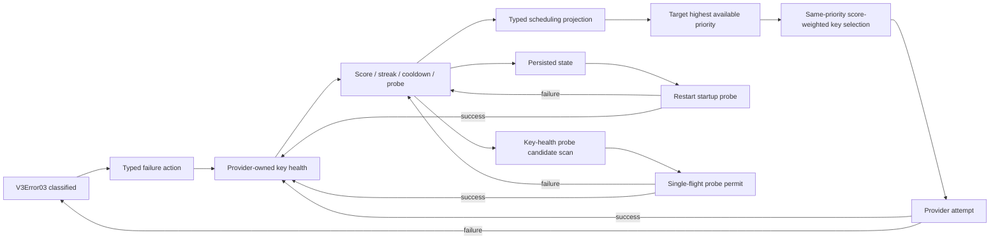

# V3 Provider Key Health Scoring

Status: source-controlled runtime pending live replay.

Canonical design: [provider health scoring and cooldown](../../design/v3-provider-health-scoring-cooldown-design.md)

Implementation plan: [provider health scoring and cooldown plan](../../goals/v3-provider-health-scoring-cooldown-plan.md)

Review locks:

- Error creates action; Provider health is the only mutation owner.
- Target reads scheduling projection; Virtual Router does not read or mutate provider score.
- Cooldown is an availability gate before score; score cannot revive blocked key.
- Score only affects equal-priority candidates.
- Normal provider/client payloads never contain score, streak, cooldown, probe, or routing state.
- Runtime status remains `design_pending_runtime` until source, live replay, and DSH Review closeout.
