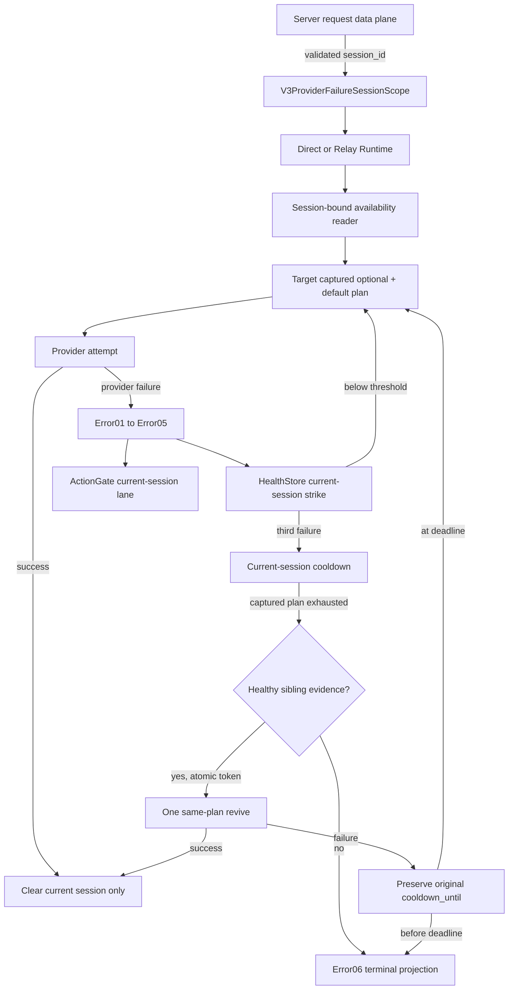

# V3 Provider Failure Session Isolation

Status: pending implementation and live verification.

Canonical contract:
[V3 Session-Isolated Provider Failure Plan](../../goals/v3-session-isolated-provider-cooldown-plan.md)

## Review Locks

- Failure key: `server_id+routing_group+session_id+provider_id+auth_alias+model_id`.
- ActionGate adds `normalized_error_family` only below that session key.
- Session identity comes only from the current Server/ReqInbound request data plane.
- Missing session fails before provider send. No request/conversation/continuation/MetadataCenter or
  routing-group substitution exists.
- Session A failure, cooldown, waiter, permit, success and terminal transitions never touch B.
- Global configured-disable, health-disable, quota and concurrency facts still block every session.
- Runtime recovery uses `selected.route.target_plan`; it never invokes Virtual Router a second time.
- Target remains read-only and Virtual Router remains health-blind.
- Sibling evidence must be explicit. Missing record is not healthy.
- Revive admission is atomic per current-session provider and original cooldown deadline.
- Failed revive does not extend the deadline and cannot send again before expiry.
- Client disconnect is health-neutral; request-local provider compatibility failure stays local.
- Cooldown state is in-memory only and has deterministic success/expiry/idle cleanup.

## Required Evidence

- Paired HealthStore, ActionGate and Error05 unit/contract tests.
- Direct plus Responses/OpenAI Chat/Anthropic/Gemini Relay JSON/SSE integration tests.
- Post-commit stream failure tests.
- Source verifier and mutation fixtures wired into build and CI.
- Global install/source hash alignment, one aggregate restart and all member health checks.
- Real A/B cooldown replay plus one-revive/no-second-send-before-original-deadline replay.
- Final Codex review semantic PASS after live verification.
