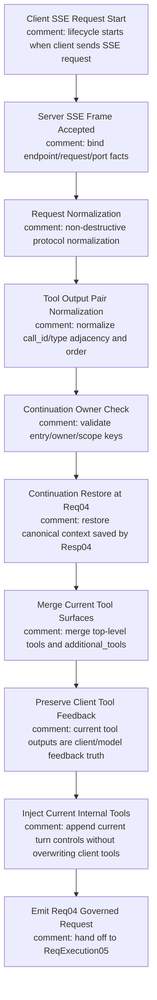
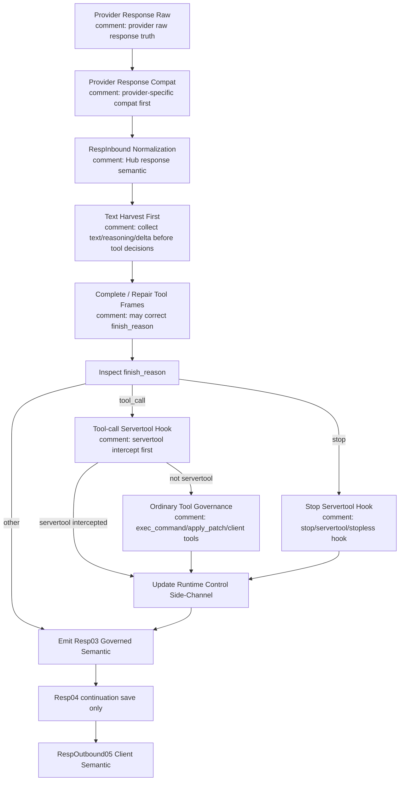

# V3 Req04 / Resp03 Tool Governance Review

## Purpose

This is the small-skeleton review surface for split request-side and response-side tool governance. Request lifecycle starts at the client SSE request. Response lifecycle starts at provider raw response and must pass compat before RespInbound normalization.

Canonical sources:
- `docs/architecture/v3-mainline-call-map.yml`
- `docs/architecture/v3-resource-operation-map.yml`
- `docs/architecture/v3-architecture-audit-locks.yml`
- `docs/architecture/wiki/v3-mainline-skeleton-sop.md`
- `v3/crates/routecodex-v3-runtime/src/hub_v1/relay_request.rs`
- `v3/crates/routecodex-v3-runtime/src/hub_v1/req_chat_process_04_governed.rs`
- `v3/crates/routecodex-v3-runtime/src/hub_v1/resp_chat_process_03_governed.rs`
- `v3/crates/routecodex-v3-runtime/src/hub_v1/resp_continuation_04_committed.rs`
- `v3/crates/routecodex-v3-runtime/src/hub_v1/servertool_hooks.rs`

## Main Rule

Request lifecycle starts at Client SSE Request Start: server accept -> request normalization -> tool output pair normalization -> continuation owner check -> Req04 restore -> current-turn merge/governance -> ReqExecution handoff.

Response lifecycle is separate: provider raw -> provider response compat -> RespInbound normalization -> Resp03 text harvest -> complete/repair tool frames -> inspect finish_reason -> branch tool_call/stop into different servertool hooks -> ordinary tool governance for non-servertool tool_call -> Resp04 continuation save -> RespOutbound projection.

Audit labels locked for generated HTML:
- Client SSE Request Start
- Server SSE Frame Accepted
- Request Normalization
- Tool Output Pair Normalization
- Continuation Owner Check
- Continuation Restore at Req04
- Merge Current Tool Surfaces
- Preserve Client Tool Feedback
- Request Tool Governance Flow
- Response Tool Governance Flow
- Provider Response Raw
- Provider Response Compat
- RespInbound Normalization
- Text Harvest First
- Complete / Repair Tool Frames
- Inspect finish_reason
- Tool-call Servertool Hook
- Ordinary Tool Governance
- Stop Servertool Hook
- Request node logic
- Response node logic
- Error feedback is preserved
- Provider codec owns malformed provider fields
- Resp03 owns response governance
- Resp04 continuation save is Chat Process endpoint
- RespOutbound Client Semantic
- JSON to SSE Client Frame
- Diagnostics stay side-channel only

## Request Tool Governance Flow

## Response Tool Governance Flow

## Request node logic

| Node | 干什么 | 逻辑 |
| --- | --- | --- |
| Client SSE Request Start | Client sends SSE `/v1/responses` request. | Client-side stream intent starts request lifecycle; client SSE response must remain SSE. |
| Server SSE Frame Accepted | Server accepts HTTP/SSE request and binds endpoint/request/port facts. | Server captures raw facts only; no tool pairing, history repair, or continuation restore. |
| Request Normalization | Non-destructively normalizes client protocol request into Hub normal payload. | Normalize protocol shape and stream intent only; no semantic trimming or text downgrade. |
| Tool Output Pair Normalization | Normalizes submitted tool outputs and their call_id/type adjacency. | Parse-error/unknown-tool/unsupported feedback is client feedback truth; preserve and order it. |
| Continuation Owner Check | Validates entry protocol, continuationOwner, session/conversation, and port/group scope. | Owner/scope mismatch fails fast; this node does not restore payload. |
| Continuation Restore at Req04 | Restores canonical local context saved by previous Resp04. | Restored context is canonical; do not read it as raw history again. |
| Merge Current Tool Surfaces | Merges current request top-level `tools` and `input[].additional_tools.tools`. | Preserve original surface; `additional_tools` is Codex capability declaration surface. |
| Preserve Client Tool Feedback | Adds current client tool execution results to governed request truth. | Pair only by explicit protocol fields `call_id`/type; error feedback is model correction input. |
| Inject Current Internal Tools | Injects current-turn internal tools such as `reasoningStop`. | At most once; append/augment current turn; do not clear system/developer/user context. |
| Emit Req04 Governed Request | Emits restored context + current request deltas to ReqExecution05. | Provider malformed fields are fixed in ReqOutbound/provider codec, not by deleting Req04 truth. |

## Response node logic

| Node | 干什么 | 逻辑 |
| --- | --- | --- |
| Provider Response Raw | Receives provider raw JSON/SSE response truth. | No governance or projection here. |
| Provider Response Compat | Applies provider-specific response compatibility. | Compat precedes RespInbound normalization and cannot own servertool/stopless/ordinary tool governance. |
| RespInbound Normalization | Normalizes compat output into Hub response semantic. | Establishes response semantic input only; finish_reason split and governance wait until Resp03. |
| Text Harvest First | Harvests text, reasoning, and accumulated deltas first. | Tool decisions must not run on incomplete text/delta state. |
| Complete / Repair Tool Frames | Completes or repairs tool frames that are determinable from response semantics. | This can correct finish_reason, for example stop -> tool_call, before branch selection. |
| Inspect finish_reason | Branches by corrected `finish_reason`. | `tool_call` and `stop` have different servertool hooks and are modeled as separate Resp03 branches. |
| Tool-call Servertool Hook | Runs servertool interception under `finish_reason=tool_call`. | Servertool intercept runs before ordinary tool governance. If intercepted, do not process as ordinary exec/apply_patch. |
| Ordinary Tool Governance | Governs non-servertool tool calls such as `exec_command`, `apply_patch`, and client tools. | Runs only after tool-call servertool hook passes through. |
| Stop Servertool Hook | Runs stop/servertool/stopless hook under `finish_reason=stop`. | Stop branch hook is distinct from tool_call branch hook. |
| Update Runtime Control Side-Channel | Updates runtime control after either branch. | Side-channel only; no provider/client normal payload pollution. |
| Emit Resp03 Governed Semantic | Emits governed response semantic after branch convergence. | Response governance is complete at Resp03 exit; later nodes only save/project. |
| Resp04 Continuation Save | Commits/releases continuation context from Resp03-governed output and ends Chat Process. | No response reinterpretation, tool repair, history repair, or guidance injection; after this, only outbound projection and JSON→SSE framing may run. |
| RespOutbound Client Semantic | Projects governed response to client protocol semantic after Chat Process endpoint. | Projection only; no continuation save/restore and no error swallowing. |
| JSON to SSE Client Frame | Converts outbound client semantic to SSE frames for client SSE entry. | Framing only; no tool governance, continuation save, or response repair. |

## Resource Matrix

| Resource | Owner | Rule |
| --- | --- | --- |
| Client SSE request | Server entry / ReqInbound | Request lifecycle starts here; preserve client stream intent. |
| Client tool output result | Tool Output Pair Normalization / Req04 | Pair by explicit protocol call_id/type; preserve error feedback. |
| Local continuation context | Resp04 save / Req04 restore | Save after Resp03, restore before Req04 current-turn merge; immutable between those points. |
| Client tool declarations | Request data plane / Req04 reader | Preserve by default; do not delete because a provider cannot consume the exact shape. |
| `additional_tools` | Codex capability declaration surface / Req04 reader | Preserve original Responses input surface; do not flatten or drop it for convenience. |
| Provider raw response | ProviderRespInbound01Raw | Must pass ProviderRespCompat02 before RespInbound normalization. |
| Provider response compat | ProviderRespCompat02ProviderCompat | Provider-specific response shape compatibility only; no response governance. |
| Text/tool-frame harvested response | Resp03 | Text harvest and tool frame completion happen before finish_reason split. |
| Tool-call servertool action | Resp03 tool_call branch | Servertool interception before ordinary tool governance. |
| Stop servertool action | Resp03 stop branch | Stop/servertool/stopless hook distinct from tool_call hook. |
| Ordinary tool calls | Resp03 ordinary tool governance | Exec/apply_patch/client tools are governed after servertool pass-through. |
| Stopless runtime control | Metadata side-channel / StoplessCenter | Read at Req04, update at Resp03; never enter provider/client normal payload. |
| Provider malformed fields | ReqOutbound / provider codec owner | Provider codec owns malformed provider fields; fix provider-bound field generation before send. |

## Allowed Actions

- Server may accept client SSE and bind endpoint/request/port facts.
- ReqInbound may non-destructively normalize request protocol shape and stream intent.
- Req04 may normalize current tool output pairing by explicit call_id/type.
- Req04 may restore local continuation context after scope/owner/entry validation.
- Req04 may merge current tool declarations and current tool outputs into governed request truth.
- Req04 may inject internal tools such as `reasoningStop` only when policy allows.
- Response chain must run provider raw -> ProviderRespCompat02 -> RespInbound normalization before Resp03 governance.
- Resp03 may harvest text first, complete/repair tool frames, and correct finish_reason before branching.
- Resp03 may run distinct servertool hooks for `finish_reason=tool_call` and `finish_reason=stop`.
- Resp03 may run ordinary tool governance after tool-call servertool pass-through.
- Resp03 may update runtime control through side-channel resources.
- Resp04 may save/commit or release continuation truth after Resp03 governance.
- RespOutbound may project governed response semantic to client protocol.

## Forbidden Actions

- Start request audit at Req04 and omit client SSE / server accept / request normalization.
- Read restored canonical context as raw history again.
- Delete non-RouteCodex tool calls or non-RouteCodex tool outputs.
- Delete by matching error text such as `failed to parse`, `unsupported`, `unknown tool`, or `malformed`.
- Delete only one side of a matching call/output pair.
- Skip ProviderRespCompat02 before RespInbound normalization.
- Make finish_reason branch decisions before text harvest and tool frame completion/repair.
- Treat stop servertool hook and tool_call servertool hook as one node.
- Run ordinary exec/apply_patch/client-tool governance before tool-call servertool interception.
- Move response-side tool/servertool/stopless governance out of Resp03.
- Let Resp04 repair response semantics, tools, history, or prompt guidance.
- Repair provider-specific fields in Req04 or Resp03.
- Downgrade `tool_call` / `tool_output` into plain text.
- Put stopless/servertool/debug/snapshot metadata into provider body or client normal payload.

## Review Checklist

| Check | Expected |
| --- | --- |
| C1 | Request diagram starts at Client SSE Request Start. |
| C2 | Request diagram includes server accept and request normalization. |
| C3 | Request diagram includes tool output pair normalization before continuation restore/governance. |
| C4 | Continuation owner check is separate from continuation restore. |
| C5 | Restored canonical context is not read as raw history again. |
| C6 | Req04 merges current request deltas after restore. |
| C7 | No request-side internal artifact removal path is declared in this small skeleton. |
| C8 | Error feedback is preserved. |
| C9 | `additional_tools` reach provider-visible tools. |
| C10 | Response starts at provider raw and passes ProviderRespCompat02 before RespInbound normalization. |
| C11 | Resp03 text harvest and tool frame completion/repair happen before finish_reason split. |
| C12 | `finish_reason=tool_call` and `finish_reason=stop` have distinct servertool hooks. |
| C13 | Ordinary tool governance runs only after tool-call servertool pass-through. |
| C14 | Resp04 saves/commits continuation truth as Chat Process endpoint, before RespOutbound and JSON→SSE. |
| C15 | Provider-specific malformed fields are fixed in ReqOutbound/provider codec. |
| C16 | Metadata/debug remains side-channel only. |

## Required Red Fixtures

- Client SSE request lifecycle begins before Req04.
- Tool output pair normalization preserves parse-error `function_call_output`.
- Continuation owner mismatch rejects before restore.
- Restore canonical context then merge current deltas.
- Preserve malformed ordinary `function_call`.
- Preserve unknown-tool feedback.
- Reject one-sided deletion of a paired call/output.
- Preserve `additional_tools`.
- Reject response graph without ProviderRespCompat02 before RespInbound normalization.
- Reject finish_reason split before text harvest and tool frame completion/repair.
- Reject merged servertool hook for stop and tool_call branches.
- Reject ordinary tool governance before tool-call servertool interception.
- Reject Resp04 semantic repair.
- Reject RespOutbound or JSON→SSE doing Chat Process governance.
- Keep provider malformed-field repair in codec/builder, not Req04 deletion.
- Reject metadata/control leaks into provider/client payload.
