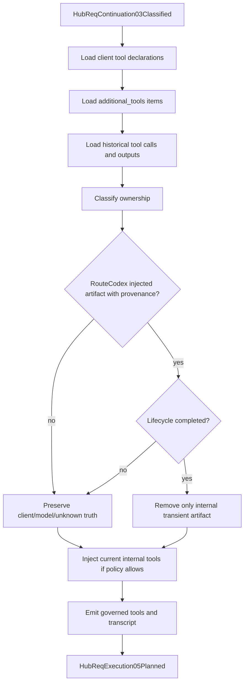

# V3 Req04 Tool Governance Review

## Purpose

This is the small-skeleton review surface for `HubReqChatProcess04Governed` request-side tool governance.

Canonical sources:
- `docs/architecture/v3-mainline-call-map.yml`
- `docs/architecture/v3-resource-operation-map.yml`
- `docs/architecture/v3-architecture-audit-locks.yml`
- `v3/crates/routecodex-v3-runtime/src/hub_v1/relay_request.rs`
- `v3/crates/routecodex-v3-runtime/src/hub_v1/servertool_hooks.rs`

## Main Rule

Req04 may govern request-side tool surface and transcript order, but it must not silently delete client/model truth. It may clean only RouteCodex-owned transient artifacts with explicit provenance and completed lifecycle.

## Tool Governance Flow

## Resource Matrix

| Resource | Owner | Rule |
| --- | --- | --- |
| Client tool declarations | Client protocol data plane | Preserve by default; do not delete because a provider cannot consume the exact shape. |
| Historical tool calls | Transcript truth | Preserve `call_id`, `name`, `arguments`, and type. |
| Historical tool outputs | Client feedback truth | Preserve parse errors, unsupported tool errors, schema rejects, and execution failures. |
| RouteCodex injected tools | RouteCodex control resource | Must carry provenance; only this class can be removed by lifecycle cleanup. |
| Restored continuation context | Req04-owned context truth | After restore, process with the same governance rules. |
| Metadata/debug/stopless state | Side-channel control resource | Never enter provider/client normal payload. |

## Allowed Actions

- Normalize tool declaration shape into the governed tool surface.
- Inject internal tools such as `reasoningStop` only when policy allows.
- Preserve malformed client feedback so the model can correct itself.
- Validate call/output ordering without deleting one side of a client/model pair.
- Remove only RouteCodex-owned transient artifacts with explicit provenance and completed lifecycle.
- Emit diagnostics only through side-channel resources.

## Forbidden Actions

- Delete non-RouteCodex tool calls.
- Delete non-RouteCodex tool outputs.
- Delete by matching error text such as `failed to parse`, `unsupported`, or `unknown tool`.
- Delete only one side of a matching call/output pair.
- Repair provider-specific fields in Req04.
- Downgrade `tool_call` / `tool_output` into plain text.
- Put stopless/servertool/debug/snapshot metadata into provider body or client normal payload.

## Review Checklist

| Check | Expected |
| --- | --- |
| C1 | No error-text-based cleanup in Req04. |
| C2 | No cleanup of non-provenance tool calls or outputs. |
| C3 | No one-sided deletion of paired call/output events. |
| C4 | `additional_tools` reach provider-visible tools. |
| C5 | `reasoningStop` is injected at most once. |
| C6 | Internal tools do not overwrite client tools without explicit owner rule. |
| C7 | Stopless guidance augments current turn only; it does not clear system/developer/user context. |
| C8 | Provider-specific malformed fields are fixed in ReqOutbound/provider codec. |
| C9 | Cleanup is locked by red fixtures. |
| C10 | Provider dry-run shows final tool list. |
| C11 | Live replay proves old tool-chain errors no longer recur. |
| C12 | Metadata/debug remains side-channel only. |

## Required Red Fixtures

- Preserve malformed ordinary `function_call`.
- Preserve parse-error `function_call_output`.
- Preserve unknown-tool feedback.
- Reject one-sided cleanup of a paired call/output.
- Allow internal stopless cleanup only by RouteCodex provenance.
- Preserve `additional_tools`.
- Keep provider malformed-field repair in codec/builder, not Req04 deletion.
- Reject metadata/control leaks into provider/client payload.
