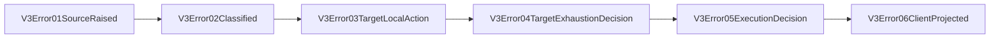
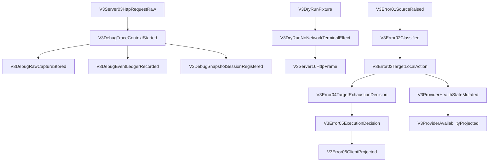
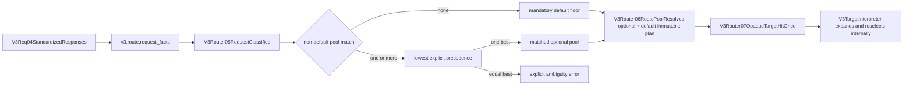

# V3 Foundation and Responses Direct Review

[Open the remote-continuation browser review surface](v3-responses-direct-remote-continuation.html).

## Purpose

This is the human review surface for the RouteCodex V3 Rust foundation and first business lifecycle. The order is Config -> Server -> Debug -> Error/Provider health -> Virtual Router/Target -> Responses direct Pipeline/Provider.

Virtual Router classification consumes typed `V3RouterRequestFacts`; pool-match planning and the non-empty default floor remain inside the Router owner before the one opaque target hit.

Canonical documents:

- [V3 system definition](../../design/v3-system-definition.md)
- [V3 Rust module boundaries](../../design/v3-routecodex-rust-module-boundaries.md)
- [V3 runtime resource contract](../../design/v3-routecodex-runtime-resource-contract.md)
- [V3 foundation implementation order](../../goals/v3-foundation-implementation-order.md)
- [V3 resource operation map](../v3-resource-operation-map.yml)
- [V3 mainline call map](../v3-mainline-call-map.yml)
- [V3 verification map](../v3-verification-map.yml)

## Required mainline

```mermaid
flowchart LR
  C1[V3Config01FileSource] --> C2[V3Config02AuthoringParsed]
  C2 --> C3[V3Config03SchemaValidated]
  C3 --> C4[V3Config04ResourceRegistryBuilt]
  C4 --> C5[V3Config05ManifestPublished]
  C5 --> S3[V3Server03HttpRequestRaw]
  S3 --> R4[V3Req04StandardizedResponses]
  R4 --> C{previous_response_id?}
  C -->|new turn| VR5[V3Router05RequestClassified]
  C -->|direct remote| HC3[V3HubReqContinuation03Classified]
  HC3 --> HT6[V3HubReqTarget06Resolved exact pin]
  VR5 --> VR6[V3Router06RoutePoolResolved]
  VR6 --> VR7[V3Router07OpaqueTargetHitOnce]
  VR7 --> T8[V3Target08KindClassified]
  T8 --> T9[V3Target09CandidateSetExpanded]
  T9 --> T10[V3Target10ConcreteProviderSelected]
  T10 --> D11[V3ResponsesDirect11Policy]
  D11 --> P12[V3Provider12ResponsesWirePayload]
  P12 --> P13[V3Transport13ResponsesHttpRequest]
  P13 --> PR14[V3ProviderResp14Raw]
  PR14 --> RC4[V3HubRespContinuation04Committed]
  RC4 --> O15[V3Resp15ClientPayload]
  O15 --> S16[V3Server16HttpFrame]
```

P0-P5 are anchored through `V3Target10ConcreteProviderSelected`. P6 is source-bound through
`V3Server16HttpFrame`, including generic Provider JSON/SSE transport, Target-local reselection,
full exhaustion, and same-kernel Dry Run with only Transport13 replaced by a no-network effect.
The clean built-CLI controlled-upstream replay is recorded in the P6 local-live evidence section.

Responses Direct remote continuation is now source-bound on the same fixed Runtime kernel. A new
turn uses Virtual Router once. A turn carrying `previous_response_id` instead loads the immutable
direct locator at `V3HubReqContinuation03Classified`, validates capability revision, resolves the
exact provider/model/auth pin at `V3HubReqTarget06Resolved`, and rejoins the same Direct request,
transport, response projection, Resp04, and client exit. It never enters Relay/local materialization,
Virtual Router, or target-local reselection.

The Server owns no continuation store logic. All listeners share one Runtime state, while the
locator key isolates endpoint, session, conversation, listener port, and routing group. JSON and SSE
controlled HTTP replay both prove first-turn Resp04 commit and next-turn Req03/Req06 exact pin. The
current 5555 replay remains a separate completion gate until its request/sample/log evidence is
recorded.

## Ownership review

| Surface | Unique owner | Review rule |
| --- | --- | --- |
| Config file IO | `routecodex-v3-config::V3ConfigStore` | no other crate opens or writes `config.v3.toml` |
| Listener lifecycle | `routecodex-v3-server` | all enabled listeners start or aggregate startup fails |
| Full request lifecycle | `routecodex-v3-runtime` | no flow module or CLI owns a second lifecycle |
| Route hit | `routecodex-v3-virtual-router` | typed request facts compile one optional-plus-default plan and consume it once |
| Target expansion/reselection | `routecodex-v3-target` | expands the captured opaque plan; internal failures never re-enter Virtual Router |
| Error taxonomy/actions | `routecodex-v3-error` | no local retry/cooldown policy copies |
| Health state/action execution | Provider runtime | provider/auth/model state never moves to Router/Error |
| Logs/snapshots/dry run | `routecodex-v3-debug` | side-channel only; same runtime kernel replay |
| Responses wire/transport | `routecodex-v3-provider-responses` | secret resolution occurs only at transport |
| Responses Direct remote continuation | `routecodex-v3-runtime` | Resp04 commit/release, Req03 load, Req06 exact pin; Server only supplies typed request scope |

## Error side chain

Error emits health/cooldown actions; Provider applies them to provider instance, auth key, or canonical model state. Target queries availability and reselects inside the selected target. Only `TargetPoolExhausted` moves upward.

## P3/P4 Debug and Health Foundation

P3 Debug is owned by `routecodex-v3-debug`: trace context, event ledger, raw capture, transient snapshots, and dry-run fixtures are diagnostic side-channel resources. P4 Error is owned by `routecodex-v3-error`: every error uses adjacent builders from `V3Error01SourceRaised` through `V3Error06ClientProjected`. Provider health is owned by `routecodex-v3-provider-responses`: `V3ProviderHealthStateMutated` stores scoped provider/auth/model state, while `V3ProviderAvailabilityProjected` is read-only for later Target use. P6 Dry Run executes the same Runtime topology and substitutes only Transport13 with `V3DryRunNoNetworkTerminalEffect`; Debug records the Runtime-provided node trace and does not own the business topology.

## Phase checklist

- [x] P0 definition documents created.
- [x] P0 maps/wiki/verifiers synchronized and green.
- [x] P1 full Config graph, nested forwarders, cycle rejection, declaration-only manifest.
- [x] P2 multi-listener Server and CLI startup.
- [x] P3 global Debug logs/snapshots/dry run.
- [x] P4 global Error and Provider health boundaries.
- [x] P5 one-hit Virtual Router and Target Interpreter source binding (runtime verification evidence below).
- [x] P6 source-bound Responses Direct lifecycle through Server frame node 16.
- [x] P6 built CLI Responses direct JSON/SSE/reselection/exhaustion/Dry Run evidence.
- [x] Responses Direct remote continuation source binding and controlled JSON/SSE two-turn HTTP replay.
- [ ] Current 5555 same-entry real two-turn replay evidence.

## P2 live evidence

- Built binary: `v3/target/debug/routecodex-v3`.
- Config fixture: `v3/fixtures/config.p2.toml`.
- Started listeners from one CLI process: `127.0.0.1:45444` and `127.0.0.1:45445`.
- `/health` returned `server_id=p2_primary` on `45444` and `server_id=p2_secondary` on `45445`.
- Pending `/v1/responses` and `/v1/messages` returned `501 not_implemented` with `V3Debug01NodeEventRegistered` and `V3Error06ClientProjected` headers/body.
- The exact CLI session was stopped with Ctrl-C and both test ports were confirmed closed.

## P3/P4 live evidence

- The actual built V3 CLI started the same dedicated `45444` and `45445` listeners from one process.
- A real pending Responses request returned `501` and the complete `V3Error01SourceRaised` through `V3Error06ClientProjected` chain.
- Debug state written on `45444` was visible through the shared Debug instance on `45445`; retained logs did not expose the submitted bearer secret.
- A real Dry Run returned six transient node snapshots, `no_network_send`, and `stopped_before_provider_send=true`; its request/response secrets were redacted.
- The snapshot registry was empty after Dry Run completion. A malformed Dry Run returned `500 v3_debug_failure` through the same six-node Error chain instead of panicking.
- The exact CLI session was stopped with Ctrl-C and both dedicated ports were confirmed closed.

## P5 contract binding

- `routecodex-v3-virtual-router` exclusively owns listener route-group resolution, typed request-fact matching, the immutable optional-plus-default plan, deterministic pool ordering, and the single opaque plan hit.
- `routecodex-v3-target` exclusively owns direct/nested Forwarder expansion, read-only Provider availability checks, and target-local reselection/exhaustion across every opaque entry captured by the original Router hit.
- `execute_v3_p5_routing_runtime` is the no-network P5 terminal path. It records adjacent nodes `03` through `10` through the shared Debug runtime and maps only full exhaustion into the existing six-node Error chain.
- P6 transport remains a later node and is not invoked by the P5 Server path.

### Full Virtual Router extension

- `v3.route.request_facts` is a control resource built from the current normalized request. It is not copied into Provider or client payloads.
- `v3.route.selection_plan` captures the matched optional pool, mandatory default floor, declared selection policy, and opaque target order before the one visible hit.
- A target repeated in optional and default tiers is deduplicated by semantic target identity while retaining first-declared plan order.
- Round-robin cursor identity is `server/listener + routing group + pool`; different listeners cannot share cursor state.
- Provider health, key availability, transport failure, retry and cooldown are absent from Virtual Router. Target/Provider/Error remain their unique owners.
- Config publishes explicit precedence, optional closed entry-protocol, model/capability and token-range match criteria. Lower precedence wins; only equal-best matches are ambiguous. Config rejects a `default` match declaration, a non-default pool without a match, missing precedence, unknown protocols, empty predicates and invalid token ranges before startup.

## P5 live evidence

- The actual built `v3/target/debug/routecodex-v3` loaded `v3/fixtures/config.p5.toml` and started listeners `45454` (`p5_success`) and `45455` (`p5_exhausted`) in one process.
- The `45454` request traversed `V3Server03HttpRequestRaw -> V3Req04StandardizedResponses -> V3Router05..07 -> V3Target08..10`, hit Router once, skipped one disabled fixture candidate, reselected the next fixture candidate inside Target on attempt 2, and returned `stopped_before_provider_send=true` plus `x-routecodex-v3-no-network-send: true`.
- The `45455` request hit Router once, expanded one disabled candidate, emitted availability-skip and target-exhausted Debug events, then returned `503 selected_target_exhausted` through the complete six-node Error chain.
- The exact PTY process received Ctrl-C and both `45454` and `45455` were confirmed closed.

## P6 source evidence

- `routecodex-v3-provider-responses` owns the generic Responses wire, transport request, and raw response nodes: `V3Provider12ResponsesWirePayload`, `V3Transport13ResponsesHttpRequest`, and `V3ProviderResp14Raw`.
- Controlled upstream tests prove the same implementation serves distinct provider IDs without provider-specific branches, preserves the full request body except selected `model` mapping, resolves env and token-file auth only at send time, and returns typed JSON/SSE raw responses.
- Negative coverage proves typed missing-auth, HTTP 401/503, connection failure, malformed SSE, and client-disconnect errors. Source and compile gates reject old 07/08/09 node names, Provider routing/Target imports, Server/CLI Provider transport imports, and non-owner construction of nodes 12/13/14.
- Runtime static hooks bind Direct policy and client projection; Server exclusively owns
  `build_v3_server_16_http_frame_from_v3_resp_15` and JSON/SSE emission. Final clean CLI replay is
  recorded below. Relay, continuation, and servertool remain outside P6.

## P6 local-live evidence

- Actual built `v3/target/debug/routecodex-v3` loaded `v3/fixtures/config.p6.toml` and started
  `45464` success, `45465` reselection, and `45466` exhaustion listeners in one process.
- Controlled upstream `45467` captured auth-present `wire-success` JSON and SSE requests while
  preserving client metadata; JSON returned `P6_LIVE_OK`, and SSE returned equivalent raw event bytes.
- `45465` first received controlled HTTP 503 from `45468`, traversed Error01-06, reselected inside
  Target without Router re-entry, then completed through the success upstream.
- `45466` exhausted controlled 503 plus unreachable candidates and returned HTTP 502 with the
  complete Error01-06 chain and `target_exhausted=true`.
- Dry Run traversed the same nodes through Server16, reported `provider_pipeline_executed=true`,
  `provider_network_send=false`, and `stopped_before_network_send=true`, redacted request/response
  secrets, returned transient snapshots, and left the shared snapshot registry empty.
- Explicit Ctrl-C stopped both the V3 server and controlled upstream; socket checks confirmed
  ports `45464-45469` closed.

## Forbidden shortcuts

- Server/CLI -> Provider transport.
- Runtime/Server/Provider -> direct config file IO.
- Virtual Router -> provider/key health or forwarder expansion.
- Target failure -> Virtual Router re-entry.
- Error -> health-state storage.
- Debug snapshot -> live request/response truth.
- Pending endpoint -> handler-local hard-coded error response.
- Flow module -> independent complete lifecycle.
- Generic Responses Provider -> deployment provider ID or provider-family branch.
