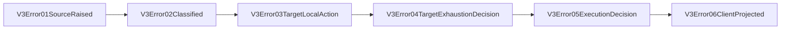
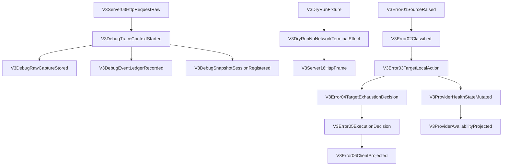

# V3 Foundation and Responses Direct Review

## Purpose

This is the human review surface for the RouteCodex V3 Rust foundation and first business lifecycle. The order is Config -> Server -> Debug -> Error/Provider health -> Virtual Router/Target -> Responses direct Pipeline/Provider.

Canonical documents:

- [V3 system definition](../../design/v3-system-definition.md)
- [V3 Rust module boundaries](../../design/v3-routecodex-rust-module-boundaries.md)
- [V3 runtime resource contract](../../design/v3-routecodex-runtime-resource-contract.md)
- [V3 foundation implementation order](../../goals/v3-foundation-implementation-order.md)
- [V3 resource operation map](../v3-resource-operation-map.yml)
- [V3 mainline call map](../v3-mainline-call-map.yml)
- [V3 verification map](../v3-verification-map.yml)

## Required mainline

Only the expanded Config chain is currently anchored. Early Server/direct prototype code exists, but the expanded Router/Target/Error/Debug contract is not fully bound. Responses direct is therefore not usable or complete.

## Ownership review

| Surface | Unique owner | Review rule |
| --- | --- | --- |
| Config file IO | `routecodex-v3-config::V3ConfigStore` | no other crate opens or writes `config.v3.toml` |
| Listener lifecycle | `routecodex-v3-server` | all enabled listeners start or aggregate startup fails |
| Full request lifecycle | `routecodex-v3-runtime` | no flow module or CLI owns a second lifecycle |
| Route hit | `routecodex-v3-virtual-router` | exactly one opaque target hit |
| Target expansion/reselection | `routecodex-v3-target` | internal failures never re-enter Virtual Router |
| Error taxonomy/actions | `routecodex-v3-error` | no local retry/cooldown policy copies |
| Health state/action execution | Provider runtime | provider/auth/model state never moves to Router/Error |
| Logs/snapshots/dry run | `routecodex-v3-debug` | side-channel only; same runtime kernel replay |
| Responses wire/transport | `routecodex-v3-provider-responses` | secret resolution occurs only at transport |

## Error side chain

Error emits health/cooldown actions; Provider applies them to provider instance, auth key, or canonical model state. Target queries availability and reselects inside the selected target. Only `TargetPoolExhausted` moves upward.

## P3/P4 Debug and Health Foundation

P3 Debug is owned by `routecodex-v3-debug`: trace context, event ledger, raw capture, transient snapshots, and dry-run fixtures are diagnostic side-channel resources. P4 Error is owned by `routecodex-v3-error`: every error uses adjacent builders from `V3Error01SourceRaised` through `V3Error06ClientProjected`. Provider health is owned by `routecodex-v3-provider-responses`: `V3ProviderHealthStateMutated` stores scoped provider/auth/model state, while `V3ProviderAvailabilityProjected` is read-only for later Target use. `V3DryRunNoNetworkTerminalEffect` is executed by the Runtime foundation kernel and must stop before provider send.

## Phase checklist

- [x] P0 definition documents created.
- [x] P0 maps/wiki/verifiers synchronized and green.
- [x] P1 full Config graph, nested forwarders, cycle rejection, declaration-only manifest.
- [x] P2 multi-listener Server and CLI startup.
- [x] P3 global Debug logs/snapshots/dry run.
- [x] P4 global Error and Provider health boundaries.
- [x] P5 one-hit Virtual Router and Target Interpreter source binding (runtime verification evidence below).
- [ ] P6 installed-binary Responses direct JSON/SSE evidence.

## P2 live evidence

- Built binary: `v3/target/debug/routecodex-v3`.
- Config fixture: `v3/fixtures/config.p2.toml`.
- Started listeners from one CLI process: `127.0.0.1:45444` and `127.0.0.1:45445`.
- `/health` returned `server_id=p2_primary` on `45444` and `server_id=p2_secondary` on `45445`.
- Pending `/v1/responses` and `/v1/messages` returned `501 not_implemented` with `V3Debug01NodeEventRegistered` and `V3Error06ClientProjected` headers/body.
- The exact CLI session was stopped with Ctrl-C and both test ports were confirmed closed.

## P3/P4 live evidence

- The actual built V3 CLI started the same dedicated `45444` and `45445` listeners from one process.
- A real pending Responses request returned `501` and the complete `V3Error01SourceRaised` through `V3Error06ClientProjected` chain.
- Debug state written on `45444` was visible through the shared Debug instance on `45445`; retained logs did not expose the submitted bearer secret.
- A real Dry Run returned six transient node snapshots, `no_network_send`, and `stopped_before_provider_send=true`; its request/response secrets were redacted.
- The snapshot registry was empty after Dry Run completion. A malformed Dry Run returned `500 v3_debug_failure` through the same six-node Error chain instead of panicking.
- The exact CLI session was stopped with Ctrl-C and both dedicated ports were confirmed closed.

## P5 contract binding

- `routecodex-v3-virtual-router` exclusively owns listener route-group resolution, explicit `default` pool resolution, and the single opaque target hit.
- `routecodex-v3-target` exclusively owns direct/nested Forwarder expansion, deterministic policy ordering, read-only Provider availability checks, and target-local reselection/exhaustion.
- `execute_v3_p5_routing_runtime` is the no-network P5 terminal path. It records adjacent nodes `03` through `10` through the shared Debug runtime and maps only full exhaustion into the existing six-node Error chain.
- P6 transport remains a later node and is not invoked by the P5 Server path.

## P5 live evidence

- The actual built `v3/target/debug/routecodex-v3` loaded `v3/fixtures/config.p5.toml` and started listeners `45454` (`p5_success`) and `45455` (`p5_exhausted`) in one process.
- The `45454` request traversed `V3Server03HttpRequestRaw -> V3Req04StandardizedResponses -> V3Router05..07 -> V3Target08..10`, hit Router once, skipped disabled `cc`, reselected `asxs` inside Target on attempt 2, and returned `stopped_before_provider_send=true` plus `x-routecodex-v3-no-network-send: true`.
- The `45455` request hit Router once, expanded one disabled candidate, emitted availability-skip and target-exhausted Debug events, then returned `503 selected_target_exhausted` through the complete six-node Error chain.
- The exact PTY process received Ctrl-C and both `45454` and `45455` were confirmed closed.

## Forbidden shortcuts

- Server/CLI -> Provider transport.
- Runtime/Server/Provider -> direct config file IO.
- Virtual Router -> provider/key health or forwarder expansion.
- Target failure -> Virtual Router re-entry.
- Error -> health-state storage.
- Debug snapshot -> live request/response truth.
- Pending endpoint -> handler-local hard-coded error response.
- Flow module -> independent complete lifecycle.
