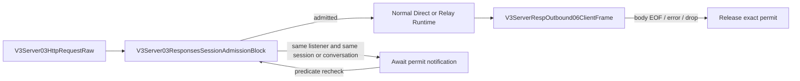

# V3 Responses Session Admission

## Owner

- Feature: `v3.responses_session_inflight_admission`
- Resource: `v3.server.responses_session_admission`
- Crate: `routecodex-v3-server`
- Node block: `V3Server03ResponsesSessionAdmissionBlock` inside the existing
  `V3Server03HttpRequestRaw` HTTP boundary.

## Lifecycle

## Contract

1. Each `V3ListenerState` owns one gate, so ports are isolated by construction.
2. Only `POST /v1/responses` participates.
3. `read_json_payload` remains the only HTTP JSON body parser. Admission runs
   immediately after its typed result and before Direct/Relay Runtime.
4. Explicit session and conversation identities come only from transparent
   protocol headers or `x-codex-turn-metadata`; request payload cannot construct
   this control identity.
5. A matching non-empty session or matching non-empty conversation waits inside
   the listener-local gate until the exact active permit releases.
6. Missing identities do not create a global or request-derived lock key.
7. Contention does not enter Error01-Error06, does not reach Runtime/provider
   transport early, and does not return an overlap error to the client.
8. The permit lives in the HTTP response body stream and releases on EOF,
   stream error, or client drop.
9. Permit release wakes all predicate waiters so a notification for one scope
   cannot strand a different scope whose permit has become available.

## Forbidden Owners

- Virtual Router
- Provider Action Gate
- continuation store
- Anthropic/OpenAI/provider codecs
- Provider Runtime
- SSE semantic projection

## Review Checklist

- [ ] Same listener and same session waits before provider capture, then returns
      200 after the active response body releases.
- [ ] Same listener and different session remains concurrent.
- [ ] Different listeners and the same session remain concurrent.
- [ ] EOF, stream error, and client drop release the exact permit.
- [ ] A real TCP client disconnect releases before provider EOF.
- [ ] No client-visible admission error, fallback, history repair, or
      provider-specific branch exists.
