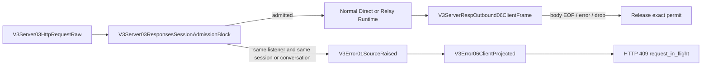

# V3 Responses Session Admission

## Owner

- Feature: `v3.responses_session_inflight_admission`
- Resource: `v3.server.responses_session_admission`
- Crate: `routecodex-v3-server`
- Node block: `V3Server03ResponsesSessionAdmissionBlock` inside the existing
  `V3Server03HttpRequestRaw` HTTP boundary.

## Lifecycle

## Contract

1. Each `V3ListenerState` owns one gate, so ports are isolated by construction.
2. Only `POST /v1/responses` participates.
3. `read_json_payload` remains the only HTTP JSON body parser. Admission runs
   immediately after its typed result and before Direct/Relay Runtime.
4. Explicit session and conversation identities come from transparent protocol
   headers, `x-codex-turn-metadata`, or body `client_metadata`.
5. A matching non-empty session or matching non-empty conversation conflicts.
6. Missing identities do not create a global or request-derived lock key.
7. Conflict enters Error01-Error06 before Runtime and provider transport.
8. The permit lives in the HTTP response body stream and releases on EOF,
   stream error, or client drop.

## Forbidden Owners

- Virtual Router
- Provider Action Gate
- continuation store
- Anthropic/OpenAI/provider codecs
- Provider Runtime
- SSE semantic projection

## Review Checklist

- [ ] Same listener and same session conflicts before provider capture.
- [ ] Same listener and different session remains concurrent.
- [ ] Different listeners and the same session remain concurrent.
- [ ] JSON and SSE conflicts use standard Error06 projection.
- [ ] EOF, stream error, and client drop release the exact permit.
- [ ] A real TCP client disconnect releases before provider EOF.
- [ ] No queue, fallback, history repair, or provider-specific branch exists.
