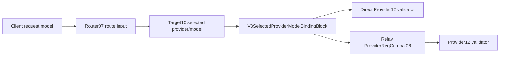

# V3 Selected Provider Model Binding

## Purpose

Keep the client request model and the selected Provider model as different resources. The client
model is route input. The selected target `wire_model` is the sole upstream request model truth.

## Architecture rule

Virtual Router remains payload-pure: it selects an opaque target and does not mutate request JSON.
Target resolution freezes `{provider_id, model_id, wire_model}`. Immediately after that truth exists,
`selected_provider_model_binding.rs` is the only block allowed to replace `body.model`.

Provider wire validates `body.model == selected.wire_model`. It never silently repairs a stale
client alias. A mismatch is an internal pipeline contract failure, not a Provider failure.

## Mainline bindings

| Step | Path | Contract |
| --- | --- | --- |
| `v3-model-bind-01` | Direct Target10 -> binding | Bind selected `wire_model` once. |
| `v3-model-bind-02` | Direct binding -> Provider12 | Provider12 validates the bound model. |
| `v3-model-bind-03` | Relay Req07 -> binding | Convert protocol shape, then bind selected `wire_model`. |
| `v3-model-bind-04` | Relay binding -> ProviderReqCompat06 | Compat consumes Provider model truth, not client alias. |

## Direct and Relay

- **Direct** calls the shared binding owner before `build_v3_provider_12_responses_wire_payload`.
- **Relay** calls the same owner before `run_req_outbound_stage3_compat` for Responses, OpenAI Chat,
  Anthropic, and Gemini.
- Retry/reselection rebuilds from the request semantic source and binds the newly selected target;
  the previous attempt model cannot leak.

## Forbidden paths

- Virtual Router or Target mutating payload JSON.
- Direct and Relay implementing separate model mapping rules.
- Provider12 overwriting `body.model` to hide an earlier contract violation.
- Provider suffix/prefix cases such as upstream billing aliases inside Hub/Router.
- Treating local model-binding mismatch as provider health/cooldown input.

## Review checklist

- [ ] `request.model` is used only as route input before target selection.
- [ ] `candidate.wire_model` is non-empty and bound by the shared owner.
- [ ] Provider compatibility receives the bound payload.
- [ ] Provider wire validates rather than repairs.
- [ ] Direct, Relay, and reselection positive/negative tests pass.
- [ ] Provider-request snapshots prove each attempt uses its own selected wire model.
