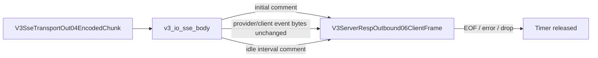

# V3 SSE HTTP Keepalive

## Boundary

`v3_io_sse_body` runs after client semantic projection and before Axum writes
the successful Responses SSE body. It emits only the standard SSE comment
`: keepalive`.

## Invariants

1. Direct and Relay successful Responses SSE start with one immediate comment.
2. Idle streams use `ROUTECODEX_HTTP_SSE_KEEPALIVE_MS`, then
   `RCC_HTTP_SSE_KEEPALIVE_MS`, with the V2 default of 3000 ms.
3. Provider/client event bytes and event order are unchanged.
4. Error06 SSE starts with `event: error`; no success keepalive is prepended.
5. EOF, provider stream error, and client body drop release the timer.
6. Keepalive owns no continuation, tool, routing, provider, or terminal
   semantics.
