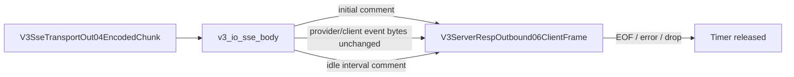

# V3 SSE HTTP Keepalive

## Boundary

`v3_io_sse_body` runs after client semantic projection and before Axum writes
the successful Responses SSE body. It emits only the standard SSE comment
`: keepalive`.

- Scheduling owner: `v3.sse_http_keepalive_boundary` in
  `routecodex-v3-server`.
- Comment encoding owner: `v3.sse_transport_core_independent` in
  `routecodex-v3-sse`.
- Interval truth owner: `routecodex-v3-config` publishing
  `V3Config05ManifestPublished`.

## Invariants

1. Direct and Relay successful Responses SSE start with one immediate comment.
2. Config compilation reads only `ROUTECODEX_HTTP_SSE_KEEPALIVE_MS`, publishes
   the validated positive interval in each `V3ServerManifest`, and uses 3000 ms
   only when the canonical setting is absent.
3. Empty, malformed, zero, or non-UTF-8 canonical values fail config
   compilation before any listener binds. `RCC_HTTP_SSE_KEEPALIVE_MS` is
   rejected and never acts as a fallback or second truth.
4. Provider/client event bytes and event order are unchanged.
5. Error06 SSE starts with `event: error`; no success keepalive is prepended.
6. EOF, provider stream error, and client body drop release the timer.
7. Keepalive owns no continuation, tool, routing, provider, or terminal
   semantics.
