# Virtual Router Route Availability Mainline Source

## Purpose

This page is the review surface for one specific invariant only:

- when an ordinary route pool is filtered by exclusion, health, quota, protocol, or forwarder availability, the runtime must not project `PROVIDER_NOT_AVAILABLE` while a default-pool last provider still exists.

This page does not replace the canonical owner docs. Runtime owner and gate truth remain:

- `docs/architecture/function-map.yml`
  - `feature_id: vr.route_availability_floor`
  - `feature_id: virtual_router.primary_exhausted_to_default_pool`
  - `feature_id: vr.provider_forwarder_runtime`
- `docs/architecture/verification-map.yml`
- `docs/architecture/mainline-call-map.yml`

This page exists because the live 10000-port incident showed that "route pool empty" and "provider globally unavailable" are not the same thing. The review surface must make that distinction queryable before code changes.

## Main Rule

- Ordinary route-pool filtering and default-pool protection are Rust Virtual Router truth.
- The filter order may exclude the current route pool, but the runtime must still distinguish:
  - ordinary route exhausted, default pool still available
  - ordinary route exhausted, default pool also exhausted
- The last provider of the default pool is a hard availability floor.
- No TS executor, handler, provider runtime, or error mapper may re-decide this floor locally.
- Forwarder collapse is not terminal by itself. A `fwd.*` candidate becoming empty must still be evaluated against the route/default-pool floor before client projection.

## Mainline

```mermaid
flowchart LR
  VrAvail01RouteCandidates["VrAvail01RouteCandidates<br/>route-tier targets before exclusion"]
  VrAvail02PoolFiltered["VrAvail02PoolFiltered<br/>ordinary route candidates after exclusion/health/quota/protocol/forwarder filtering"]
  VrAvail03DefaultFloorEvaluated["VrAvail03DefaultFloorEvaluated<br/>default-pool last-provider guard evaluated"]
  VrAvail04PrimaryExhaustedPlanned["VrAvail04PrimaryExhaustedPlanned<br/>primary_exhausted -> default_pool plan"]
  VrAvail05ExecutionDecision["VrAvail05ExecutionDecision<br/>mayProject=false until both route+default empty"]

  VrAvail01RouteCandidates -->|vra-01| VrAvail02PoolFiltered
  VrAvail02PoolFiltered -->|vra-02| VrAvail03DefaultFloorEvaluated
  VrAvail03DefaultFloorEvaluated -->|vra-03| VrAvail04PrimaryExhaustedPlanned
  VrAvail04PrimaryExhaustedPlanned -->|vra-04| VrAvail05ExecutionDecision
```

## Stage Contract

| step | transition | unique owner | semantic input | semantic output |
| --- | --- | --- | --- | --- |
| `vra-01` | route candidates -> filtered route pool | `vr.provider_forwarder_runtime` + `vr.route_availability_floor` | route-tier targets plus request-scoped exclusion/health/quota/protocol state | filtered ordinary route pool, unavailable-route-pool details, forwarder empty-vs-real-target evidence |
| `vra-02` | filtered route pool -> default floor evaluated | `vr.route_availability_floor` | filtered ordinary route pool and blocker details | explicit knowledge whether the request has reached the default-pool last-provider floor |
| `vra-03` | default floor evaluated -> primary exhausted plan | `virtual_router.primary_exhausted_to_default_pool` | primary exhausted route name, exhausted targets, configured route tiers, known targets | declarative default-pool plan only, never local synthesis |
| `vra-04` | primary exhausted plan -> ErrorErr05 execution decision | `vr.route_availability_floor` via Rust native decision contract | route/default tiers, route pool, provider key, excluded providers, and default-pool plan context | Rust-owned ErrorErr05 availability decision: `remainingRouteCandidates`, `defaultPoolAvailable`, `routePoolAuthoritative`, `verifiedLastProvider`, `policyExhausted`, and `mayProject` |

## Owner Binding

### `vra-01` Filter owner

Rust source of truth:

- `sharedmodule/llmswitch-core/rust-core/crates/router-hotpath-napi/src/virtual_router_engine/engine/selection.rs`
  - `resolve_forwarder_candidate_for_pool`
  - `collect_recoverable_cooldown_for_key`
  - `build_provider_not_available_error`
- `sharedmodule/llmswitch-core/rust-core/crates/router-hotpath-napi/src/virtual_router_engine/forwarder.rs`
  - `ForwarderRegistry::select`

Contract:

- forwarder target filtering may collapse a `fwd.*` candidate
- that collapse is still route-pool-local truth, not final client projection truth
- unavailable-route-pool details must preserve `poolTargets`, `candidateProviderKeys`, and `forwarder_no_available_target`

### `vra-02` Default floor owner

Rust source of truth:

- `sharedmodule/llmswitch-core/rust-core/crates/router-hotpath-napi/src/virtual_router_engine/engine/selection.rs`
  - `evaluate_singleton_route_pool_exhaustion`
  - `build_provider_not_available_error`

Contract:

- if the current empty pool is still upstream of a default pool with remaining providers, this is not terminal
- default-pool last-provider truth must not be reconstructed in TS from ad hoc routePool arrays alone

### `vra-03` Default-pool planner owner

Rust source of truth:

- `sharedmodule/llmswitch-core/rust-core/crates/router-hotpath-napi/src/virtual_router_engine/routing/primary_exhausted_to_default_pool.rs`
  - `plan_primary_exhausted_to_default_pool`
- NAPI bridge:
  - `sharedmodule/llmswitch-core/rust-core/crates/router-hotpath-napi/src/primary_exhausted_to_default_pool_blocks.rs`

Contract:

- route-tier to default-pool transition is declarative and Rust-owned
- host may pass route-scoped tiers unchanged
- host must not synthesize a target list, invent backup tiers, or bypass empty/unknown states

### `vra-04` ErrorErr05 availability decision owner

Rust source of truth:

- `sharedmodule/llmswitch-core/rust-core/crates/router-hotpath-napi/src/virtual_router_engine/routing/error_err05_availability.rs`
  - `resolve_error_err05_route_availability_decision`
- NAPI / host bridge:
  - `sharedmodule/llmswitch-core/rust-core/crates/router-hotpath-napi/src/lib.rs`
    - `resolve_error_err05_route_availability_decision_json`
  - `src/modules/llmswitch/bridge/native-exports.ts`
    - `resolveErrorErr05RouteAvailabilityDecisionNative`
- TS consumers:
  - `src/server/runtime/http-server/executor/request-executor-core-utils.ts`
    - `resolveErrorErr05RouteAvailabilityDecision`
- `src/server/runtime/http-server/index.ts`
- `src/server/runtime/http-server/request-executor.ts`

Consumer contract:

- TS may pass route/default tiers, route pool, provider key, and excluded provider keys into Rust unchanged
- TS may log, wait, and replay with the Rust-derived decision
- TS must not decide terminal projection before Rust returns `defaultPoolAvailable=false`
- TS must not locally compute remaining route candidates, routePoolAuthoritative, verifiedLastProvider, or default-pool availability
- TS must not reinterpret forwarder empty as global no-provider

## Incident Interpretation Rule

For a live symptom like:

- one session returns `PROVIDER_NOT_AVAILABLE`
- another session on the same port still gets 200

the first question is not "how can both be true at once?"

The first question is:

- did the failing request hit a route-local filtered-empty pool while another request hit a different route, different sticky target, or different surviving default path?

If yes, the system may still be globally healthy while a route-local floor check is wrong or incomplete.

## Required Gates

- `npm run verify:architecture-mainline-call-map`
- `npm run verify:function-map-compile-gate`
- `npm run verify:request-executor-routepool-contract`
- `npm run verify:vr-route-availability-default-floor`

## Required Tests

- `tests/red-tests/vr_route_availability_floor_singleton_truth.test.ts`
- Rust unit tests in `sharedmodule/llmswitch-core/rust-core/crates/router-hotpath-napi/src/virtual_router_engine/routing/error_err05_availability.rs`
- `tests/server/runtime/http-server/executor/request-executor-primary-exhausted-plan.spec.ts`
- `tests/server/runtime/http-server/router-direct-pipeline.candidate-exhaustion.spec.ts`
- `tests/server/runtime/http-server/provider-direct-pipeline.candidate-exhaustion.spec.ts`
- `tests/sharedmodule/virtual-router-quota-health-shadow-regression.spec.ts`

## What Must Never Happen

- ordinary route pool empties and client gets terminal `PROVIDER_NOT_AVAILABLE` while default pool still has one remaining provider
- forwarder empty is treated as global no-provider without default-floor check
- TS executor/handler adds a second copy of default-pool availability logic
- a request excludes the last default provider without proving the default pool is already empty
