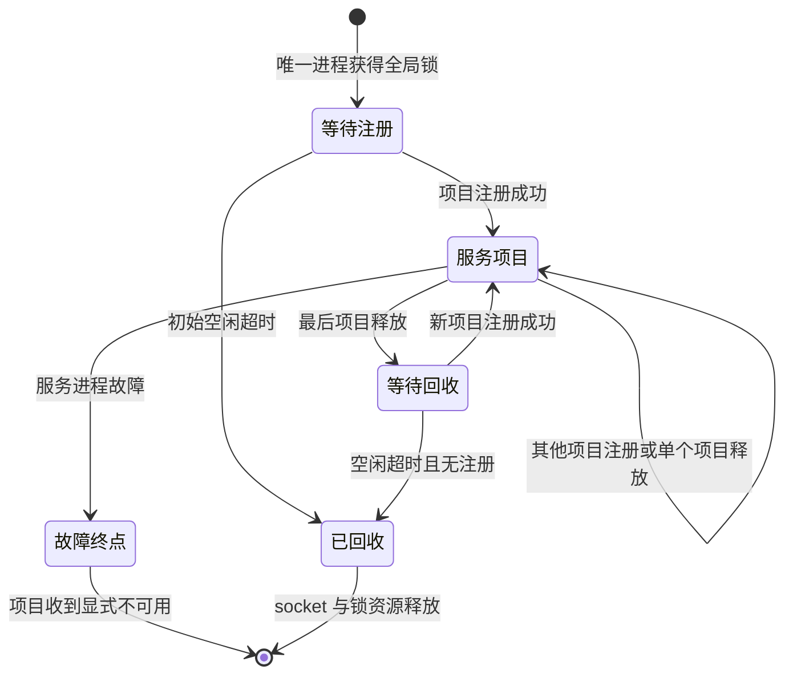

# hooksd 全局共享与项目回收

状态：设计准入；未实现。候选基线：688f7a1c6a15ecf45dfee12cc430148ae3c03898。

项目图：[hooksd-project-registration.graph.json](../architecture/dags/hooksd-project-registration.graph.json)，位于现有控制面功能图治理目录，使用 verify:v3-dagpipe-feature-graphs；代理 request/response/error 目录与 modules.json 不登记此图。资源声明在现有 v3-resource-operation-map.yml 标记 implementation_pending，不能宣称源代码锚点已经实现。

用户目标：同一用户只运行一个 hooksd，各项目注册独立控制资源；项目停止或异常退出均回收注册，最后注册释放后回收 daemon。现有每实例启动进程的模式必须移除。

## 对象与边界

- daemon：同一操作系统用户的共享服务。固定入口为安装后的 rccv3-hooksd；目录从当时 HOME 派生，默认 $HOME/.rcc/hooks。全局锁贯穿进程生命周期，竞态启动只允许一个获锁进程。
- 项目注册：canonical instance directory + registration generation；生命周期持有 Unix connection lease。不同注册拥有独立 HooksSidecarCore、handlers、schedules、intent ledger、App Server socket 配置和 state file。
- 项目控制 socket：继续使用实例的 hooks-sidecar.sock，由共享 daemon 在该项目注册存续期间提供；现有 runtime consumer 不改变协议。一个进程可以拥有多个项目 listener，不产生项目子进程。
- 生命周期：负责注册/释放 lease，不能给共享 daemon 发 Shutdown 或向其进程组发信号。进程崩溃会关闭 lease；daemon 删除对应注册并停止其 listener/timer/连接线程，identity 校验后删除自己的 socket。
- 全局服务：只负责注册表及空闲回收。注册加载失败显式返回错误；不得使 RCC listener 启动失败。全局控制资源不可承载业务 payload。
- 兼容边界：显式 legacy_supervisor 配置保持原独立外部进程契约；internal_hooksd 唯一启动路径替换为共享注册，不保留第二条 internal 启动链。

## 事件与状态

| 事件 | 生产者 → 消费者 | 状态作用 |
|---|---|---|
| 项目请求注册 | RCC lifecycle → daemon | 校验注册并绑定独立项目资源 |
| 注册成功/失败 | daemon → lifecycle | 发布 hooks available/unavailable；RCC 保持 running |
| 项目停止/进程退出 | lease close → daemon | 停止项目资源，释放注册 |
| 最后注册释放 | registry → daemon | 开始有限空闲窗口；窗口内新注册取消回收 |
| 空闲窗口结束 | daemon clock → daemon | 无注册且无进行中的注册时退出，释放 socket/lock |
| daemon 断开 | global connection → lifecycle | 显式 hooks_unavailable:crashed，不自动补偿/伪成功 |

项目注册 DAG 单入口为 typed registration，单出口为 disposition。节点内部处理成功/失败/取消；取消和失败也先释放本次拥有的资源再抵达出口。状态机中的新注册是新的执行，图无回边。

## 注册、竞争与清理的具体约束

注册请求只接受 canonical instance directory，控制 socket 固定为该目录 hooks-sidecar.sock，state 固定为该目录 hooks-sidecar-state.json；客户端不提供任意删除路径。同目录活跃注册重复请求返回 AlreadyRegistered，禁止替换配置或并发写相同 state。项目标识来自实例目录，不从业务请求恢复。项目 socket 权限 0600；全局目录 0700；全局 socket 0600；不跟随现有目录/socket/state symlink。

全局互斥使用同一固定 lock inode 的 flock：创建者贯穿整个 daemon 生命周期持锁，不 unlink 锁文件；进程退出释放锁，不创建第二套 owner。只有获锁后、确认已有服务不可连接、路径为本用户所拥有的 socket 时，才清理 global stale socket。无锁的重复启动显式 AlreadyRunning 并退出。无 socket 参数、help、未知参数均有限时间退出，不能 ready 后无条件 sleep。

登记中连接、已注册 lease、正在 drain 的项目都计入服务存续条件；新登记与退出判断由同一 registry mutex 串行化。接受连接之后先计入登记中，再启动限时读取；初始空闲和最后释放后的空闲窗口均为 5 秒。读取注册 JSON 的截止时间为 5 秒，部分数据不能延长截止时间。空闲判定成立后先关闭 listener，再释放 socket 和锁；恰逢退出的注册取得显式连接失败，新执行可重新获取服务，不能误报注册成功。

lease 是生命周期独占连接；创建时设置 CLOEXEC，禁止 fork/exec child 继承延长生命。停止发送 typed release 并读取清理 ACK；异常 close 同样触发回收。项目进入 closing 后不接受新业务连接；关闭所有已有业务 stream，唤醒阻塞读取，停止 timer，join 所有已登记 worker，不 detach 丢失归属；等待现有真实外部执行按其既有 deadline 结束，draining 期间不得删项目 state、重注册同目录或触发全局退出。native transport 当前单次 timeout 为 15 秒；web-search adapter 已按请求 deadline 与配置 timeout 取最小值并回收自己的 child。若某执行未能收口，项目保持 closing 并显式报告 cleanup incomplete；不能跨项目终止 daemon 来掩盖它。任务验收必须覆盖该实际最长清理边界，不能用 2 秒 RCC 主进程 stop timeout 当作项目清理证明。

项目 clean ACK 在停止 listener/timer、关闭流、join workers、identity-bound unlink socket 后发送；global daemon 失去连接时 lifecycle 记录 hooks_unavailable:crashed。启动/加载失败的局部资源由 RAII guard 清理；注册成功前可失败，不得创建没有 lease 的持久驻留项目。SIGKILL 后的 stale 项目 socket 仅在全局锁下、同目录无注册且身份/路径确认后回收；state 不删除以保留 delivery/schedule 语义。

| 业务节点 | 唯一 owner / 绑定 | 可观察验收 |
|---|---|---|
| 获取共享服务 | lifecycle / hooks shared registration client | 多项目同时注册得到同一 daemon PID；重复启动没有第二个 daemon |
| 建立隔离项目 | hooks / project registration server | 同名 handler/schedule/intent 可独立使用；配置失败无半注册 |
| 服务项目直到释放 | hooks / scoped ControlServer | 实际 Unix JSON-lines 请求、timer 与 lease close；慢项目不堵其他项目 |
| 回收本次注册 | hooks / registration guard | 正常停止、owner SIGKILL、注册失败、取消均无项目 socket/thread 泄漏 |
| 记录注册终点 | lifecycle / typed status | 退出证据或 hooks_unavailable；不把关闭项目等同于关闭共享 daemon |

## 修改范围与验收

仅 hooks crate、lifecycle hooks_sidecar owner、对应 tests、现有四 maps 与设计文档。runtime/provider/request/response/routing 不改。

先确认 installed binary、构建依赖、真实 Unix 注册/控制入口、全局锁、独立 review、安装与管理 restart 能力。任何必需能力缺失先停在能力准入，禁止产品编码。

黑盒验收：并发 A/B 注册只一个进程；隔离 handler/schedule/intent 与 state；停止 A 不影响 B；杀死 A owner 自动回收 A；最后 B 退出后 daemon 有限时间退出；重复 30 轮启动/停止不累积进程/socket/thread；无注册的错误启动不永久驻留；服务故障保持 RCC running 并显式 degraded。项目注册失败与 slow clients 覆盖有界清理。

实现后依次 hooks/lifecycle tests、distribution gate、四 maps/architecture gates、候选重建安装、managed restart + 同入口黑盒、独立架构 review、最新 main 组合复验、合入与远端回执、资源清理。图验证仅证明静态拓扑，不等同于 runtime 接线或功能完成。
