# V3 Provider Directory Config Design

## Objective

Move Provider authoring truth out of the V3 root TOML and into the V2-compatible sibling directory:

```text
<rcc-home>/config.v3.toml
<rcc-home>/provider/<provider-id>/config.v2.toml
```

The root config owns servers, route groups, forwarders, global features, debug, and error policy. Each Provider file owns its provider identity, transport/profile, auth handles, models, health, provider semantic policy, and provider-request cleanup.

## Resource contract

- Root authoring resource: `config.authoring_surface@V3Config01FileSource`.
- Provider source resource: `v3.config.provider_source_closure@V3ProviderDirectory02ReferencedSource`.
- Published truth: `config.provider_profile_projection@V3Config05ManifestPublished`.
- Runtime consumes only `V3Config05ManifestPublished`; it never scans `provider/`.
- Provider files are config/control resources and never enter provider/client payloads.

## Deterministic source mode

Native V3 root parsing has two explicit authoring modes:

1. `providers` non-empty: legacy inline mode. Every referenced provider must be inline; no Provider directory file is read.
2. `providers` absent or empty: directory mode. Every provider referenced by a forwarder or route-pool provider target must resolve at exactly `provider/<id>/config.v2.toml`.

Partial mixing is rejected. Missing files, identity mismatch, unsupported provider types, malformed auth, and invalid V3 extension fields fail before manifest publication. This is an input-format branch, not parse-failure fallback.

## Directory codec

`config.v2.toml` remains the Provider authoring codec. Existing V2 fields retain their meaning. V3-only Provider policy is stored under an optional `[provider.v3]` extension:

```toml
version = "2.0.0"
providerId = "cc"

[provider]
id = "cc"
enabled = true
type = "responses"
baseURL = "https://example.invalid/openai/v1"
defaultModel = "gpt-5.5"

[provider.auth]
type = "apikey"
entries = [{ alias = "key1", tokenFile = "/path/to/token" }]

[provider.v3]
health = { enabled = true, failure_threshold = 3, cooldown_ms = 900000 }
provider_request_cleanup = { historical_fields = ["reasoning.encrypted_content"] }
```

The extension does not create runtime-specific files or a second Provider format. It lets the shared directory codec carry V3 policy without returning Provider definitions to the root TOML.

## Source identity

`V3ConfigLoadedSnapshot.source_sha256` hashes the complete authoring closure in deterministic order:

- canonical root source label + raw root TOML;
- each referenced canonical Provider source label + raw Provider TOML, sorted by provider id.

Changing only a Provider file therefore changes the managed instance identity and is visible to lifecycle restart logic. Secret values are never included in debug projection or manifest output.

## Mainline

```mermaid
flowchart LR
  A[V3Config01FileSource] --> B[V3Config02AuthoringParsed]
  B --> C[V3ProviderDirectory02ReferencedSource]
  C --> D[V3ProviderDirectory03ProviderCompiled]
  D --> E[V3Config03SchemaValidated]
  E --> F[V3Config04ResourceRegistryBuilt]
  F --> G[V3Config05ManifestPublished]
```



`V3ProviderDirectory02/03` are compiler-owned internal blocks between authoring parse and schema validation; they do not add runtime pipeline nodes.

## Forbidden designs

- Runtime/server/CLI dynamically scanning Provider directories.
- Reading every directory and treating incidental files as enabled providers.
- Partial inline/directory merging or silent source precedence.
- Provider-specific branches in Hub Pipeline or Virtual Router.
- Copying Provider auth/config into request metadata or wire payload.
- Hashing only `config.v3.toml` while ignoring referenced Provider sources.
- Falling back to inline providers after a directory Provider fails to parse.
