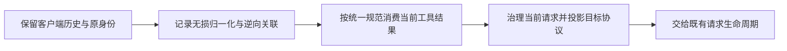

# REQ02 canonical history consumer admission

Status: supplemental design for independent admission. No product implementation.
Owner: /root; author repairs and final delivery remain incomplete.

## Bound evidence and scope

The active source is the task-owned candidate
`/Volumes/Intel/playground/routecodex/req02-latest-combination-20261007-r205`,
HEAD `e7e64ee6920f07ce249a125d839fc9a5f75fb1eb`,
MERGE_HEAD `79d38a4343daa551053758aba695071d05547961`, with working repairs.
The candidate is not installed or merged. This design tree is documentation only.
Remote refresh failed twice with SSL_ERROR_SYSCALL; this is not latest-main evidence.

Existing evidence root:
`/Volumes/Intel/playground/routecodex/.worker-runs/dagpipe-parallel-foundation-20261005`.

- `req02-gemini-http-owner-r232/records/result.md` identifies the actual HTTP
  divergence. Its recommendation to add name-based admission is not adopted:
  admission would still reject the already-required native orphan/empty-name
  preservation cases in `hub_relay_request_semantics.rs`.
- `parent-req02-server-r231/gemini-http-after-producer.log` proves Relay with-ID
  passes and Relay without-ID terminates before provider send with
  `malformed tool output at input index 3: call_id is required`.
- `parent-req02-server-r231/public-nine-and-four.log` proves public normalization
  and native projection preserve the named no-ID result.
- `r235-admission.exit` and `r235-architecture.exit` are zero, with43/43
  static gates. They do not prove HTTP or tool execution acceptance.

## Contract and first divergence

RouteCodex preserves representable history. REQ02 records actual source identity,
optional IDs, names, native container anchors and inverse relations in typed
request resources. Canonical business values remain in messages. A result need
not have an ID when its native protocol represents it without one. A native
result may also be carried without a locally visible call: remote continuation
and partial history do not authorize inventing or rejecting a counterpart.

Canonical Req04 must consume that preserved history. It must not add an
independent rule requiring every tool result to have an ID and a call in the
current local payload. That rule does not establish a trust boundary or a target
representation limit. It duplicates identity handling and rejects passable data.

Actual order:
`relay_runtime_core -> REQ02 SDK normalization -> relay_request run_from_normalized
-> govern_tool_outputs_at_req04 -> govern_chat_tool_outputs_at_req04 -> Req04`.
The canonical branch's missing-ID/orphan-ID rejection is the first divergence.
No second normalizer or temporary Responses projection causes this failure.

## Existing DAG, one owner and bounded change

Reuse `docs/architecture/dagpipe/v3.operation_runner.request.graph.json`.
This is a necessary consumer correction for REQ02's admitted canonical output,
not full REQ05 implementation or an extra graph node. Graph topology, control
resources, attempt loop and protocol profiles remain as declared.

Unique owner: `hub_v1/relay_request.rs::govern_chat_tool_outputs_at_req04`.
Replace its canonical identity admission with a read-only count of role=tool
messages from the supplied current-history offset. Physically delete the
canonical call-ID collection and missing/orphan rejection. Do not add name-based
admission, native-protocol branches, inferred/fake IDs, or another pairing store.
Canonical data and typed request identity must pass unchanged. The subsequent
registered governance/projection consumes the current data and existing inverse.

The separate Responses-native input branch remains unchanged in this slice.
Actual Responses field representation limits at native codec/standard Outbound
are not loosened. The ID helper remains only where that unchanged branch calls
it; remove only code made unreachable by this canonical correction.

Allowed product file: `v3/crates/routecodex-v3-runtime/src/hub_v1/relay_request.rs`.
Allowed existing regression changes: the two orphan admission assertions in
`tests/hub_relay_request_semantics.rs` and
`tests/hub_relay_tool_servertool_multiturn_parity.rs`, replaced by stronger
public normalize/govern/inverse preservation assertions and result counts.
Keep their successful pairs, complete bytes, missing-ID preservation, cross-kind
cases and trust-boundary failures. All paths above are runtime-crate-relative.
The Server fixture `req02_gemini_native_container_http.rs` remains unchanged
during the product repair; run its actual supported Relay cases independently.

Forbidden: REQ06 operator/projection owner changes, model-specific mapping,
Compat repair, output compensation, candidate selection/error policy changes,
fake IDs, history stripping, silent failure, local continuation and premature
production cutover. Author/test workers own disjoint files.

## Gemini Direct fixture applicability

The maps explicitly mark Gemini Direct pending/unsupported; the real Server
dispatch only implements Gemini Relay. The HTTP fixture fabricates
`implemented=true` by replacing the real Relay binding. Public Direct projection
does not prove a supported Direct HTTP entry. Preserve the two original red
Direct cases and their evidence; do not skip, delete or weaken them to claim
green. Resolve the test declaration independently before final acceptance.
No Gemini Direct Server capability is admitted by this document.

## Verification and lifecycle

Before product repair, run existing public governance fixture to capture red
no-ID/empty-name/native-result cases. After repair:

1. Existing Runtime `hub_relay_request_semantics` and
   `hub_relay_tool_servertool_multiturn_parity` public consumers pass. Canonical
   inverse preserves actual orphan IDs and native no-ID/name/empty-name values.
2. Real Server fixture filter `relay_http` passes with-ID and without-ID. Actual
   provider capture preserves full contents/siblings/generation/tools; client
   gets the controlled valid response. No fake ID is introduced.
3. Existing native container9/frozen4 remain unchanged and pass.
4. Existing Direct JSON/SSE, shared Relay protocol/scope tests and affected
   parity/architecture gates pass after stable source formation.
5. Full candidate HTTP/SSE/WS, gpt-5.5/gpt-5.6 exec/native patch/MCP execution,
   results and follow-up, runtime installation/restart, final architecture review,
   latest-main integration/push and owned cleanup remain required for REQ02.

The correction adds no resources. Existing request/attempt finalizer remains
the sole success/failure/cancel/disconnect/Drop cleanup owner. A failure does not
become success; provider/error decisions remain typed and outside this node.
Each implementation/validation stage records exact source and environment.
Design admission is not code acceptance or node completion.
