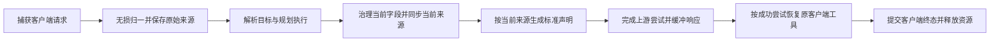
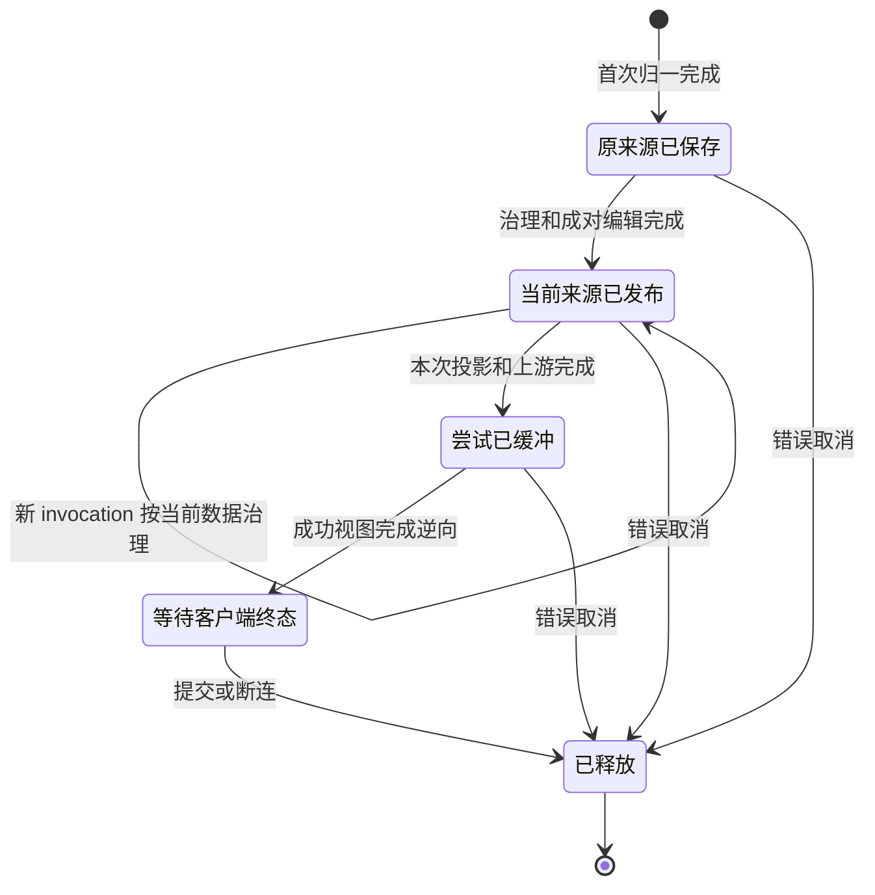

# REQ02 消费补链：当前字段来源关联

状态：待独立设计准入。只定义现有 request 图的 typed 资源边和字段算子合同；无生产接线、无实现完成声明。实现 review 仍须作者测试及真实入口 E2E 全通过。

## 已复现的缺口

作者实际 SDK capture → REQ02 normalize → 当前 canonical namespace 删除第一个子工具 → 既有 Chat 标准 emitter。wire 正确只剩 `functions__exec`，但返回的 declaration record ID 指向已删除的 custom `apply_patch`。原 ID `opaque-2`，应为 `opaque-3`。

证据：`/Volumes/Intel/playground/routecodex/req02-main327-20261004/.execution/sdk-emission-shift-red-r1.log` 与 `.exit`（0 PASS、1 FAIL、exit101）；测试 `chat_emission_after_preceding_declaration_removal_keeps_surviving_source`。因果边界：原始来源只按 canonical 初始数组地址登记；数组移位后，这个地址已经指向另一声明。名字/schema/模型完全不参与确认。

原请求 inverse/history pair 是不可变客户端真源；它的 destination 是**归一完成时地址**，不能冒充 Chat Process 之后的当前地址。禁止改写原 pair、重放旧值、按工具名/schema猜 ID、用拒绝请求掩盖错配。

## 最小资源与唯一 owner

复用现有 `V3RequestContextHandle` 的 request-local 固定 slots，增加一个 `v3.operation_runner.current_field_associations`，不建跨请求 registry 或第二 MetadataCenter。资源只存原 FieldMapping 的稳定引用与当前结构路径；参数、patch、schema、结果值仍只在 canonical 数据。

概念类型：`CurrentFieldAssociation { original_mapping_index, current_destination }`。`original_mapping_index` 引用同一 request 不可变 inverse.field_mappings 内的记录；原工具 record ID/name/kind/namespace 继续由该记录 source_path 及原 tool_declarations 读取。多来源折叠允许多条不同来源关联到同一当前地址；来源不得因值相同而合并。

唯一资源 writer 为现有 Chat Process 节点 `V3OperationRunnerGovernChatRequest`。首次 client entry 在任何治理算子前按原 inverse 的实际 emitted destination 建立本地关联，然后每个真实结构变换同时修改数据和关联，最后成对交付当前 canonical ARC 与当前 typed 关联。Direct 分支在该节点只登记关联，不改业务数据。REQ02 只负责原 pair，不成为当前槽的第二 writer。

Retry/InternalFollowup 保留同一 original pair；治理节点从请求当前关联及同一当前 canonical 继续，而非重新从初始 destination 建图。新增内部或发现工具没有原 FieldMapping 时不伪造客户端来源。纯追加未改变旧关联；旧关联的存活和移位只能由拥有该变换的注册算子决定。

## 字段算子行为

共享字段库提供结构编辑的来源伴随行为。配置只选择已注册算子及 typed 路径参数，不能改固定节点次序。

| 当前数据操作 | 同一实际操作点的关联行为 |
| --- | --- |
| 修改 schema/参数容器内的字段值 | 来源 ID 不变；完整值原样搬运，不解析工具参数业务语义 |
| 删除数组元素 | 删除该元素所有关联；后续元素路径减一；原客户端 record 保留于 immutable pair |
| 移动/排序元素 | 将该元素全部关联随同一个实际元素迁移；不扫描名字/schema推断 |
| 插入新元素 | 原有后续元素路径加一；新元素只使用该 producer 明确提供的来源，没有来源则为新来源 |
| 扁平化 namespace、custom/function 标准表示转换 | 同一遍历和实际 emit 点将本元素来源传给最终 wire 声明；最终 kind/name/namespace 来自实际声明及实际 namespace 容器 |
| 过滤 hosted 工具、refresh/去重替换 | 使用实际选择的元素来源；不保留被过滤/被替换元素的关联 |

结构路径解析复用已有 `project_canonical_paths` 的字段/数组解析能力，不用字符串正则修地址。结构算子只处理字段树和来源引用，不执行工具，也不穷举/解析命令、patch 或 MCP 参数。

数据与关联必须由一个公开的成对编辑接口交付；准备失败不得仅提交一半。调用者不能先裸改 Value 后让 observer 从原请求猜恢复。现有裸数组编辑 caller 在本次必需消费边界改为委托此注册算子，删除被替代的编辑分支；未接入的后续完整节点不冒充已迁移。

## 标准投影与响应

统一 projection helper 同时接收当前 canonical、compiled profile、原 inverse/history、当前字段关联及 attempt identity。Direct/Relay 用同一当前关联读取来源；Direct 原字段逆向算子需要当前 destination 的地方，消费当前关联而非旧 inverse.destination。

标准 emitter 从当前关联取**当前源元素**的原引用，在它自己的 push/copy/replace 点写 `AttemptDeclarationMap`。wire payload 与 AttemptContext 分离。Outbound 的局部转换可使用当前关联的本地工作副本，输出本 attempt 的声明映射；不能回写请求当前槽或重新拼原始请求。unknown/discovered 来源保持可表示 wire，不发明原 ID。

成功 attempt 由实际上游成功及缓冲 owner 发布。响应只消费该成功 attempt 的 emitted token → record ID → 同请求原声明，恢复客户端原 name/kind/namespace 与完整调用值。失败 attempt 不进入成功视图，不从请求 payload、模型名或日志重建控制事实。

## 图与生命周期

不增加调度节点、跨节点回边或 local continuation。复用现有 request graph，当前槽只增加治理和投影的 typed 资源边。

状态图的自迁移表示新 invocation 的状态事件，不是 request DAG 回边。失败 attempt 在下一候选前释放；retry 不释放请求当前槽。成功、terminal error、cancel、future drop、HTTP/WS disconnect 使用既有非 Clone Runtime finalizer：attempt → 当前关联及原 pair 的 request scope。Server/handle clone 不得发布或释放槽。

## 编码与验收范围

唯一 owner：`operation_runner/request_context_store.rs` typed slot，`operation_runner/operators` 现有共享字段库/结构路径与 Direct/标准 helper，`hub_v1/req_chat_process_04_governed.rs` 既有治理 caller，以及实际标准 declaration emit 点。父负责固定接口集成；GCM 分拆按文件互斥。不争抢外部 REQ06 Operator 文件，不提前替换其他完整节点。

验收必须包含真实 SDK归一 → **公开成对结构编辑** → 实际标准 emit → 成功 attempt → 响应逆向：删除首项、连续删除、插入前项、移动、重复同名不同namespace、重复值不同原kind、nested namespace、当前schema变化、原pair不变、unknown新增、失败attempt隔离、两请求隔离。现有直接 `.remove` 红测的失败证据保留，正式回归改用真实注册编辑consumer后，外部身份/data断言不变；不能通过删断言或skip变绿。

完整节点仍须候选精确 SHA 的 HTTP/WS JSON/SSE 成功/失败/取消、GCM gpt-5.5/5.6 真实 exec/apply_patch/MCP回合、适用build/install/restart、实现架构review、merge/push及runtime验收。此文档的设计PASS不替代这些证据。
