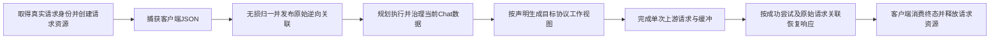

# REQ02 增量替换与既有 consumer 合同

instruction 多来源补链沿用 [无损文本段设计](v3-req02-lossless-instruction-segments.md)；
独立 oauth/gpt-6.1-sol 设计审查 PASS（20261004-r1），只授予该补链编码准入，不作为实现或接线验证。

状态：R2 已取得独立设计准入（`docs/evidence/dagpipe/req02-consumer-design-review-receipt-20261003.md`）；实现与真实接线仍未完成。依据为主设计、现有三条图/四张map、REQ02实际红测及GPT6.1必要接口攻关。此前consumer草稿的三文件限制、Direct旁路和全四方向新walker前置结论不作为本次实施合同。此状态只引用已有准入回执，不把实现测试、runtime 或 merge 判为完成。

## 单一表示与接线顺序

唯一canonical为既有Chat字段和`routecodex_chat_extension`。字段库直接发出此表示，不另设事后改名器；opaque业务值、嵌套扩展、provenance destination和引用路径使用同一carrier绑定。原始工具类型、namespace、名字、参数/结果编码与call_id关联来自请求，provider编码由实际attempt投影记录，不能按模型名猜测。

独立Error图接收真实失败并返回typed执行决定；重试启动新attempt/图invocation，不回写其他节点真源。取消、future drop、HTTP/WS断连进入Runtime释放终点。Provider失败不能直接提交客户端；真实终止仍由已声明Error/SSE owner完成。

REQ02只执行`client_request_to_chat`。另外三方向暂由既有owner实现及最小接口/helper消费；无需先迁移其完整Operator，也不能在consumer缺失时接REQ02。当前历史图片占位清理从旧Inbound归一化分支移动到既有Chat Process标准处理点，保持现有政策且仅一次执行，完整保留当前轮图片、工具参数和自由文本；它是本次删除旧分支后维持owner/行为的必需边，不等待未来REQ05才补。

## 必需接口与唯一owner

| 范围 | 本次实施合同 |
| --- | --- |
| Runtime graph entry | 增加仅消费已捕获`client-json`的REQ02单节点slice，真实request身份、invocation身份、attempt身份分别传入；不能再capture一次。 |
| REQ02 field/operator | 按compiled profile归一；ClientEntry+RawEntry成对一次发布inverse/history；Retry或InternalFollowup+AlreadyCanonical只读原pair。 |
| 既有Relay入口 | 提前取得execution control；统一调用新REQ02，不再由protocol codec执行旧归一化。旧builder仅封装新Operator结果，旧Responses/Anthropic分支物理删除。 |
| Gemini Chat Process | 从canonical messages/tools/config及Gemini扩展读取和治理；native wire codec仍处理真正wire输入。不得在Req04恢复contents并运行旧入站流程。 |
| 标准Outbound | 既有owner调用registered profile projection helper，消费当前canonical及opaque引用，返回provider标准payload和本次typed projection/declaration map；不双重消费旧字段。 |
| Direct | 去掉active raw standardized入口，接收已归一请求；native工作视图只能通过registered Direct projection/view hook由当前canonical生成。handoff搬运canonical与同一handle，不能从native/raw再归一。 |
| 响应JSON/SSE | 既有response owner消费成功attempt的typed projection view及原始inverse/history，实际恢复namespace、name、function/custom类型和opaque关联；禁止只增加accessor或继续从governed payload猜原始身份。 |
| Server | 创建/搬运Runtime factory返回的opaque handle/guard，HTTP/WS及显式Relay均覆盖；metadata plan是carrier之一，不能作为所有请求唯一创建点。 |

REQ06 owner提供最小`project_canonical_request(...) -> CanonicalRequestProjection` helper；返回数据与typed attempt上下文分离。该helper可被既有Outbound及registered Direct hook使用，不运行完整REQ06 Operator。REQ02任务不改其独占Operator文件，按交接合同协调helper与配置。

2026-10-05 命名同步（R52a 审计 A0）：交付实现是`operation_runner/operators/project_canonical_request.rs:79`，返回类型`CanonicalRequestProjection`（同文件`:26`）；本文件早期草案写的`ProjectedRequest`在全树无任何引用。交付实现不把`compiled_profile`作为形参传入，而是由helper内部按当前请求解析profile。类型名与形参表以交付实现为准。

response owner提供`ResponseProjectionView::from_successful_attempt(request_context, attempt_context)`并接入既有JSON/SSE/client projector；这项必须有真实反向恢复行为和工具回合证据，类型定义本身不算消费。

### Direct-to-Relay / Relay-to-Direct 已归一输入的显式搬运补链

2026-10-05 的公开 Chat runtime probe 在同一请求句柄已发布原始 pair 后进入 Relay，返回 `request scope already has an original pair; raw entry cannot republish`，且没有 provider attempt。这是重复归一化的接线缺口。本节补齐已有 handoff 合同的 typed 表达；编码准入等待本节独立设计审查，不表示实现或接线通过。

- Direct kernel 的 handoff carrier 增加 `canonical_request: Value`，搬运当次已归一结果；`request_execution_control`、selected target、expanded candidates、exclusions、observability accumulator 和 finalizer 仍移动原对象。Server 不从 raw payload 重建这些数据。
- Runtime invocation origin 增加 `DirectRelayHandoff`。它只消费 `AlreadyCanonical`，且只读同一 handle 的已发布原始 pair；不得伪称 Retry/InternalFollowup，不 recapture、不清空 slots、不另建 scope。
- 普通客户端 Relay 入口继续显式选择 `ClientEntry + RawEntry`。handoff 的公开 adapter 显式选择 `DirectRelayHandoff + AlreadyCanonical`。协议只搬运 carrier，归一选择和资源政策在共享 Runtime entry 执行；不按 payload shape、模型、pair 是否存在或日志推断 origin。
- **反向 Relay-to-Direct 边（2026-10-06 R53 独立设计审查补正）**：反向同样使用本节的 typed 形状，但载具与入口不同名，必须显式实现。Relay→Direct 的 carrier 是 `hub_v1/responses_relay_types.rs` 的 `V3ResponsesProtocolDirectHandoff`；它增加**一个 control 字段**承载 Direct 入口 origin 枚举 `{ClientEntry, DirectRelayHandoff}`，业务半边仍是已归一的 `canonical_request`。Direct kernel 入口 `kernel/direct_request_scope.rs` 的 `build_v3_direct_request_canonical_from_captured` 当前把 origin 硬编码为 `RequestOriginKind::ClientEntry`；修订后 origin 必须是显式入参，由其两个调用方 `kernel.rs` 与 `kernel/v3_direct_core.rs` 传入：普通客户端入口传 `ClientEntry`，Server 的 Relay→Direct adapter 传 `DirectRelayHandoff`。禁止用 `original_pair().is_ok()` 之类存在性推断代替显式 origin。
- 镜像 Direct→Relay **不是**充分条件：Direct→Relay 方向可用，是因为 Relay entry 已接受显式 origin 形参（`hub_v1/relay_runtime_core.rs` 的 `V3RelayEntryOrigin`）；而 Direct kernel 入口此前没有 origin 形参，直接复制字段会得到惰性字段。同时 `kernel/direct_state.rs` 的 `V3DirectRelayHandoffRequestOrigin` 已声明但全树无消费者，属同一语义的死实现：本次修改必须消费它或物理删除它，不得保留第二套 origin 表达。
- 同协议 Data 与 control 分离：canonical_request 是业务数据，origin/target/候选及请求资源是 typed control。adapter 不把这些控制事实写入业务 metadata。
- Chat handoff 复用已选 target、expanded candidates 与本请求 exclusions；不再次进入 Virtual Router。首 attempt 消费原选中候选；后续失败仍由 Error/Target Interpreter 在原候选集合内选择。Responses handoff 复用现有预选与候选参数，补同一 canonical/origin 边。不得为消除重复归一化而重写 routing/retry 策略。
- 共享 REQ02 builder 处理新增 origin；既有 request graph 的 Capture/Normalize/Chat Process/Outbound 顺序不变。本节没有新增节点、跨图 shortcut 或第二 normalization 实现。
- handoff guard 仍由 Runtime 搬运：成功输出、失败、取消/future drop/HTTP断连均先清 attempt 再清 request。Server 不复制 finalizer。

唯一实现范围是 `kernel/{direct_state.rs,direct_runtime_helpers_stream.rs,v3_direct_core.rs}` 的 handoff 搬运行、`operation_runner/request_context_store.rs` 的 origin 契约、`req_inbound_02_normalized.rs` 的 entry 选择、共享 `relay_runtime_core{.rs,/request_scope.rs}` 和 Responses Relay entry、Chat handoff adapter、Server 两条 handoff caller。**反向边（2026-10-06 补正）另含**：`kernel/direct_request_scope.rs` 的 Direct 入口 origin 形参（含其调用方 `kernel.rs`、`kernel/v3_direct_core.rs`）、`hub_v1/responses_relay_types.rs` 的反向 carrier control 字段，以及 Server 的 Relay→Direct adapter 消费点（`hub_v1/responses_direct_server_outcome.rs`、`server/src/websocket.rs`、`server/src/endpoint_handlers.rs`）。Direct actual-emission worker 的 request projection 和 response worker 的 successful publication/inverse 行不属于本补链。

公开行为验收必须从真实 HTTP Chat/Responses 入口到 loopback provider capture，再到客户端 JSON/SSE。断言首 attempt 到达原 target、没有第二路由、完整 exec/custom patch/MCP 历史与 opaque 值、正确客户端成功结果、同请求 pair 不重发布，失败切 provider 不提交错误与取消释放。另保留 RawEntry 正常入口、禁止 RawEntry handoff 的 typed 内部契约负向测试。SDK内部状态测试只辅助定位，不能替代上述 consumer。

## 请求资源与释放

Runtime factory在真实requestId已取得、首次规划之前建立request-local固定typed slots。`V3RequestExecutionControl`和Server metadata carrier持有同一个opaque handle；不采用参考候选跨请求HashMap，不建立第二MetadataCenter。inverse/history保存引用和关联，业务值保留于canonical。

真实requestId是请求关联键。SDK graph execution_id使用每次invocation身份，attempt_id显式传入；不得用capture自动生成的sequence代替请求关联，也不能把不同invocation合并成同一执行身份。请求原始pair与attempt slots身份不同。

资源顺序：首次归一成功→成对发布immutable inverse/history→下游消费；retry/followup保持请求pair，新attempt另建projection/declaration/provenance/binding；失败attempt在下一个candidate前释放；成功响应投影消费后才能释放所依赖attempt资源。

唯一Runtime finalizer guard不可Clone，不能放在每个可Clone handle的Drop上。Runtime输出交给Front时移动guard；JSON消费、SSE EOF/Drop、错误输出消费/Drop、取消/future drop/断连各自触发请求终态。先attempt cleanup，后request cleanup。SSE保留Completed/Dropped差别；Server残留opaque clone不能使已终止slots继续有效或提前释放别人的请求。

## 实施范围与依赖拆分

### 并发实施共用的接口

| 公共边界 | 固定合同 |
| --- | --- |
| `V3RequestContextHandle` | 可Clone的opaque请求资源引用，真实requestId/entryProtocol固定；内含固定typed slots，不含业务值或跨请求registry。 |
| `V3RequestFinalizerGuard` | 不可Clone；仅Runtime创建，显式终态或Drop按attempt→request释放，重复终态不产生第二次副作用。实际输出owner接管guard，不能由普通handle clone触发。 |
| `RequestInvocationContext` | 请求handle、invocationId、attemptId、originKind的typed上下文；invocation结束后origin自然失效，不序列化为payload。 |
| `RequestNormalizationEntry` | `RawEntry(Value)`或`AlreadyCanonical(Value)`，由Runtime入口状态提供；RawEntry只用于client_entry，reentry显式消费AlreadyCanonical。非法内部组合进入typed内部错误链，不新增业务拒绝规则。 |
| `execute_v3_operation_runner_request_normalize_losslessly` | 接收已capture数据及typed invocation，通过SDK编译/执行REQ02 slice，返回canonical Value；原始inverse/history成对发布到同一handle。不能直接调用Operator绕过SDK。 |
| `RequestInverseContext` / `ExplicitHistoryPairing` | 原请求的typed身份、来源路径、encoding与call/output引用；field库内部临时JSON记录要在唯一边界转为这些typed结构，业务参数/结果留在canonical。 |
| `AttemptProjectionContext` / `AttemptDeclarationMap` | 由同一标准projection owner发布到当前attempt固定slots，记录实际发出的声明；不由response或Server重建。 |
| `ResponseProjectionView::from_successful_attempt` | 借用原请求pair与成功attempt上下文，供现有JSON/SSE响应owner执行逆向恢复；不能仅提供检查accessor。 |

请求scope factory在原有`V3RequestExecutionControl`预算创建边界复用其budget构造，并在有真实requestId处创建资源与guard；接线时删除旧的无请求身份创建路径，而不是保留Option状态并在每个consumer兜底。必须覆盖`kernel/direct_execution_control.rs`、四协议Relay入口及Direct-to-Relay handoff的实际调用点；调用点准备与资源runner实施分开所有权，最终候选不存在两套factory。

`kernel.rs`是`resolve_v3_direct_request_execution_control`的真实caller；它与`kernel/direct_execution_control.rs`均由入口/Direct worker独占。该worker在本caller最小修改factory参数、真实requestId及同一handle传递，和REQ02 canonical入口的必要消费，不扩展为完整kernel重写。资源runner worker不编辑这两个文件。

1. 字段配置与carrier：field库owner修改`field_operator_{library,records,gemini,profiles,library_tests}.rs`及请求方向profile配置；不添加按protocol/model名字猜测的fallback。
2. 资源与runner：`operation_runner/{request_context_store.rs,mod.rs,operators/normalize_request_losslessly.rs}`、`execution_control.rs`；公开typed接口与单节点consumer测试。
3. 真实入口与Direct：`server/{metadata_center.rs,endpoint_handlers.rs,websocket.rs}`、`runtime/{nodes.rs,hooks.rs,kernel/v3_direct_core.rs,kernel/v3_direct_protocol_codec.rs}`及必要声明/调用点；固定接口由同一worker独占集成，其他worker不并发编辑。
4. Relay/Gemini/响应consumer：`hub_v1/{req_inbound_02_normalized.rs,relay_runtime_core.rs,responses_relay_runtime_inner.rs,gemini_codec.rs}`及实际协议projection context owner；按具体符号继续限定文件，不能扩大为整条response迁移。
5. 标准projection helper由REQ06另任务独占；本任务集成其已验公共边界，不争抢文件。

字段配置、carrier统一、projection helper与response typed消费是REQ02切换的必需依赖，不是其他完整节点的交付前置。依赖准备可并发；caller替换、runtime准入与节点交付按顺序。

## 准入与验收

### 已审R2生命周期合同的具体输出carrier绑定

此处只补足同一非Clone guard的实际搬运路径，不改变R2的factory、slot、释放政策或图拓扑。Runtime仍是唯一生命周期owner，Server只搬运资源；各协议不得复制清理决策。

| 必要路径 | 限定职责 |
| --- | --- |
| `runtime/src/kernel/{direct_state.rs,direct_runtime_helpers_stream.rs}` | Direct JSON/error/SSE及handoff输出的唯一guard carrier；handoff不重建scope。 |
| `runtime/src/hub_v1/{responses_relay_types.rs,openai_chat_relay_runtime.rs,anthropic_relay_runtime_helpers.rs,gemini_relay_runtime.rs}` | 各协议既有typed输出搬运同一个guard；协议差异仅为body carrier，释放政策复用Runtime唯一owner。 |
| `server/src/{live_snapshot.rs,executors.rs,endpoint_handlers.rs,websocket.rs,responses_direct_server_outcome.rs}` | 在既有输出消费边界搬运guard至实际HTTP/WS输出或stream；不创建第二scope、不从control clone重建生命周期、不吞内部失败。 |

实际future必须在首次归一化/规划前持有guard，取消时即使仍有control clone也释放；SSE EOF立即释放，不等待stream对象Drop。JSON/error的终点按实际公开输出消费契约验证。必要initializer迁移只改变typed资源字段，不改payload或SSE协议投影。具体实现先落盘carrier路线与源绑定；如果需要修改这些已审语义而非搬运接口，退回设计准入，不先写产品。

### 已审R2响应consumer的具体codec绑定

`anthropic_codec/projection_context.rs`依据原declaration_record_id关联成功attempt实际emitted identity；原kind/namespace允许与emitted不同，不能添加相等检查。`anthropic_codec_tool_projection.rs`是既有工具输出唯一投影owner，按该context恢复所有映射工具的原kind/name/namespace presence及call_id，完整业务值仍从响应读取。既有metadata/reasoning业务context独立读取，不进入typed请求控制资源。

`responses_relay_runtime/provider_stream_materialization.rs`保留唯一provider SSE reducer/materializer；必要公共with_context overload仅委托既有实现，由`responses_relay_runtime.rs`最小export。公开provider SSE测试必须输入真实provider事件并使用同一成功attempt context，不以JSON后frame代替。此绑定实现既有R2逆向合同，不新增协议决策或第二mapper；Runtime实际caller另由接线owner负责。

### 请求方向配置与compile gate的同一合同

`direction_bindings`是同一行已有consumer的逐方向显式参数覆盖，增量REQ02只声明`client_request_to_chat`，不凭REQ02补造另外三方向。验证器对每个声明的binding使用其自身`operator@version + direction`的typed profile；未覆盖的已有方向继续验证该方向的行级参数，不可拿请求profile检查其他方向。binding仍必须引用本行声明consumer和raw inventory内source；未知方向/operator、缺必需参数、重复消费和虚构路径仍是compile失败。

typed参数schema的`optional(string)`表示可缺省；有值时必须是非空字符串，不能接受数字、对象或空白。容器transform必须由本方向显式binding声明；沿用现有leaf保留语义的字段不伪造transform。`transform_id`缺省的leaf不触发协议/path推导。字段库与compile gate分别实现同一参数合同，不能以放松校验替代注册的可执行变换。

gate实现修改限定`verify-v3-operation-runner-dagpipe.mjs`的参数验证及方向绑定选择，回归fixture限定`v3-operation-runner-red-fixtures.mjs`；先记录当前新增optional schema引出的实际红证据，设计准入后实现，再验证缺省optional正常、错误optional类型/缺必需字段/错误方向/未注册变换均显式失败。这是配置compile契约修复，不是新增业务payload校验或拒绝理由。

补齐本合同在主设计、function/caller/resource/verification maps和现有graph中的唯一owner/允许路径/资源及终点绑定，dagpipe校验及独立设计review通过后才写依赖产品代码。

作者验收包含四协议、Direct/Relay、HTTP/WS、JSON/SSE、未知嵌套值、完整exec字符串、apply_patch自由文本、MCP参数/结果、namespace及function/custom反向恢复、真实工具执行与follow-up、历史图片/当前图片、retry/followup/handoff与成功/error/cancel/drop资源终点。gpt-5.5和gpt-5.6 GCM真实consumer均须通过；只单位归一化或200不能作为caller准入。

当前字段红测21pass/11fail保留为配置缺口证据；字段输入/配置改变后重验受影响项。只有候选完整验证、实际安装/restart/replay、实现架构review PASS、main/remote等价回执和owned cleanup完成，才交付REQ02并推进REQ03。
