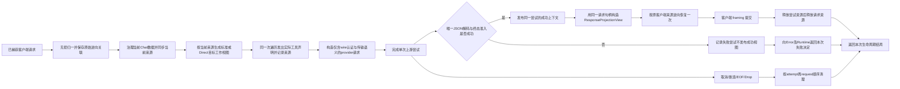

# REQ02 Direct 实际声明发射补链（2026-10-04）

状态：设计补链完成，待独立设计 review。本文只固定 Direct Responses 实际发射和标准 Outbound 的 owner、调用边、typed 资源与验收边界。所有新增实现边保持 `binding_pending` 或 `design_pending`；不得用它声称生产接线、运行时已验证或 REQ02 已完成。

目录：本文复用 [消费补链合同](v3-req02-cutover-consumer-contract.md) 与 [当前字段来源关联](v3-req02-current-field-associations.md)，只补齐“实际发出的声明来自哪一次遍历”这一缺口。它不改变固定请求/响应/error 图拓扑，也不允许 Provider wire 继续承担 namespace/custom/history 语义转换。

## 边界与缺口

已确认的实际偏离如下：

- `project_canonical_request` 先生成 Direct native view 和 `AttemptContext`；该上下文描述的是 native/namespace-shaped 声明。
- 注册的 Direct request projection hook 随后构造 wire；`provider-responses/src/wire.rs::build_v3_provider_12_responses_wire_payload` 又执行 namespace/custom 扁平化与历史 call 名重写。
- 因此现有 `attempt_declaration_map` 不能表示实际发出的 provider 声明。响应不能从该 map 还原真实 emitted identity。

本补链的唯一语义修复方向是：**在真正生成 provider tools 的同一遍历里同时产生 wire payload 和 declaration mappings，然后把 Provider wire 收敛为 wire/auth/transport 关注点**。不新增第二 mapper，不从名字、schema 或模型名反查，不把控制事实写入 payload。

## 中文语义流程



失败、取消和断连不进入成功视图。重试只启动新的 attempt；它不把失败 attempt 的声明或 response provenance 复制给下一个候选。

## 唯一 owner 与调用边界

| 语义 | 唯一 owner | 现有符号 | 本次设计结论 |
| --- | --- | --- | --- |
| Direct 实际发射 | 既有 registered Direct projection hook | `responses_direct_request_projection_hook_with_key_catalog_and_view`；`V3DirectRequestProjectionView` | hook 在同一次实际发射中返回 payload 与 `AttemptContext`，不新增 mapper。 |
| 标准 Responses Outbound 实际发射 | ReqOutbound07 标准投影 owner | `project_canonical_request`；`build_v3_openai_responses_standard_request_from_chat_canonical_for_selected_with_declarations` | namespace/custom 在标准 Outbound 发出点展开；同一展开返回声明来源。 |
| 实际声明来源记录 | 既有 declaration observer | `StandardOutboundDeclarationObserver`；`ToolMappingReference` | 在真正 push/replace 点调用 observer，使用 current association → immutable inverse record。 |
| namespace/custom flatten | 既有共享 helper | `flatten_namespace_tool_for_provider_with_sources`；`NamespaceToolEmission`；`NamespaceToolProjection` | 复用 `source_child_indices` 和 `destination_index`；不做输出名/schema 扫描。 |
| Provider wire | Provider wire construction | `build_v3_provider_12_responses_wire_payload` | 对本转换只保留 wire/auth/transport；不得再执行 namespace/custom/history 语义重写。 |
| JSON 解码与准入 | 既有 Shared JSON owner | `project_provider_raw_to_client_payload_with_plan_and_projection_and_observation_context`；`classify_v3_provider_terminal_admission` | 每次成功发布前只跑一次；HTTP 200 不是发布条件。 |
| 成功发布与视图 | Runtime request-context owner | `V3RequestContextHandle::publish_successful_attempt`；`ResponseProjectionView::from_successful_attempt` | 准入通过后才发布；后续逆向只消费同一 handle 的成功 attempt。 |
| 客户端 framing | 既有 client projection/framing owner | JSON/SSE 既有出口 | 只提交已逆向成功的业务 payload；不得由 Provider wire 或 Server 重建身份。 |

## 精确接口

### 已存在、必须复用

| 已实现项 | 位置 | 约束 |
| --- | --- | --- |
| `flatten_namespace_tool_for_provider_with_sources(protocol, tool) -> Result<Option<NamespaceToolProjection>, String>` | `provider-compat-core/src/namespace_tools.rs` | 返回实际 flat tools 与每个 leaf 的 source-child path。 |
| `StandardOutboundDeclarationObserver::note_emitted*` / `into_mappings()` | `request_outbound_declaration_emission.rs` | 仅在真实 push/replace point 记录；去重 no-op 保留先前来源。 |
| `project_canonical_request(...) -> CanonicalRequestProjection` | `operation_runner/operators/project_canonical_request.rs` | 返回 payload、drops、typed `AttemptContext` 三者分离。 |
| `V3DirectRequestProjectionView { payload, attempt }` | `kernel/direct_request_scope.rs` | Direct 工作视图已能携带 native payload 与 attempt context。 |
| `V3RequestContextHandle::publish_successful_attempt(...)` | `operation_runner/request_context_store.rs` | 只能发布通过身份校验的成功 attempt。 |
| `ResponseProjectionView::from_successful_attempt(...)` | `operation_runner/request_context_store.rs` | 从同一 request handle 验证并绑定成功 attempt。 |
| `project_provider_raw_to_client_payload_with_plan_and_projection_and_observation_context` | `shared.rs` | 唯一 JSON decode、provider response compat、terminal admission 边界。 |

### 本次提出、尚未实现

下面是精确 implementation contract，不是已接线事实：

```text
# Direct actual emission
responses_direct_request_projection_hook_with_key_catalog_and_view(
    policy: &V3ResponsesDirect11Policy,
    key_catalog: &V3DirectRequestKeyHookCatalog,
    request_view: &V3DirectRequestProjectionView,
) -> Result<(V3Provider12ResponsesWirePayload, AttemptContext), V3Error01SourceRaised>

# Standard Responses Outbound actual emission
build_v3_openai_responses_standard_request_from_chat_canonical_for_selected_with_declarations(
    payload: &Value,
    inverse: &RequestInverseContext,
    current: &CurrentFieldAssociations,
    has_web_search_capability: bool,
) -> Result<(Value, Vec<V3ProjectionDropRecord>, Vec<ToolMappingReference>), String>
```

实际实现可以在现有返回结构上增加同等 typed carrier；但必须满足：

- Direct hook 返回的 `AttemptContext` 来自这次 hook 内实际 flatten/push 的遍历。
- `ToolMappingReference` 的 `declaration_record_id`、`source_path`、`destination_path`、`emitted_kind`、`emitted_name`、`emitted_namespace`、`encoding` 均来自实际 emit point。
- `source_child_indices` 是事件来源结构路径，不是输出名或 schema 匹配。
- wire payload 与 attempt context 分离；attempt context 不写入 provider body、metadata、日志或客户端 payload。

源码核对：Shared 的 JSON 分支在唯一 decode、Provider Compat 和 terminal admission 后返回 `V3ProviderResponseProjection`，其 JSON body 是已准入的 provider payload；它没有执行 typed 工具身份 inverse 或客户端 framing。Runtime 应先复用这个返回值，再发布同一 attempt、构造必需视图、调用既有 inverse owner 一次并 framing。不增加 Shared 阶段回调或第二 decoder。当前活动候选的 Direct caller 尚未发布或消费这个成功 attempt 视图；这是待补边，不是“已经发布但顺序错误”的已实现事实。

SSE 分支与 JSON 使用各自既有 decoder。SSE 必须等待完整 attempt buffer 与终态准入成功，再发布同一 attempt 和逆向映射；Shared 返回一个尚未读完的流不证明成功。复用既有 collector 与注册的 inverse owner，不借 JSON 分支重复解码，也不把未准入的 frame 提交给客户端。

## 数据与控制边界

| 项目 | 规则 |
| --- | --- |
| opaque 参数/结果 | 完整 bytes/string 只在业务 payload；typed resource 不解析、不重编码、不截断。 |
| original inverse/history | immutable；保留原 kind/name/namespace/调用关联。 |
| current associations | 只存原 mapping 引用与当前结构路径；只在治理与投影 owner 更新。 |
| attempt declarations | 只描述该 attempt 实际发出的声明；失败 attempt 不发布。 |
| response provenance | 只描述成功 attempt 的 provider response source 与 canonical-path origin。 |
| 控制事实 | 不写 provider body、client body、metadata、debug 或隐式上下文。 |

## 响应与生命周期顺序

成功 publication 必须严格按序：

```text
provider raw
-> 唯一 JSON decode
-> provider response compat
-> classify_v3_provider_terminal_admission
-> publish_successful_attempt
-> ResponseProjectionView::from_successful_attempt
-> inverse once
-> client framing
```

具体规则：

- provider HTTP 200 或传输成功不能直接发布 successful attempt。
- terminal admission 失败、malformed JSON、content-type 错误或 EOF 不发布成功视图。
- 失败 attempt 进入 typed Error chain；重试创建新 attempt，不能复用失败 attempt 的 declarations。
- 成功后必须从同一 `V3RequestContextHandle` 构造 `ResponseProjectionView`；不能用 payload、模型名或日志重建控制状态。
- 逆向恢复一次恢复原 custom/function/namespace、name、kind 和 call/output 关联；完整参数/结果 bytes 保持不变。
- JSON 成功、terminal error、cancel、future drop、HTTP/WS disconnect、SSE EOF/Drop 使用既有非 Clone finalizer：先 attempt cleanup，再 request cleanup。
- servertool follow-up 由既有 disposition 进入新的 request-graph invocation；不引入 local continuation 或第二条响应路径。

## 直接与 Relay consumer 边

| consumer | 必须满足 |
| --- | --- |
| Direct Responses | Direct hook 的同一次实际发射返回 wire 与 `AttemptContext`；Provider wire 不再 flatten。 |
| Standard Responses Outbound (Relay) | `project_canonical_request` 的 Responses 分支在标准 Outbound 发出点 flatten 并返回 actual mappings；Relay runtime 只消费已发出的 wire。 |
| Chat Outbound | 继续使用既有 `flatten_namespace_tool_for_provider_with_sources` + `push_provider_tool_with_emission` 模式；不得回退到 Provider wire 重写。 |
| Responses Relay runtime | 只调用 transport-only wire builder；不得在 wire 之后再次展开 namespace/custom 或重写历史。 |

## 实施合同草案

最小实现文件范围如下；每项都保持 `design_pending` 到真实 source anchor 与行为证据出现：

- `v3/crates/routecodex-v3-runtime/src/hub_v1/request_outbound_format.rs`
  - Responses tools emit point 使用 `flatten_namespace_tool_for_provider_with_sources`。
  - 每个实际 emitted flat tool 通过 `StandardOutboundDeclarationObserver` 记录来源。
- `v3/crates/routecodex-v3-runtime/src/hub_v1/request_outbound_declaration_emission.rs`
  - 复用 observer origin resolution；不新增 mapper。
- `v3/crates/routecodex-v3-runtime/src/hooks.rs`
  - Direct hook 返回 wire 与 actual `AttemptContext`。
- `v3/crates/routecodex-v3-provider-responses/src/wire.rs`
  - 移除本转换的 namespace/custom/history semantic rewrite，保留 wire/auth/transport。
- `v3/crates/provider-compat-core/src/namespace_tools.rs`
  - 复用既有 source-aware helper；不新增 API。
- `v3/crates/routecodex-v3-runtime/src/kernel/direct_request_scope.rs`
  - 在现有 request guard 内搬运 actual attempt context，不重建 scope。
- `v3/crates/routecodex-v3-runtime/src/kernel.rs` 与 `kernel/v3_direct_core.rs`
  - Direct successful JSON 发布移动到既有 decode/admission 之后。
- `v3/crates/routecodex-v3-server/tests/req02_direct_successful_inverse.rs`
  - 将 native namespace fixture 期望更新为实际 flat provider wire，同时保留原客户端身份断言。

## 公开黑盒验收

实现后的黑盒测试必须从真实 HTTP/WS 业务入口运行，并至少覆盖：

```text
CARGO_NET_OFFLINE=true node v3/scripts/run-v3-cargo-test.mjs -p routecodex-v3-server --test req02_direct_successful_inverse
CARGO_NET_OFFLINE=true node v3/scripts/run-v3-cargo-test.mjs -p routecodex-v3-server --test req02_direct_sdk_runtime
CARGO_NET_OFFLINE=true node v3/scripts/run-v3-cargo-test.mjs -p routecodex-v3-server --test req02_runtime_tool_roundtrip
```

断言必须至少包含：

- 原客户端 namespace `functions` 的子项 `function exec` 与 `custom apply_patch` 在 provider wire 中实际发出为 flat `functions__exec` 与 `functions__apply_patch`。
- 成功响应恢复原客户端 kind/name/namespace，完整 exec/patch text 或调用参数 bytes 不变。
- 工具回合使用真实 client execution 结果与 follow-up，HTTP 200 或 `requires_action` 不等于成功。
- 历史 call/output pair 在正确 owner 处同步改写；缺失声明时不使用 convention fallback 猜名。
- provider 4xx/5xx、malformed JSON/SSE、EOF、disconnect、cancel 不发布 successful attempt，也不向客户端发送错误响应。
- 一次成功尝试只 publish 一次；失败 attempt 不进入 `ResponseProjectionView`。
- JSON 使用既有 Shared decode/admission 返回值；SSE 使用既有完整 attempt collector 的终态准入结果。两者只在成功后发布同一 attempt，再 reverse once、client framing。

## 非声明

- 本文没有实现产品代码或测试。
- 本文没有运行 build、install、restart、runtime、review、commit、merge 或 push。
- `v3.operation_runner.attempt_declaration_map` 仍是 `design_pending`。
- 新增映射边保持 `binding_pending`；实现出现真实 source anchor 后才能改状态。
