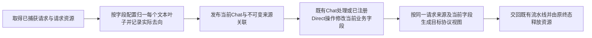
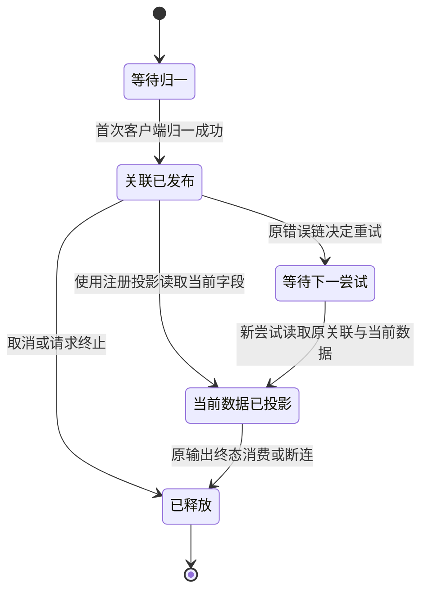

# REQ02 多来源 instruction 的无损归一与反向投影补链

状态：设计准入候选；尚未实施或接线。本次仅补既有 REQ02 归一与 registered Direct projection/view 的数据合同，不新增 graph、MetadataCenter、控制载体或协议分支。请求图仍由项目唯一 graph 治理；REQ06 完整 Operator 不属于本次范围。

## 已证实的断边

当前 REQ02 字段库的 process_instructions / process_system_instruction 把多个文本段交给 flush_system_instructions，后者用换行拼成一个字符串，再将所有来源映射指到同一个 content。形状的 opaque data reference 能说明原输入结构，不能从被修改的单字符串恢复每个当前段。native inverse 草稿 restore_instruction 对多段返回原文，造成当前 mutation 丢失。不能靠旧值重放、文本 split/offset 猜配对、拒绝请求或在响应层补偿。

父候选观察来源：req02-main322-20261004 的 field_operator_library.rs 399/432、field_operator_records.rs 509/538，及隔离 native inverse 的 restore_instruction。既有节点笔记是 dagpipe-req02-cutover-notes-20261002.md；本设计不改变其唯一状态载体。当前 source-reference 补链作者公开归一化 32/32、runner 86/86，尚无完整 projection/live/实现 review 证据。

## 唯一业务链与状态

静态功能图没有回边。尝试与资源生命周期沿既有 typed Runtime owner，不在 instruction 算子中执行重试或释放。

## 当前 canonical 表示

沿用标准 Chat 的 string 或 text-part array。所有协议使用同一个表示规则，输入形状由注册 transform/config 决定，不按协议名称或模型选择流程。

- 只有一个语义文本叶子且不与既有 system content 合并时，保留当前 scalar content；已有单段行为和其真实 destination 不变。
- 有多个文本叶子或需合并 instruction 与已有 system content 时，使用有序 text-part array。每个原语义叶子对应一个当前 canonical text 叶子。按现有顺序在贡献之间放入换行 text part，使标准文本投影拼接后的字节与当前 join 策略相等，包括空文本、原文本中的换行、CRLF 与尾部标记。
- 不把多段源字段都指向数组容器。生产时直接记录每个实际 emitted index 的完整 destination，例如 chat.messages[k].content[j].text。整体来源记录用于识别注册 transform/原形；逆向当前值由具体叶子记录提供。
- opaque/non-Chat siblings 仍作为 data-plane extensions 保留；其身份/路径引用仍在 typed inverse/history。没有业务值写入 typed control，也没有控制字段写入业务 payload。
- instruction 多源与既有 system history 合并时，同一唯一 producer 同步既有 source content 的实际 leaf association。原 history source 只读取其 own contribution；不能将新 prefix 当作其原始 content，更不能复制成第二份业务指令。

例如原 instruction 两段 A、B 与既有 system C，对应 canonical text parts A、换行、B、换行、C；分别记录三个 source leaf 的 concrete destinations。不会从最终字符串反推三个来源。

## 反向消费与唯一 owner

| 标准处理点 | 完成且只完成的行为 |
| --- | --- |
| REQ02 field operator library | 按现有注册 instruction transform 遍历原结构、归一语义文本叶子、创建一次 canonical 表示并记录真实 source-to-destination；现有 fold/remap 只 remap 一次。 |
| shared project_canonical_paths | 复用唯一结构路径 parser 读取当前字段、识别 literal keys 与源 data reference；不处理协议政策或工具参数。 |
| registered Direct history projection | 依据原形 data reference 和具体 typed associations 重组对应原字段；返回值从当前 canonical/opaque extension 读取。缺省/null、多个 source parts、opaque siblings 的 current mutation/removal 都必须保留。删除已映射 leaf 不复活旧值。 |
| existing standard Outbound owner | 消费当前 Chat scalar/text parts；若目标是 scalar，按注册标准文本语义连接所有 text parts，不再次插入换行或重跑 Inbound。数组支持保留顺序；不能把数组发给只接受字符串的目标字段。 |
| Runtime/Error/SSE | 沿既有职责收取真实算子错误、重试决定和终态；本次不添加拒绝策略、成功包装或错误短路。 |

所有逆向 helper 复用本次已审来源关联，不新增 instruction 专用 raw registry、Shadow Chat、字符串 diff、备用旧链或协议处理骨架。输入为 scalar、对象或数组的非文本部分仍按现有 lossless extension 合同保存与投影；不扩大语义校验。

## 实施范围、消融与配置

修改限定既有 operation_runner/operators 下 field_operator_library / records / helpers / profiles 的 instruction 实现及其 shared inverse/history helper，并补对应公開 consumer。如 1500 行门限需要提取私有 sibling，只物理迁移唯一实现，删除旧定义，不保留并行路径。

现有 instructions_to_system_message、Anthropic/Gemini instruction container 注册 transform 继续是唯一规则入口；仅当配置 schema 确实不能声明上述行为时，补它的 typed 参数与现有 compile gate/fixtures，不新增协议流程或宽松默认。scope 外标准 owner 如缺少 text-part consumer，只补其最小公开边界，由父负责单一所有权，不能把整个 REQ06 Operator 并入本任务。

物理删除旧 join-then-alias 所有来源的实现和 native inverse 的多段旧文回放。scalar 与多段是同一算子的已声明 representation branches；都遍历相同来源并发出精确关联，不维护新旧双执行路径。

## 必须达到的测试条件

1. 作者先用真实公开 REQ02 runner 输入多段 native instruction、两个 input 来源及已有 system history，记录缺具体 current leaf association 的红测。使用当前 canonical 的两个不同叶子修改、删除和 opaque sibling 修改，公开 projection 返回对应原 source parts 的 current 值。
2. 四协议同一消费骨架：scalar 不变，多段与合并来源各保持来源唯一；跨协议 text flatten 的完整字节等于改造前正常实现，包括 CRLF、内部换行、空段、长文本与尾标记。original type/role/null/missing 不由内容猜测。
3. 标准 Outbound 必须通过公开 consumer 验证 scalar/array target 行为。库黑盒需贯穿 normalization 到 public projection；只检查 metadata 或源码不算成功。Direct 不重跑旧入站，Relay 仍仅 Chat Process 改业务值。
4. 原 instruction shift/fold/repeated-result/media/tool suites 全部通过；编译配置与完整 architecture gate 绑定冻结候选输入。
5. 这是编码前设计准入；其 PASS 不替代实现后的真实 HTTP/WS JSON/SSE、gpt-5.5/5.6 exec/apply_patch/MCP 回合、安装 restart/live、独立实现 review、最新 main 组合与 merge/push/clean 回执。

独立 reviewer 只审上述设计能否闭合 current-values 来源反向链、是否破坏 owner/配置/SESE、是否存在猜测或数据丢失；不接受“返回原数据”作为 mutation 的解决方案。设计通过后才改 instruction 产品表示。
