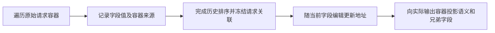
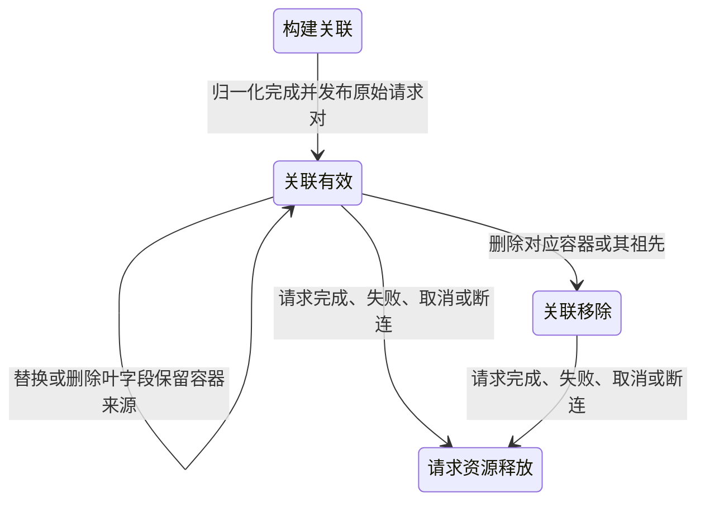

# REQ02 原始容器关联补充设计

状态：编码前设计准入候选。这里只修改设计文档；产品实现、黑盒、接线和交付均未完成。

## 1. 范围与输入

本文件补正 r222 的设计，不采用其“以容器关联替换字段关联”的方案。字段关联与容器关联属于同一个请求资源，但表达不同关系。字段关联负责读取当前字段值；容器关联负责把未消费的原始兄弟字段放回正确容器。两者不能互相替代。

设计工作树基线：`e7e64ee6920f07ce249a125d839fc9a5f75fb1eb`。
产品来源工作树：`/Volumes/Intel/playground/routecodex/req02-latest-combination-20261007-r205`。其 HEAD 为上述 main，MERGE_HEAD 为 `79d38a4343daa551053758aba695071d05547961`，九处冲突已收口，尚未提交。设计审查期间不修改相关产品源文件。以下源码路径均相对此产品来源工作树；审查者须读取该树，不能把设计工作树的 main 源码当作已有候选实现。

已确认的公开 consumer 红测：四例完整比较 `contents/tools/generationConfig`；Direct 两例通过，Relay 两例失败。无 ID 结果不能投影；有 ID 结果将 `functionResponse.id/name/response` 重复写到外层。证据位于 `/Volumes/Intel/playground/routecodex/.worker-runs/dagpipe-parallel-foundation-20261005/parent-combination-gates-r224/gemini-latest-red.log`。r203 的已保存 role/name 修改解决了前一个问题，但没有解决容器错位；必须一起验收。

不修改 REQ06 的 `project_canonical_request` 公共合同、另任务工作树或标准投影算法。本切片只提供原始容器关联，并在父集成候选中替换既有 Gemini emitter 的六处兄弟字段恢复调用。Server、SSE、Router、Provider、响应链和错误链不属于实现写入范围。

## 2. DAG、状态和唯一 owner

复用产品来源树的 `docs/architecture/dagpipe/v3.operation_runner.request.graph.json`。本切片不增加节点、回边、operator 或第二元数据中心。REQ02 发布的原始请求对仍是不可变真源；后续当前关联由 `CurrentFieldAssociations` 唯一维护；标准投影消费它，不重新归一化。





失败继续使用现有 typed Error 链；本设计不增加客户端语义拒绝，不把失败伪装为成功。请求级 finalizer 继续释放整个原始请求对和当前关联。没有新增独立资源、订阅或释放路径。

## 3. 不可变和当前关联

在 `operation_runner/request_context_store.rs` 的 `RequestInverseContext` 增加 `native_container_bindings: Vec<NativeContainerBinding>`。`FieldMapping`、`CurrentFieldAssociation.current_destination`、`destination_for_original_mapping` 和 `original_mapping_indices_for_destination` 保持原义。

新增类型：

```rust
pub enum NativeContainerRole {
    ToolResultPart,
    ContentPart,
    FunctionCallPart,
    Message,
    GenerationConfig,
    ToolDeclaration,
}
pub struct NativeContainerBinding {
    pub source_path: String,
    pub canonical_anchor: String,
    pub role: NativeContainerRole,
}
pub struct CurrentContainerAssociation {
    pub original_binding_index: usize,
    pub current_anchor: String,
}
```

序列化字段是 `native_container_bindings` 数组；每项字段为 `source_path`、`canonical_anchor`、`role`，角色编码为 `tool_result_part/content_part/function_call_part/message/generation_config/tool_declaration`。在 `RequestInverseContext::from_field_value` 用现有 `required_array` 读取，再由 `parse_native_container_binding` 解析三项字段及 typed enum。生产者总是生成该数组，其他协议生成空数组。缺少字段或非法角色是内部资源契约错误，不能通过从业务请求补猜来源来恢复。

`CurrentFieldAssociations` 保留原 `associations`，新增 `container_associations: Vec<CurrentContainerAssociation>`。`from_normalization` 同时种入两者。新增只读 `container_associations()`；调用者用 `original_binding_index` 读取不可变 binding。它不维护源请求副本、第二 provider 映射或另一字段读取路径。

## 4. 生产、排序与冻结

`RequestNormalizer` 增加构建期 `native_container_bindings: Vec<Value>`，在 `new` 初始化为空，在 `finish` 发布到已有 inverse 对象。所有 `RequestInverseContext` 直接构造点，包括测试 fixture，显式填入该字段；不得给旧 scalar mapping 伪造 container binding。

`field_operator_records.rs` 增加唯一生产 API：

```rust
record_native_container_binding(
    &mut self,
    source_path: &str,
    canonical_anchor: &str,
    role: NativeContainerRole,
    history_message_index: Option<usize>,
)
```

该 API 只记录调用者提供的实际访问路径和实际发出地址。历史项使用构建期 `_message_index`；非历史项不设置它。禁止 `parent_of(source_path)`、深度相减、模型名或字段名猜测来源。

`finish` 已先执行 `finalize_message_history`、`flush_system_instructions`，再执行 `remap_history_references(message_indices, index_shift)`。在同一个 remap owner 中，用已有 `take_message_index` 和 `remap_history_destination` 更新构建期 bindings 的 `canonical_anchor`，复用同一 `message_indices/index_shift`，移除构建期 `_message_index`。之后才冻结 inverse、种入当前关联。不能让 bindings 留在排序前地址，也不能再建立一套排序真源。

Gemini 协议的生产入口仍由已有注册 transform 选择：`v3.gemini_contents_to_chat_messages.v1`、`v3.gemini_tools_to_chat_tools.v1`、`v3.gemini_generation_config_to_chat_generation_config.v1`。不在骨架中增加协议分支；相应已注册算子在访问实际容器并发出 canonical 值时记录关联。

## 5. 六类容器的生产与消费

下表的 `m/p/c/t` 必须使用生产者实际的 messages/content_parts/tool_calls/output 长度，不使用原始数组索引冒充当前索引。历史地址再经第 4 节已有排序 owner 重映射。

| 角色 | 实际原始容器 | 当前 canonical 锚点 | 唯一生产位置 | 实际输出容器和消费路径 |
| --- | --- | --- | --- | --- |
| ToolResultPart | visitor 的整个 `item_path.parts[p]` | 实际 tool message 的 `chat.messages[m]` | `process_gemini_message` 的 functionResponse 分支 | 整个 `{functionResponse: ...}` part；消费 `functionResponse.id/name/response` |
| ContentPart | visitor 的整个 `item_path.parts[p]` | 实际 `chat.messages[m].content[c]`；已有 scalar content 时为 `.content` | 同一 visitor 的 text/inlineData/fileData 等实际发出 content part 的分支 | 整个 text/media part；消费 `text`、`inlineData.data/mimeType`、`fileData.fileUri/mimeType` |
| FunctionCallPart | visitor 的整个 `item_path.parts[p]` | 实际 `chat.messages[m].tool_calls[c]` | 同一 visitor 的 functionCall 分支 | 整个 `{functionCall: ...}` part；消费 `functionCall.id/name/args` |
| Message | 实际 `item_path`，不是 functionResponse 子对象 | visitor 实际发出的每个 `chat.messages[m]` | `process_gemini_message` 实际将基本 message 和 tool messages 加入 `self.messages` 的位置 | 整个 Gemini content row；消费 `role/parts` |
| GenerationConfig | `process_generation_config` 实际收到的 `raw_path` | 该分支实际映射的 `chat.<field>` | `process_generation_config` 的已注册 scalar/token-limit 映射分支 | 整个 generationConfig；消费现有 emitter 的标准 config 字段列表 |
| ToolDeclaration | 实际 `declaration_path` | 实际 `chat.tools[t]` | `process_gemini_tool` 的 declaration 发出位置 | 整个 function declaration；消费现有声明 encoder 的标准字段列表 |

工具结果没有 ID 时仍是 canonical `role=tool`，实际名称进入 canonical `name`，不制造 `tool_call_id`。保存的 r203 role/name delta 与本设计一起移植。ToolResultPart 和 Message 可绑定同一个当前 message，但角色不同；只允许 Message 把来源 content row 的兄弟字段恢复到外层。原始整个 part 是 part 角色的来源，因此同时保留 part 层和 functionResponse/functionCall 子对象内的未消费兄弟字段。

同一来源被已有历史 fold 合并时，保留实际来源关联，投影对来源路径去重并只填尚未发出的字段；不得改变已有 fold 的合并判定或覆盖已发出的语义。非 Gemini 的 bindings 为空，现有字段逆向读取行为不受影响。

## 6. 当前编辑与投影

`apply_canonical_field_edit` 是两类当前地址的唯一编辑入口。保留既有 scalar 行为；容器地址使用同一 path-segment 编辑算法，不复制一套 Remove/Insert/Move 规则。

| 编辑 | 容器关联动作 |
| --- | --- |
| Remove | 仅当删除路径是锚点或其祖先时移除关联；删除叶字段不移除其父容器关联。删除数组元素后，更新后续地址。 |
| InsertArray | 更新原有地址；新元素没有原始来源，不新增 binding。 |
| MoveArray | 更新当前地址，保持 original_binding_index 和原始来源。 |
| Replace | 遵守现有同地址替换合同，保留关联；不会按新值的名称或 schema 选择新来源。 |

把 `restore_standard_projection_siblings` 的 `additional_source_parent_levels: usize` 替换为 `NativeContainerRole`。六处 Gemini 调用明确提供角色和实际被发出的 canonical 容器锚点。helper 精确匹配角色和当前锚点，确认当前锚点仍存在，通过 `CurrentProjectionView.source_value` 读取 binding 的原始容器与 opaque 引用，再调用既有递归兄弟字段恢复逻辑。

物理删除 source/destination 深度相减、source truncate、concrete_sources 深度筛选及数字 parent-level 参数。没有旧路径 fallback。`restore_standard_transform_siblings` 的 systemInstruction 合同不在本次替换范围，其当前 scalar 读取继续使用原字段关联。

## 7. 实现与验收边界

实现文件为 `request_context_store.rs`、其必要 additive 类型导出、`current_field_associations.rs`、`field_operator_library.rs`、`field_operator_records.rs`、`field_operator_gemini.rs`、`project_canonical_siblings.rs`，以及父集成候选 `hub_v1/request_outbound_gemini.rs` 的六处 helper 消费调用。只逐文件修改受影响 fixture，不修改 REQ06 公共接口或其他节点语义。

编码前：本文件与实际 source owner 一致；复用项目 request graph 并由 `dagpipe graph validate` 验证；独立设计准入通过。设计准入不代替后续功能 review。

作者验证：

1. 不改 frozen `req02_gemini_public_shape_consumer` 的四例完整形状断言；修复后必须四例通过。
2. 新增公开 consumer：六类来源加入不透明兄弟字段；part 层与 functionResponse/functionCall 子对象均加入；完整比较输出位置，避免字段复制到外层。真实可表示字段必须保留。
3. 当前 Remove/Insert/Move/Replace 后通过公开投影比较值与兄弟字段来源；删除叶字段仍保留其他兄弟字段；删除整个容器不复活；插入元素不借用旧来源。
4. systemInstruction 前缀插入、已有历史 fold 与多种 history 混合后比较最终来源，覆盖排序地址变化。
5. Direct、Chat/Responses/Anthropic/Gemini 既有 consumer 和受影响 architecture gates；先作者 debug 与 E2E，再最终架构 review。
6. 按 r215 的完整合同执行真实 Server HTTP/SSE/WebSocket，以及 GCM gpt-5.5/gpt-5.6 的 exec、apply_patch、MCP 实际执行、结果回传与 follow-up。缺任何一项都不能接线或交付；200/requires_action 不等于工具成功。

后续 lifecycle、成功/失败/取消/断连释放、安装/restart、样本审计、review/merge/push 和自有资源清理沿已有 REQ02 目标。当前设计工作树及记录目录由父编排持有；完成准入后先保留证据，确认不再需要才清理，不删除任何既有或其他 owner 的资源。
