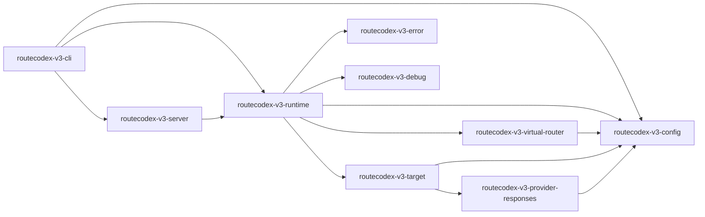

# RouteCodex V3 Rust Module Boundaries

## Scope

Canonical system definition: [RouteCodex V3 System Definition](./v3-system-definition.md).

V3 is the next RouteCodex project architecture, not a llmswitch-core sub-version.
All MVP modules are Rust-owned:

- config
- server
- runtime
- virtual router
- target interpreter
- error processor
- debug
- provider Responses
- CLI

TypeScript is not part of the V3 MVP module boundary. A future compatibility shell may exist only after an explicit design/gate, and it must not become a config/server/runtime/provider semantic owner.

Development phrases such as "large skeleton" and "small skeleton" are not naming standards. V3 code and docs use these names instead:

- runtime kernel: the only full lifecycle executor and resource owner.
- flow module: a registered lifecycle slice that provides static hooks but cannot run independently.

## Directory contract

```text
v3/
  Cargo.toml
  crates/
    routecodex-v3-config/
    routecodex-v3-server/
    routecodex-v3-runtime/
    routecodex-v3-virtual-router/
    routecodex-v3-target/
    routecodex-v3-error/
    routecodex-v3-debug/
    routecodex-v3-provider-responses/
    routecodex-v3-cli/
```

No V3 MVP source file should live under `sharedmodule/llmswitch-core/`. Existing V2 docs and Rust code may be used as design evidence, but V3 runtime ownership starts under `v3/`.

## Crate ownership

| Crate | Owns | Must not own |
| --- | --- | --- |
| `routecodex-v3-config` | unique `config.v3.toml` read/write API, schema validation, resource registry build, deterministic manifest publish, multi-server/provider/model/forwarder/route-pool/feature declarations, provider auth handle names | route interpretation, target expansion, target selection, HTTP server, provider HTTP transport, client response projection |
| `routecodex-v3-server` | HTTP listener, `/v1/responses` route, request inbound parse, HTTP/SSE/JSON outbound framing | provider selection, provider send, provider wire repair, direct semantic policy, continuation |
| `routecodex-v3-runtime` | lifecycle executor, fixed Hub v1 request/response graph, four-axis typed branch classification, adjacent node transitions, static hook registry, continuation and Chat Process boundaries | config file IO, provider-family branching, dynamic hooks, route/target/error semantic ownership, env secret read, raw provider transport IO, HTTP listener |
| `routecodex-v3-virtual-router` | classify request, resolve route pool, hit exactly one opaque route target, publish route decision | interpreting a target, expanding forwarders/providers/keys, provider retry, provider transport |
| `routecodex-v3-target` | interpret the one opaque route target, expand aggregate/forwarder targets, select concrete provider/key/model, keep target-local reselect/retry until the selected target pool is exhausted | request classification, route-pool re-hit, client error projection, provider wire construction |
| `routecodex-v3-error` | source capture, classification, target-local action, exhaustion decision, client error projection plan | route selection, target expansion, provider wire repair, success fallback |
| `routecodex-v3-debug` | structured node events, lifecycle trace, diagnostic projection with payload/secret isolation | request/response truth, route/target decisions, config file IO |
| `routecodex-v3-provider-responses` | OpenAI-compatible Responses provider wire, HTTP transport, raw response capture, provider source errors | route selection, server request parsing, client response repair, relay/continuation |
| `routecodex-v3-cli` | command parsing and smoke entry shell | provider transport, provider wire construction, response semantic projection |

## Unique config resource and API

`~/.rcc/config.v3.toml` is the only V3 authoring file. V3 does not read or merge V2 config files.

Only `routecodex-v3-config::V3ConfigStore` may read or write the file:

```text
V3ConfigStore
  -> V3Config01FileSource
  -> V3Config02AuthoringParsed
  -> V3Config03SchemaValidated
  -> V3Config04ResourceRegistryBuilt
  -> V3Config05ManifestPublished
```

All other crates consume `V3Config05ManifestPublished` or narrower typed projections. Server, runtime, router, target, provider, error, debug, and CLI must not open, parse, rewrite, or merge config files. CLI may only call `V3ConfigStore��.

Config parses and structurally validates declarations. It does not interpret them:

- it records servers, providers, canonical models, aliases, forwarders, route pools, selection policies, and feature flags;
- it validates references, unique listen addresses, canonical provider model keys, auth handles, and the required non-empty `default` pool;
- it does not classify a request, hit a route target, expand a forwarder, select a provider/key, or execute priority/weight/round-robin.

## Virtual router, target interpreter, and error processor

The Virtual Router hits once:

```text
request -> route classify -> route pool -> one opaque route target
```

The selected target may be a concrete provider-model target or a virtual aggregate/forwarder target. Virtual Router treats both as one target and never expands provider/key members.

The target interpreter owns every selection below that opaque target:

```text
opaque target
  -> target kind
  -> candidate set expansion
  -> concrete provider/key/model selection
  -> provider execution
```

As long as the selected target still has an eligible internal candidate, failures remain target-local. They may cause target-local reselect/retry, but must not re-enter Virtual Router or re-hit the route pool. Only `TargetPoolExhausted` returns upward.

The error processor owns the error response:

```text
source error
  -> classify
  -> target-local action or exhaustion
  -> execution decision
  -> client error projection
```

Virtual Router selects routes. Target interpreter explains targets. Error processor handles errors. No module may absorb another module's responsibility.

## Dependency rule



Allowed dependency direction:

- CLI may call public config/server/runtime entrypoints.
- Server may call runtime and consume a validated manifest.
- Runtime may consume the published manifest and orchestrate router/target/error/debug through narrow traits.
- Router may consume route declarations and return one opaque target.
- Target interpreter may consume the opaque target and resolve one concrete provider target.
- Provider may consume only the selected provider projection and auth handle names.
- Provider may consume its own validated provider slice and auth handle names.

Forbidden dependency direction:

- Provider must not import server.
- Provider must not import config authoring readers.
- No non-config crate may open or write `config.v3.toml`.
- Router must not import target expansion/provider transport internals.
- Target interpreter must not call Router after the opaque target has been hit.
- Error processor must not select routes or rewrite provider/client success payloads.
- Server must not import provider transport internals.
- Flow modules must not import HTTP client libraries.
- Shared pure functions must not import runtime resources or provider transport.

## Shared function rule

Shared functions are the primary place for small logic. Module code orchestrates typed node transitions and hook execution.

Allowed shared functions:

- pure parser/validator/projector helpers
- deterministic resource field checks
- provider-wire shape assembly helpers owned by the provider crate
- response projection helpers owned by the runtime response node
- error classification helpers owned by the runtime error chain

Forbidden shared functions:

- any helper that opens files, reads env secrets, listens on HTTP, sends provider HTTP, or advances lifecycle nodes
- generic "do everything" helper shared across config/server/runtime/provider
- duplicate parser/projector implementations in multiple modules
- hidden fallback, repair, sanitize, or relay decision helpers

If two modules need the same semantic check, the check must move to one shared function with one owning crate and one map entry. The module layer calls it; it does not copy the logic.

## Static hook registry

V3 MVP uses compile-time static hook registration only.

Allowed:

```text
responses_direct::register_hooks() -> &'static [V3RegisteredHook]
runtime::execute(manifest, request, hook_registry)
```

Forbidden:

- runtime plugin loading
- file-system hook discovery
- dynamic provider hook injection
- hook code that calls provider HTTP directly
- hook code that advances to the next lifecycle node by itself

Hook names must describe lifecycle role, not development shorthand:

- `ResponsesDirectRouteHook`
- `ResponsesDirectRequestProjectionHook`
- `ResponsesDirectProviderTransportHook`
- `ResponsesDirectResponseProjectionHook`
- `ResponsesDirectErrorHook`

## MVP path

The first V3 executable path is Responses direct:

```text
/v1/responses HTTP request
  -> Rust server inbound
  -> Rust runtime kernel
  -> static Responses direct flow hooks
  -> Rust Responses provider transport
  -> Rust runtime response projection
  -> Rust server outbound
```

CLI may expose a smoke command, but it must call the same runtime kernel and cannot create a second lifecycle.

## Non-goals for the first slice

- Relay
- Responses continuation
- servertool / stopless
- provider-specific compatibility repair
- dynamic hooks
- TypeScript bridge
- V2 compatibility execution path
- global install or live server replacement

## Compile locks required before runtime code

The first implementation slice must add compile/source gates for:

- no `v3/**/*.ts` MVP source
- no provider HTTP client outside `routecodex-v3-provider-responses`
- no HTTP server listener outside `routecodex-v3-server`
- no config authoring file IO outside `routecodex-v3-config`
- no complete lifecycle runner outside `routecodex-v3-runtime`
- no `run_*pipeline*` export from flow modules
- no secret materialization in manifest/debug/error/client payload
- no fallback/repair/sanitize path in Responses direct provider wire
