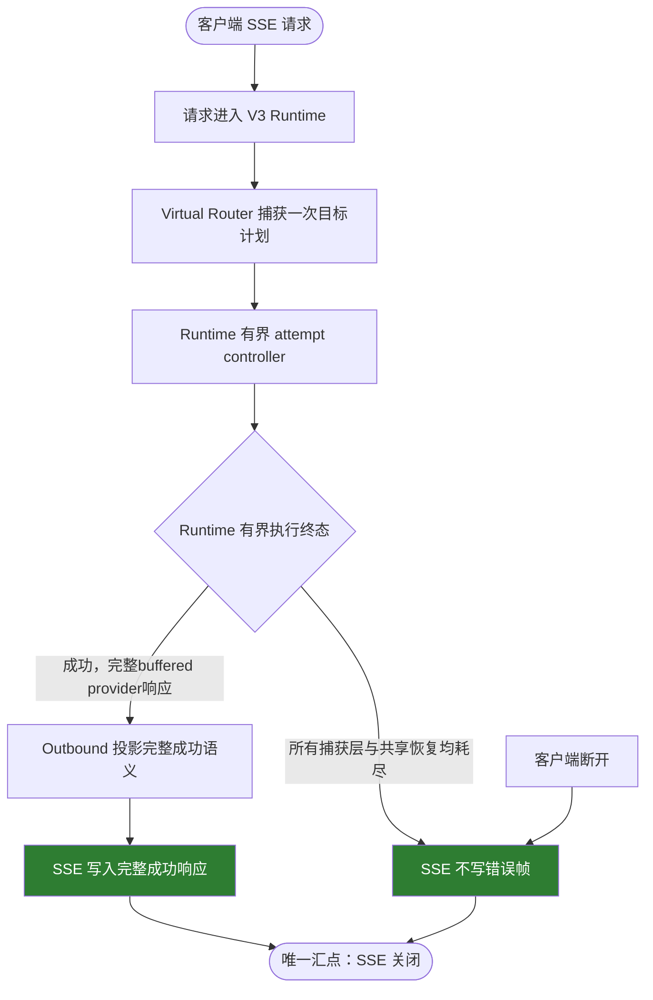

# SSE 连接单源单汇 DAG 与 Provider 恢复等待修复

> 日期：2026-09-26
> 范围：RouteCodeX V3 `4444` Responses SSE 链路；修复“服务器与客户端 SSE 连接挂死”的根因。

## 1. 结论

当前证据显示挂死发生在 provider cooldown 恢复等待阶段：

- 请求已进入 `/v1/responses` 生命周期，打印过 `route_selected` 或 `provider-error`；
- 后续没有 `request.completed` / `request.failed`，客户端 SSE 一直 Working；
- 根因候选集中在 `provider_cooldown_rescue` 的无 deadline 等待，以及 session 成功恢复后未发布 availability generation，导致等待中的请求永远不醒。

## 2. 语义 DAG（单源单汇）



该图保持请求生命周期的单源单汇：只有 Runtime 内部状态机执行有界 provider attempts；每次失败交给 Error Center，Error Center 返回 typed disposition。SSE transport 不承担 provider retry，也不成为无终点泳道。

## 3. 实际根因

### 3.1 cooldown-only exhaustion 等待无请求级 deadline

`select_v3_expanded_target_with_exhaustion_rescue` 在全池候选都处于 cooldown recovery 时，会进入等待循环：

- `next_provider_cooldown_probe_deadline` 返回 `None` 时，直接 `wait_for_availability_change(...).await`，没有任何 deadline；
- 有 probe deadline 时，只等待 `availability_change` 或 probe deadline，不会在服务端请求 residence deadline 到达时结束。

当 probe 无法恢复、availability 不变化时，该请求就永久挂在 Target 选择等待中，客户端 SSE 无法收到终端错误帧。

### 3.2 session 成功恢复没有唤醒等待者

`record_provider_success_in_session` 会清除 session cooldown，但它没有调用 `publish_availability_change()`。等待中的请求观察的是同一个 `availability_generation`，因此即使 provider 已经恢复，等待任务也不会被唤醒，只能继续挂住。

## 4. 修复方案

### 4.1 给 rescue 等待加有界 deadline

在 `provider_cooldown_rescue.rs` 中：

- 从 manifest server 的 `execution.attempt_store.residence_timeout_ms` 计算 rescue deadline；
- 循环顶部检查 deadline，超时返回 `V3TargetSelectionAfterRescue::Exhausted`；
- `Some(deadline)` 与 `Ok(None)` 两个等待分支都使用 `tokio::select!`，同时等待 availability change、probe deadline、rescue deadline。

这样 cooldown-only exhaustion 不再是无界等待；超时后由 Error Center 投影 typed terminal，SSE 最终关闭。

### 4.2 成功恢复发布 availability generation

在 `health.rs` 的 `record_provider_success_in_session` 末尾调用 `publish_availability_change()`，与 `record_provider_key_success` 等其他成功路径保持一致。等待中的请求收到 generation 变化后会重新评估 provider 池。

## 5. 保持的架构边界

- SSE 仍是客户端通信边界，不承担 provider retry；
- session-bound provider availability 仍是 Target 的输入契约，不被本次修改折叠进全局 cooldown truth；
- provider cooldown 恢复仍由 typed provider health 和 Error chain 驱动，不在业务 payload 中重建控制状态。

## 6. 验收条件

1. `cooldown_only_exhaustion_bounds_rescue_wait_with_residence_deadline` 回归：短 residence timeout 下返回 `Exhausted`，不再挂住。
2. `success_in_any_session_publishes_availability_change_for_waiters` 回归：session 成功会发布新的 availability generation。
3. `routecodex-v3-runtime --lib` 与 `routecodex-v3-provider-responses --lib` 测试通过。
4. 架构 gate `verify:v3-architecture-ci` 通过。

## 7. 源码锚点

```text
v3/crates/routecodex-v3-runtime/src/provider_cooldown_rescue.rs
  select_v3_expanded_target_with_exhaustion_rescue

v3/crates/routecodex-v3-provider-responses/src/health.rs
  record_provider_success_in_session
  publish_availability_change

v3/crates/routecodex-v3-provider-responses/src/health_tests.rs
  success_in_any_session_publishes_availability_change_for_waiters

v3/crates/routecodex-v3-runtime/src/provider_failure_runtime_policy/tests/cooldown_exhaustion.rs
  cooldown_only_exhaustion_bounds_rescue_wait_with_residence_deadline
```
