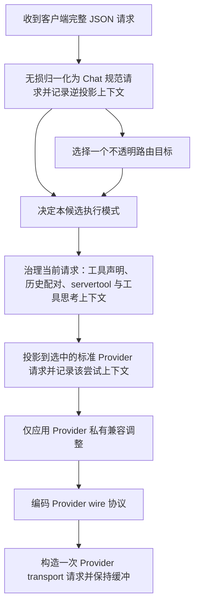
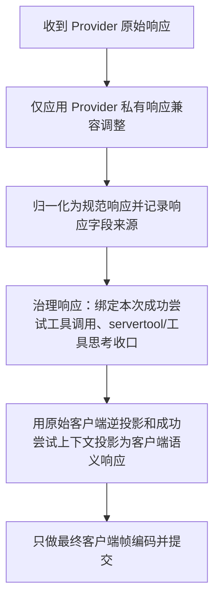
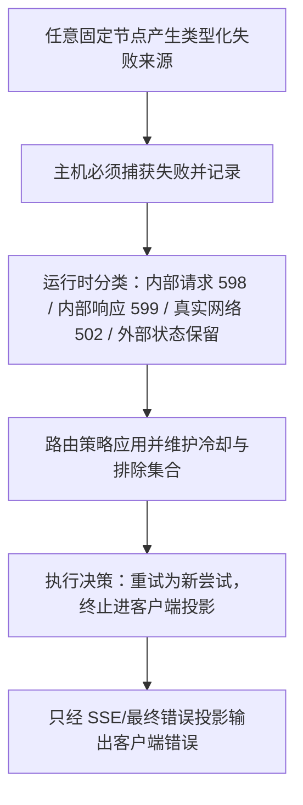
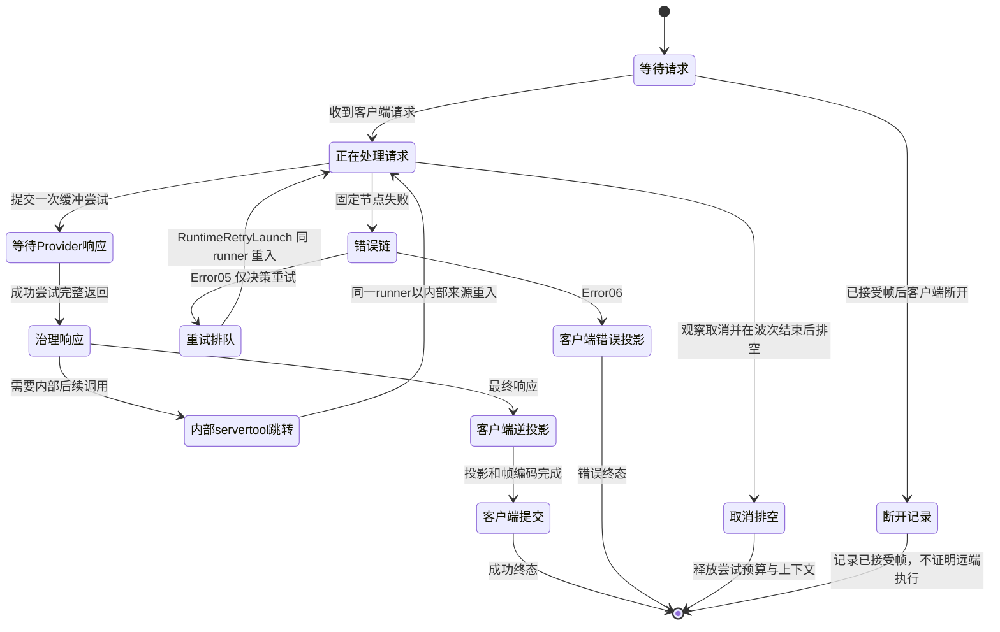

# V3 unified operation runner design

> Contract for the complete target graphs. In the current production baseline, only the
> `capture_client_json` SESE slice is compiled and run by the DAGpipe Runtime entry. The complete
> request, response, and error graphs, their later Operators, and field-profile execution are not
> claimed as runtime cutovers. Existing Hub v1 owners and maps remain the execution truth for every
> operation after capture until its own node delivery.

## Scope

The proxy admits client requests and provider responses without using field or protocol-shape
validation as a rejection gate. Field operators choose a semantic mapping when one is registered;
otherwise the original value remains an opaque extension for the same request/response inverse
path. A validator may report a mapping defect, but the runtime does not turn that report into a
client-visible rejection or silently discard the field. Black-box acceptance compares complete
payloads and the paired return path, including fields absent from the current standard profile.
The node tables' typed failure exits are reserved for actual internal execution/configuration
faults and provider/transport failures. Unknown fields, unmatched discriminators, null business
values, and target shape incompatibility take the opaque preservation path and never enter those
failure exits by themselves.
The opaque record belongs to the Chat extension data plane and contains the original field path,
value, and encoding. `request_inverse_context` and response provenance contain only typed
references to those records and the entry protocol; they never mirror the business value.
Outbound forwards an unmatched request value unchanged on the provider attempt, and the inverse
projection restores unmatched provider response values to the client's entry protocol from the
same attempt's records. Every opaque record is consumed once and remains associated with its
original request/response turn; no log or snapshot reconstructs it.

The legacy outbound parity gate still characterizes old projection behavior, including local
`UnmappedOutboundFields` failures and custom grammar loss. Those are known transparency defects,
not normative acceptance criteria for the new runner. At each Outbound owner cutover, replace the
legacy rejection assertions with positive provider-wire forwarding and paired client inverse
tests, then remove the superseded implementation. A green legacy parity gate does not prove this
transparency contract; the field-profile gate guards the new design until real-entry tests prove it.

The design fixes the six P1 findings from the earlier unified-operation candidate:

1. Define one fixed Runtime runner with a published Config manifest and MetadataCenter control
   resource wiring, not a second lifecycle graph in documentation.
2. Make Config declaration-only. Transformation implementation truth is the static reusable
   field operator library; existing runtime tables and adjacent codecs are the production baseline
   only and are physically removed at their own cutover. No hand-written mapping defaults or
   incompatible Anthropic/Gemini container mappings are introduced by this design.
3. Require operator/compat/fold admission through exact registered operator name+version, not
   non-empty descriptors. The DAGpipe CLI validates syntax only; project `compile()` remains the
   authoritative registry/schema/effect gate.
4. Reuse the existing `ErrorErr01SourceRaised -> ErrorErr02HostCaptured ->
   ErrorErr03RuntimeClassified -> ErrorErr04RouterPolicyApplied ->
   ErrorErr05ExecutionDecision -> ErrorErr06ClientProjected` chain. HostCaptured is mandatory
   and SSE is the only client projection/communication exit.
5. Close Direct/Relay mode, ToolThinking, request inverse, successful-attempt tool projection,
   response provenance/tool binding, remote continuation, and servertool hop ownership with
   explicit writer/reader/release boundaries. The original client `request_inverse_context` stays
   request-scoped through retry and servertool follow-up; only attempt-scoped control and transport
   resources are released by a typed attempt cleanup before re-entry.
6. Bind the design to tool-semantic fixes already merged in `main` (e.g. Codex integer tool
   argument normalization and provider tool-name governance) instead of copying an older candidate
   without those fixes.

The current Anthropic inbound encoder is not a semantic golden for media. Its production
`message_encoding` path drops `document` content blocks and encodes image base64 bytes plus MIME as
a `data:` URL in `input_image.image_url`; the shape collector's synthetic
`content[].image.source.*`/`content[].document.source.*` labels are test-only diagnostics, not SDK
paths. The field profile instead binds the real `content[].source.type/url/data/media_type` members.
Before the Anthropic media projection node is connected, the actual encoder and ReqInbound02
consumer must demonstrate image URL, image base64 data/MIME, and document base64 data/MIME as
distinct Chat semantics, including negative cross-mapping cases. Black-box comparison records
these old divergences as defects to repair, never as accepted golden output.
The current `anthropic_relay_runtime_integration` expectation for a base64 image's provider wire
`input_image.image_url = data:...` must be replaced with a semantic assertion at the affected
projection boundary when that node is cut over; it cannot serve as evidence that inbound media
normalization is lossless.

### Historical image placeholder ownership

The design keeps the existing historical-image behavior, but places it at the Chat Process request
governance boundary rather than in lossless inbound normalization. `normalize_request_losslessly`
must preserve image fields and protocol provenance while creating canonical Chat; the later
`govern_chat_request` operation owns the history-aware placeholder transform as part of request
history governance. This is a deliberate, separately tested Chat Process behavior, not permission
for Inbound, Outbound, or arbitrary Compat code to rewrite media.

For Responses, OpenAI Chat, Anthropic, and Gemini request shapes with a current user carrier, the
transform replaces images in earlier history turns with the stable `[Image]` text representation
while retaining the current user turn's images for routing and multimodal inference. For the
messages/input shapes, if no newer user carrier follows the last user carrier, images in the
trailing historical tool outputs are also represented by `[Image]`. It preserves message and item
order, the surrounding text, and tool identity; it does not read or mutate tool inverse provenance,
remove the message, or rewrite image data in the current user turn. Tests must cover each source
protocol, historical and current-turn images, applicable tool-only replay shapes, stable output
across different image bytes, and the full request path through provider projection.

The production baseline currently invokes historical cleanup from ReqInbound02 and has a distinct
selected-target compatibility projection in Provider Compat. Those are implementation locations,
not the target design owner. At the corresponding node cutovers, the historical transform moves to
Chat Process and the old inbound invocation is removed so one owner applies it exactly once. The
selected-target non-multimodal projection remains a separate target-capability behavior and must
not be conflated with history cleanup. The full-image continuation-save helper is not part of this
graph: local continuation is bypassed, and only remote continuation is in scope.

## Fixed graphs

The design validates three DAGpipe SESE graphs:

- [request graph](../architecture/dagpipe/v3.operation_runner.request.graph.json): one source
  ARC `source-request`, one exit ARC `transport-request`. The Runtime runner entry
  (`RuntimeRequestGraphEntry`) creates the typed `v3.operation_runner.request_origin_kind` resource
  for every request graph invocation before the graph starts. Only `NormalizeRequest` reads that
  origin and initializes `request_inverse_context` for `client_entry`, preserving it for `retry` and
  `internal_followup` re-entries.
- [response graph](../architecture/dagpipe/v3.operation_runner.response.graph.json): one source
  ARC `provider-raw`, one exit ARC `client-frame-candidate`; every node always runs once in fixed order.
  `Resp03` writes the typed `execution_disposition` only to the control resource. RespOutbound and
  frame staging return an empty candidate for `servertool_followup`; Runtime discards it and runs
  the sidecar, runs typed attempt cleanup, and re-enters the request graph without releasing
  `request_inverse_context` or `explicit_history_pairing`. The graph nodes carry typed resource reads/writes
  (`attempt_declaration_map`, `explicit_history_pairing`, `response_provenance`,
  `response_tool_binding`, and `execution_disposition`) so the provenance chain and disposition are
  explicit in the graph artifact. Only RuntimeClientCommit may submit a staged candidate when the
  disposition is `client_commit`.
- [error graph](../architecture/dagpipe/v3.operation_runner.error.graph.json): one source ARC
  `source-failure`, one exit ARC `error-client-projected-candidate`; every node always runs once
  in fixed order. Error06 returns an empty candidate for `retry` and a projected candidate for
  `terminal_client_error`; Runtime discards or submits that candidate according to the typed
  Error05 decision. Retry releases failed attempt resources and re-enters the request graph; only
  `terminal_client_error` reaches RuntimeRequestFinalizer. The graph nodes carry typed `v3.error.execution_decision` and
  `v3.error.client_projection_candidate` resource reads/writes for the same single-sink rule.

Each graph uses exact `operator@operator_version` bindings. The graphs are design DAGs, not
executable claims. A Runtime candidate must parse them, compile them with `pipeline_runtime`,
register every referenced operator under the same name/version, and run one graph per request,
response, or error source. `dagpipe graph validate` proves static topology only.

## Node ownership matrix

Every node in the three design graphs has one owner, one typed input/output ARC pair, and one
resource family. Caller/callee binding is `runtime_bound` only for `capture_client_json` and its
listed Server callers; all later node bindings remain pending. The runtime tables and existing H1
owners remain the production baseline for those later nodes; they are not the design's field
mapping truth.

### Request graph `v3.operation_runner.request@1`

| Node | Owner | Input ARC | Output ARC | Typed resource | Success terminal | Failure terminal | Acceptance |
| --- | --- | --- | --- | --- | --- | --- | --- |
| capture_client_json | `routecodex-v3-runtime` (`operation_runner/operators/capture_client_json.rs`; RuntimeRequestGraphEntry invokes it) | source-request | client-json | none; this pure pass-through has no MetadataCenter or request-origin access | client-json produced | typed source failure to ErrorErr01 | one invocation per request-graph entry; HTTP and Responses WebSocket enter the same Runtime operation; output is the same JSON value; Direct/Relay handoff reuses it |
| normalize_request_losslessly | `routecodex-v3-runtime` (Inbound/Chat Process lossless boundary) | client-json | canonical-request | request_origin_kind read; request_inverse_context and explicit_history_pairing written only for client_entry, read/preserved for retry/internal_followup | canonical-request produced | typed source failure to ErrorErr01 | inverse context owned by this node; Config has no mapping defaults |
| resolve_target | `routecodex-v3-runtime` (Virtual Router) | canonical-request | selected-target | hub.resolved_target written | selected-target produced | typed source failure to ErrorErr01 | target identity is typed resource, not payload |
| plan_execution | `routecodex-v3-runtime` (Target Interpreter) | canonical-request, selected-target | execution-plan | execution_mode written | execution-plan produced | typed source failure to ErrorErr01 | mode is typed control resource; Config cannot select mode |
| govern_chat_request | `routecodex-v3-runtime` (Chat Process Req04) | execution-plan | governed-request | tool_thinking_turn_context written; explicit_history_pairing read | governed-request produced | typed source failure to ErrorErr01 | tool declaration domains separated; applies the declared historical-image placeholder policy exactly once while preserving current-turn images; no payload control truth |
| project_standard_provider_request | `routecodex-v3-runtime` (Outbound) | governed-request | standard-provider-request | request_inverse_context and explicit_history_pairing read; attempt_projection_context and attempt_declaration_map written | standard-provider-request produced | typed source failure to ErrorErr01 | projection runs through registered field operators and typed config; tables are baseline only |
| adjust_provider_private_request | `routecodex-v3-runtime` (Compat) | standard-provider-request | compatible-provider-request | provider_wire_payload read/write | compatible-provider-request produced | typed source failure to ErrorErr01 | compat is registered operator@version, not description |
| encode_provider_wire | `routecodex-v3-runtime` (Provider wire codec) | compatible-provider-request | provider-wire | provider_wire_payload read | provider-wire produced | typed source failure to ErrorErr01 | codec has no retry loop |
| construct_transport_request | `routecodex-v3-runtime` (Provider transport) | provider-wire | transport-request | provider.transport_request produced | transport-request produced | typed source failure to ErrorErr01 | one transport exit; network failures remain provider/Error chain |

### Response graph `v3.operation_runner.response@1`

| Node | Owner | Input ARC | Output ARC | Typed resource | Success terminal | Failure terminal | Acceptance |
| --- | --- | --- | --- | --- | --- | --- | --- |
| adjust_provider_private_response | `routecodex-v3-runtime` (Compat) | provider-raw | compatible-provider-response | attempt_projection_context read | compatible-provider-response produced | typed source failure to ErrorErr01 | provider-private adjustment only; no second mapping truth |
| normalize_provider_response | `routecodex-v3-runtime` (RespInbound02) | compatible-provider-response | canonical-response | attempt_projection_context and attempt_declaration_map read; response_provenance written | canonical-response produced | typed source failure to ErrorErr01 | RespInbound02 is the unique producer of response provenance; full provider response preserved before governance |
| govern_chat_response | `routecodex-v3-runtime` (Chat Process Resp03) | canonical-response | governed-response | attempt_declaration_map, explicit_history_pairing, response_provenance, tool_thinking_turn_context read; response_tool_binding, execution_disposition, and servertool_sidecar_plan written | governed-response produced | typed source failure to ErrorErr01 | Resp03 decides only client-vs-servertool response disposition; retry is Error05-owned and cancellation is Runtime-owned |
| inverse_project_client_response | `routecodex-v3-runtime` (RespOutbound) | governed-response | client-semantic-response candidate | request_inverse_context, attempt_projection_context, attempt_declaration_map, response_provenance, response_tool_binding, execution_disposition read | candidate produced or empty candidate for servertool_followup | typed source failure to ErrorErr01 | immutable original client inverse plus successful-attempt context and call binding; no identity reconstruction from payload |
| frame_committed_client_response | `routecodex-v3-runtime` (Server/SSE client frame staging) | client-semantic-response candidate | client-frame-candidate | client_disconnect, transport_intent, execution_disposition read | staged candidate produced or empty candidate for servertool_followup | typed source failure to ErrorErr01 | staging never communicates; RuntimeClientCommit is the only submitter |

The response graph sink is a staged candidate, never a committed client frame. All response nodes
run in declared order for every successful attempt; typed control state does not rewrite or skip
the graph. The response chain is explicitly `RespInbound02 -> Resp03 -> RespOutbound05`, where
RespInbound02 produces `response_provenance`, Resp03 consumes it and produces `response_tool_binding`
plus `execution_disposition`, and RespOutbound05 consumes both only for the successful attempt.
Resp03 writes `execution_disposition` to its typed control resource. The inverse and frame nodes
produce an empty candidate for `servertool_followup`; Runtime discards it, executes the declared
sidecar, and re-enters the request graph. For `client_commit`, RuntimeClientCommit consumes the
staged candidate only after the graph and complete provider attempt have finished. Retry is
Error05-owned and cancellation is Runtime-owned. No graph shortcut, cross-node cycle, second runner,
or payload-carried control replaces this chain.

### Error graph `v3.operation_runner.error@1`

| Node | Owner | Input ARC | Output ARC | Typed resource | Success terminal | Failure terminal | Acceptance |
| --- | --- | --- | --- | --- | --- | --- | --- |
| error_err01_source_raised | `error.pipeline_contract` (existing ErrorErr01) | source-failure | error-source | error.chain written | error-source produced | unrecoverable host capture failure still enters ErrorErr02 | every fixed-node failure enters this node |
| error_err02_host_captured | `error.provider_failure_policy` (existing ErrorErr02) | error-source | error-host-captured | error.chain read/write | error-host-captured produced | no skip path; this node is mandatory | HostCaptured never skipped |
| error_err03_runtime_classified | `error.pipeline_contract` (existing ErrorErr03) | error-host-captured | error-classified | error.chain, provider_runtime.observation read/write | error-classified produced | classification failure remains in error chain | classification is typed, not payload metadata |
| error_err04_router_policy_applied | `error.execution_decision_consumer` (existing ErrorErr04) | error-classified | error-policy-applied | error.chain, route.retry_exclusion_set read/write | error-policy-applied produced | policy failure remains in error chain | cooldown/retry policy preserved |
| error_err05_execution_decision | `error.execution_decision_owner` (existing ErrorErr05) | error-policy-applied | error-for-projection | error.chain, v3.error.execution_decision read/write | error-for-projection produced; typed decision stays in the side resource | decision failure remains in error chain | writes retry/terminal decision only to typed control resource |
| error_err06_client_projected | `error.client_projection_candidate` / SSE (existing ErrorErr06) | error-for-projection | error-client-projected-candidate | error.chain and error_execution_decision read | projected candidate for terminal_client_error; empty candidate for retry | typed source failure to ErrorErr01 | this node always runs; Runtime discards retry output and only submits terminal projection through Server/SSE |

## Runtime runner

The future runner is one Rust `Runtime::run` call per request/response/error source. It compiles
only immutable graphs and never accepts mutable graph configuration at request time. The request
and response graphs are separate SESE object flows; the error graph is separate and is invoked by
typed failure from any fixed node.

The runner owns:

- attempt budget and attempt identity;
- full-attempt buffering before client commit;
- cancellation drain after wave completion;
- one request finalizer that runs only after final client commit, terminal_client_error, cancel,
  or disconnect; retry and servertool_followup never trigger it; terminal_client_error,
  cancel, and disconnect release attempt scope through RuntimeAttemptCleanup before this finalizer;
- typed attempt cleanup that releases selected-attempt projection context, attempt declaration map,
  response provenance, response tool binding, provider/response buffers, provider permits, client
  frame candidates, and the servertool sidecar plan between graph invocations or before final
  request cleanup;
- release of request-scoped inverse context, explicit history pairing, execution mode, MetadataCenter
  request slots, and remaining provider permits only at RuntimeRequestFinalizer.

The response graph has one source and one sink. Every declared node runs in fixed order; typed
dispositions stay on the control side and do not alter graph topology:

| Disposition | Producer | Consumers | Effect |
| --- | --- | --- | --- |
| `client_commit` | `Resp03` | inverse projection, frame staging, RuntimeClientCommit, RuntimeRequestFinalizer | response graph stages a candidate; RuntimeClientCommit alone submits it; finalizer then releases request scope |
| `servertool_followup` | `Resp03` | inverse projection, frame staging, RuntimeInternalFollowup, RuntimeAttemptCleanup, request graph | response graph stages an empty candidate; Runtime discards it, releases attempt scope, and re-enters with internal origin; finalizer is not triggered |
| `retry` | `Error05` | Error06, RuntimeRetryLaunch, RuntimeAttemptCleanup, request graph | Error06 stages no client error; Runtime discards it, releases failed attempt scope, and admits one new attempt without a graph backedge; finalizer is not triggered |
| `cancel` | Runtime | `RuntimeCancellation`, RuntimeAttemptCleanup, finalizer | no client commit; drains and releases attempt scope, then request scope |
| `disconnect` | ServerDisconnectReceipt | `RuntimeAttemptCleanup`, finalizer | no new client commit; covers pre-first-frame and post-frame disconnects; releases attempt scope, then request scope |

The request, response, and error graphs stay separate. Retry and servertool re-entry happen only
after their fixed graph has returned to its single sink; Runtime consumes the typed disposition,
discards any nonterminal candidate, and starts a new request graph invocation. This is caller-owned
lifecycle control, not a graph cycle or hidden operator route. Inverse projection and Server/SSE
frame staging remain in the fixed response graph; actual client communication remains outside the
graph under Server/SSE ownership. `RuntimeRequestFinalizer` is the sole request-scoped cleanup owner
and is reached only at final client commit, terminal_client_error, cancel, or disconnect. Terminal
client errors, cancellations, and disconnects first release attempt-scoped resources through
RuntimeAttemptCleanup; only after that request-scoped cleanup runs. Retry and
servertool hops use the finite typed `RuntimeAttemptCleanup` step: it consumes attempt identity and
disposition, releases attempt-scoped resources, and returns to the same runner for the next request
graph invocation. It never starts a second runner, creates a graph backedge, or stores local continuation.

The original client inverse is domain-separated from every internal follow-up payload. A servertool
hop re-enters the request graph with internal origin but must preserve the existing
`request_inverse_context` and `explicit_history_pairing`; it never rebuilds original client control
truth from the follow-up payload. See the schema gap below for the DAG graph change this requires.

Server owns HTTP/WebSocket framing, body limits, disconnect receipt, and final frame delivery.
SSE owns framing only; it never creates a second semantic response exit.

## Config and MetadataCenter

`V3Config04ResourceRegistryBuilt -> V3Config05ManifestPublished` publishes closed operator IDs,
static hook-set references, protocol profiles, allowed modes, and capability facts. Config never
contains selected modes/targets or request-specific plans. It publishes the compiled operator
registry, fixed graph declarations, protocol field profiles, and capability facts. Runtime tables
remain the read-only production baseline until each corresponding node is cut over; they are not
Config mapping inputs or a second post-cutover owner.

The design treats MetadataCenter as a typed control resource registry, not a payload extension.
Its closed identity/provenance slots are `inbound_inverse_context`, `attempt_projection_context`,
`attempt_declaration_map`, `explicit_history_pairing`, `response_field_provenance`, and
`response_tool_call_binding`. Slot writers, readers, and release points are declared in the
lifecycle manifest and resource map. Tool arguments and outputs stay in business payloads; the
center stores identity, namespace, kind, paths, and encoding only. These values are never serialized
into request/response/provider/client metadata, history, or debug snapshots.

## Field mapping truth

Transformation implementation truth is the static reusable field operator library defined by
`field_operator_library` / `operator_registry.field_operators` in
[v3.operation_runner.field_profiles.v1.yml](../architecture/manifests/v3.operation_runner.field_profiles.v1.yml).
Per-protocol config supplies only explicit source-path -> registered `field_operator@version`
plus typed parameters. The legacy conversion tables under
`v3/crates/routecodex-v3-runtime/tables` are migration baselines only: they characterize current
behavior and provide equivalence inputs, but they are not semantic configuration truth and are
not a second owner. The new field manifest is the single post-cutover semantic configuration
truth; each legacy table is replaced and physically removed at its own node cutover. The design
does not duplicate Anthropic or Gemini
container mapping defaults. If a field has no compatible standard projection, its original path,
value, encoding, and inverse association remain opaque through the request/response cycle. The
field does not become a local `598`/`599` or disappear; operators never guess a conversion.

The semantic field matrix is inventory/characterization input for this design, not a second
executable mapping truth. `docs/architecture/reviews/v3-protocol-semantic-field-matrix.yml`
remains the review surface for protocol-specific field coverage, and this design does not create
a second executable matrix.

## Operator admission

Every DAGpipe node must bind `operator@operator_version`. Admission is not satisfied by a
non-empty name/description. The project's `pipeline_runtime::compile(graph, &registry,
&capabilities)` must resolve each exact name/version pair, validate input/output `ValueType`,
ARC access, effects, dead nodes, and declared capabilities. The new architecture gate
`verify:v3-operation-runner-dagpipe` checks that every graph node carries `operator_version` and
that the design maps reference the graphs.

Compat and fold operations are registered operators too. They may be pure/effectful as declared,
but their identity and version are part of the compiled graph. No compat/fold row can admit by
description alone.

## Error chain

The design follows the exact existing chain from [error.mainline.yml](../architecture/manifests/error.mainline.yml):

```text
ErrorErr01SourceRaised -> ErrorErr02HostCaptured -> ErrorErr03RuntimeClassified ->
ErrorErr04RouterPolicyApplied -> ErrorErr05ExecutionDecision -> ErrorErr06ClientProjected
```

`ErrorErr02HostCaptured` is mandatory: no source failure skips host capture. Internal request
stage failures project `598`; internal response stage failures project `599`; real network
failures project `502`; external provider failures preserve their real status. Local projection
and wire encoding failures never mutate provider health and never masquerade as transport
failures.

## Mode, inverse, ToolThinking, and response binding

Each control/projection family has one writer and explicit readers:

| Resource | Writer | Readers | Release |
| --- | --- | --- | --- |
| execution mode | `plan_execution` after `resolve_target` | `govern_chat_request`, `project_standard_provider_request`, `govern_chat_response` | request finalizer |
| request origin kind | `RuntimeRequestGraphEntry` (Runtime runner entry) | `normalize_request_losslessly` | graph invocation return; storage none; created immutable per invocation; never enters request/response/provider/client body; RuntimeRequestFinalizer does not consume or release it |
| request inverse context | `normalize_request_losslessly` | `normalize_request_losslessly`, `project_standard_provider_request`, `inverse_project_client_response` | RuntimeRequestFinalizer; never rebuilt from an internal follow-up payload |
| attempt projection context | `project_standard_provider_request` | `normalize_provider_response`, `inverse_project_client_response` | failed attempt before next candidate; success after final client projection or servertool attempt cleanup |
| attempt declaration map | `project_standard_provider_request` | `normalize_provider_response`, `govern_chat_response`, `inverse_project_client_response` | failed attempt before next candidate; success after final client projection or servertool attempt cleanup |
| explicit history pairing | `normalize_request_losslessly` | `govern_chat_request`, `project_standard_provider_request`, `govern_chat_response` | request finalizer |
| response provenance | `normalize_provider_response` | `govern_chat_response`, `inverse_project_client_response` | after final client inverse projection, servertool attempt cleanup, or finalizer |
| ToolThinking turn context | `govern_chat_request` (Req04) | `govern_chat_response` (Resp03) | after Resp03/client projection |
| response tool binding | `govern_chat_response` | `inverse_project_client_response` | after final client inverse projection, servertool attempt cleanup, or finalizer |
| execution disposition | `govern_chat_response` | inverse/frame staging, RuntimeClientCommit, RuntimeInternalFollowup, RuntimeRequestFinalizer | typed control stays separate; only RuntimeClientCommit submits the staged candidate; finalizer only for client_commit or terminal no-commit outcome |
| servertool sidecar plan | `govern_chat_response` (Resp03) | `RuntimeInternalFollowup` | emitted only for `servertool_followup`; released by attempt cleanup after sidecar execution before request re-entry |
| error execution decision | `error_err05_execution_decision` | Error06, RuntimeClientCommit, RuntimeRetryLaunch, RuntimeRequestFinalizer | typed control stays separate; Error06 always runs and emits a candidate only for terminal_client_error; finalizer only after terminal projection |
| remote continuation reference | entry protocol projection | provider projection and inverse projection | request-local, no local continuation store |
| servertool hop | Resp03 typed action | Runtime internal follow-up | attempt scope released before request re-entry; request scope remains until finalizer |

Tool history/current declaration are separate domains. Current declarations authorize new provider
calls. Explicit history and remote continuation are validation/pass-through only; old history does
not authorize a new provider call.

### Request origin typed resource

Every request graph invocation receives an immutable typed control resource
`v3.operation_runner.request_origin_kind` with legal values `client_entry`, `retry`, and
`internal_followup`, keyed by `requestId`, `invocationId`, and `originKind`. The Runtime runner
entry (`RuntimeRequestGraphEntry` in the architecture maps) is the single producer and creates the
origin before every request graph invocation, including each retry and servertool re-entry, without
putting it in the request payload. `normalize_request_losslessly` is its only graph reader and
reads this resource before it touches canonical request construction.
`request_origin_kind` has no MetadataCenter slot and no cross-invocation storage; its scope ends
when the graph invocation returns, and RuntimeRequestFinalizer does not consume or release it.

For `client_entry`, `normalize_request_losslessly` initializes `request_inverse_context` and
`explicit_history_pairing` from the original client payload. For `retry` and `internal_followup`,
RuntimeRequestGraphEntry creates the new invocation origin, and the same normalize node reads the
existing request-scoped `request_inverse_context` and `explicit_history_pairing` slots and preserves
them. Both request-scoped slots are released only at `RuntimeRequestFinalizer`. The request graph
resource edges and architecture maps bind this rule explicitly; no payload-carried origin marker or
fallback shortcut is introduced. The schema gap is closed by this typed resource binding.

## Main tool-semantic fixes already merged

The design is based on `origin/main` at `7f6266d6f4d95e535e123202512fa39b064ac3ad` and the following tool/semantic fixes:

- Codex integer tool argument normalization is owned at Resp03 and OpenAI codec helpers:
  `v3/crates/routecodex-v3-runtime/src/hub_v1/resp_chat_process_codex_integer_values.rs`,
  `responses_openai_codec.rs`.
- Provider tool-name governance stays at Req04/Resp03 and outbound tool ID/projection helpers:
  `relay_request.rs`, `request_outbound_tool_id.rs`, `request_outbound_builtin_tool_projection.rs`.
- `main` already bound chat Direct provider compat through the single adjacent owner. This design
  preserves that ownership and does not reintroduce a Direct-specific field map.

The old candidate is read-only reference; its content is not copied into this worktree.

## Chinese semantic diagrams

The DAGpipe JSON graphs are machine artifacts. The following Chinese business-semantic diagrams are
the human review surface and follow the `dagpipe-runtime` Skill rule: nodes and edges say what the
business does, not which function calls which function.

### 请求语义 DAG（单源单汇）



### 响应语义 DAG（单源单汇）



### 错误语义 DAG（单源单汇）



### 生命周期状态机（中文）



## Field walker and operator library

The manifest
[v3.operation_runner.field_profiles.v1.yml](../architecture/manifests/v3.operation_runner.field_profiles.v1.yml)
is the machine source for the exhaustive walker contract and operator registry. It fixes the four
directions:

1. client request -> Chat: `normalize_request_losslessly@1`
2. Chat -> provider standard request: `project_standard_provider_request@1`
3. provider response -> Chat: `normalize_provider_response@1`
4. Chat -> client response: `inverse_project_client_response@1`

Every source path from
[v3-protocol-semantic-field-matrix.yml](../architecture/reviews/v3-protocol-semantic-field-matrix.yml)
is assigned to exactly one consumer per direction through the `path_consumers` table. Container paths
own their child paths; a leaf path is never consumed by two operators in the same direction. Tool
`arguments`/`input` are opaque complete values visited as one path; the walker never reparses their
JSON text for mapping. Fold operations declare input paths, registered operator@version, typed
parameters, and exactly one finalize operator/position. Unknown business fields and unmatched
value shapes remain opaque and return through the same client protocol. Duplicate operator
ownership, missing registrations, or invalid graph/configuration fail at compile before any
business request is admitted. Actual provider/transport failures enter the Error chain; local
projection/wire failures never mutate provider health.

Protocol profiles may reference only source-inventory paths, registered operators, and typed
parameters. A profile cannot authorize a new source field by declaring its own path or shape child.
Profiles cannot configure traversal order, node branching, private exits, or a second
field-semantic truth.

An object branch is declared only when the source protocol type permits the
container itself to be an object. The pinned OpenAI SDK types used here declare
Responses `request.input` as `string | ResponseInput` where `ResponseInput` is
an array, and OpenAI Chat message `content` as `string | array | null`; neither
declares a direct object branch. Their profiles therefore cover the leaf and
array branches only. `[]` is an array-item segment and cannot be omitted to
invent direct descendants such as `request.input.type` or
`request.messages[].content.type`. Actual nested objects inside array items,
such as a content part's `image_url` or `file`, retain their exact object paths
in the source inventory and are consumed once. Opaque tool `arguments`/`input`
remain complete values and are not reparsed by the walker.

## Tool identity and attempt maps

`ReqInbound02` records separate typed resources: `explicit_history_pairing` for the current
request's explicit history call/output identity and original kind/namespace/name/argument
encoding, and `request_inverse_context` for the current request's exact `tools[]` identities and
source paths/encoding. Both are initialized only when the request graph origin is `client_entry`;
`retry` and `internal_followup` re-entries read the preserved slots and never rebuild them from the
internal payload. Argument and output values remain opaque business payload. `ReqOutbound07`
reads the inverse context and produces `attempt_declaration_map` for the provider tools actually
emitted for this attempt, using the current declaration domain only; it never
overwrites historical call identity with the current declaration shape.

For Responses array items, `request.input[].type` is the discriminator on each actual input item;
there is no object-level `request.input.type` path. The inbound field profile records the exact
array-item source path, applicable discriminator predicates, and selected semantic branch in the
same request's typed `request_inverse_context`. The paired response uses that provenance to restore
the client's original function/custom tool kind, namespace, name, and encoding. It does not infer
the return shape from a process-wide rule or from whichever provider happened to answer. A typed
discriminator chooses the branch for that one request; it does not authorize rejecting unknown
business values, dropping them, or severing the paired inverse path.

`RespInbound02` writes `response_provenance` for the successful attempt and reads only that
attempt's `attempt_declaration_map` and `attempt_projection_context` when response identity needs
provider context. `Resp03` reads `attempt_declaration_map`, `explicit_history_pairing`,
`response_provenance`, and `tool_thinking_turn_context`; it binds only a new provider call returned
in this successful attempt, and writes `response_tool_binding` plus the typed
`execution_disposition`. `RespOutbound05` restores the original client identity with the request
inverse, response provenance, attempt declaration map, and response binding. It never reconstructs
control state from payload. ToolThinking, Direct/Relay mode, servertool hop, and remote
continuation each have a typed writer/reader/release boundary. Only remote continuation is
supported; no local continuation is introduced.

## Node-by-node schedule

| Order | Graph node | Unique owner |
| ---: | --- | --- |
| 1 | `capture_client_json` | Runtime entry |
| 2 | `normalize_request_losslessly` | Inbound field normalization |
| 3 | `resolve_target` | Virtual Router |
| 4 | `plan_execution` | Target Interpreter |
| 5 | `govern_chat_request` | Chat Process Req04 |
| 6 | `project_standard_provider_request` | Outbound Req07 |
| 7 | `adjust_provider_private_request` | Provider Compat |
| 8 | `encode_provider_wire` | Provider Wire |
| 9 | `construct_transport_request` | Provider transport |
| 10 | `adjust_provider_private_response` | Provider Compat |
| 11 | `normalize_provider_response` | RespInbound02 |
| 12 | `govern_chat_response` | Chat Process Resp03 |
| 13 | Disposition-gated client commit (inverse projection + SSE frame) | Runtime runner / Outbound inverse / Server/SSE |
| 13a | Servertool follow-up after empty client stage | RuntimeInternalFollowup |
| 14 | `error_err01_source_raised` | Error01 |
| 15 | `error_err02_host_captured` | Error02 |
| 16 | `error_err03_runtime_classified` | Error03 |
| 17 | `error_err04_router_policy_applied` | Error04 |
| 18 | `error_err05_execution_decision` | Error05 |
| 19 | `error_err06_client_projected` | Error06/SSE |

### Existing production families (context only, not delivery units)

| Node family | Current production caller/callee | Current runtime implementation | Design owner | Physical ablation | Verification evidence |
| --- | --- | --- | --- | --- | --- |
| Request capture/normalize | HTTP: `pending_endpoint_after_responses_admission_inner`; WebSocket: `handle_responses_websocket_message_with_mode`; Direct then uses `V3Server03HttpRequestRaw`/`C::build_standardized`, while Relay builds protocol-specific Req01/Req02 | `capture_client_json` is compiled/run through the DAGpipe slice before dispatch; Direct and Relay normalization remain in their existing owners | `routecodex-v3-runtime` fixed runner | capture node is bound; remove mode-specific normalization only at node 2's later cutover | design graph + ingress/consumer binding table; same-entry tool and payload black-box replay |
| Target/execution/request projection | `execute_v3_direct_runtime_kernel_core` and `execute_v3_relay_runtime_core` | current Direct/Relay loops | `routecodex-v3-runtime` | remove old decision-after-ChatProcess order | design graph + this matrix |
| Response normalize/govern/project | old Direct/Relay response loops | current codecs and hooks | `routecodex-v3-runtime` | remove second response exit | design graph + this matrix |
| Error | existing `error.mainline.yml` callers | ErrorErr01-06 chain | `error.pipeline_contract` / `error.client_projection` | none; retain chain | `error.mainline.yml` + error graph |

The `capture_client_json` slice is `runtime_bound`; all other graph-node bindings are
`binding_pending` until their own runtime candidates register and run them through the DAGpipe SDK.
This does not claim that the production Server, Direct, or Relay execution loops after capture have
been replaced by the complete request, response, or error graph.

## Runner foundation and per-node delivery

The shared runner foundation is part of the first node delivery; it is not a separate all-runtime
cutover. The first delivery contains the smallest executable runner for `capture_client_json`, its
real ingress callers, and the typed handoff back to the existing downstream owners. The full
request, response, and Error graphs above are the target topology; the first node does not require
all three graphs or all legacy execution loops to switch at once.

### Node 01 gate scope boundary

The static verifier (`verify-v3-operation-runner-dagpipe`) checks the declared request topology and
the `capture_client_json` SESE slice contract. It also checks response and error graph declarations
when present; their absence never blocks this node. These are static design checks only. Runtime
compile/run acceptance and real ingress wiring apply to the `capture_client_json` slice; no later
request node or complete response/error graph must be compiled, loaded, or switched for this
node's delivery.

### Deterministic first-node SESE slice

The request graph file remains the only topology and node-contract source. The first delivery does
not author or maintain a second graph. `RuntimeRequestGraphEntry` derives an in-memory executable
slice from `v3.operation_runner.request@1` by selecting `capture_client_json`, retaining its
declared input ARC and selected output ARC, and retaining only graph nodes and edges required to
produce that output. For this first node the result is exactly:

```text
source-request -> capture_client_json -> client-json
```

The slice has one input (`source-request`) and one output (`client-json`). Both
carry the exact parsed client JSON value and therefore use the registered SDK
`Any` type. This exception applies only before protocol shape validation:
an array or scalar must pass through capture unchanged so the existing protocol
owner can classify it. Semantic ARCs after normalization retain concrete types.
The project `arc_schemas` for these two raw ARCs describe the JSON value itself;
they do not require a fabricated `arc_id` member in the client payload.

The selected node keeps
the canonical node id, operator name/version, schema references, selectors, iterator, and declared
effects unchanged; downstream request nodes and edges are omitted. Runtime resolves those schema
references to SDK `ValueType`s, registers the exact project Operator implementation, and calls
`pipeline_runtime::compile(slice, registry, capabilities)` before passing only the immutable
compiled graph to `Runtime::run`. DAGpipe stores graph id and graph version as separate fields:
`graph_id=v3.operation_runner.request.capture_client_json` and `graph_version=1`; their composite
identity is `v3.operation_runner.request.capture_client_json@1`. Both identity fields passed to
`Runtime::run` must equal the compiled slice fields. The derived id comes from the canonical graph
id and selected node id; the version comes from the canonical graph version. HTTP and Responses
WebSocket callers use this same compiled operation. A missing `capture_client_json@1` registration
must fail compile and enter the existing typed Error owner; no hand-called Operator path is allowed.

The static verifier checks the declared `dagpipe_slice` contract fields and the canonical
`capture_client_json` input/output ARC contract.
The node's runtime acceptance separately requires a real SDK compile/run using the derived slice,
exact JSON-value equality at output, and rejection when the selected Operator is absent. CLI graph
validation or a hand-written call to the Operator does not satisfy that runtime evidence.

The ingress edge is now bound to actual Server paths:

| Ingress | Existing caller | Request value given to capture | Coverage |
| --- | --- | --- | --- |
| HTTP | `pending_endpoint_after_responses_admission_inner` in `v3/crates/routecodex-v3-server/src/endpoint_handlers.rs` | validated protocol `Value`, before the Direct/Relay dispatch branches | OpenAI Chat, Responses, Anthropic, Gemini HTTP entrypoints |
| Responses WebSocket | `handle_responses_websocket_message_with_mode` in `v3/crates/routecodex-v3-server/src/websocket.rs` | the parsed `Value` returned by the existing WebSocket `response.create` framing adapter | both currently supported WebSocket execution modes; this caller bypasses the HTTP dispatcher |

The operation implementation remains owned by Runtime. Server only invokes it and forwards the
unchanged output. Its output is a transparent JSON-value handoff, adapted to the existing input
types without another capture or payload rewrite:

| Existing downstream owner | Current input boundary | First-node handoff rule |
| --- | --- | --- |
| Direct Chat/Responses | `V3Server03HttpRequestRaw` -> `C::build_standardized` in `v3_direct_core.rs` | construct the existing raw request from `client-json`; do not call Relay normalization |
| OpenAI Chat/Gemini Relay | Relay runtime input -> `V3HubReqInbound01ClientRaw` -> existing Req02 | adapt the same `client-json` value into Req01; the adapter has no capture or mapping semantics |
| Responses/Anthropic Relay | protocol Relay input -> existing Req01/Req02 boundary in `responses_relay_runtime_inner.rs` or `anthropic_relay_runtime.rs` | adapt the same `client-json` value into the existing input; do not claim a shared old normalizer exists |
| Direct-to-Relay handoff | existing `request_execution_control` handoff in `executors.rs` or `responses_direct_server_outcome.rs` | retain the in-flight `client-json` value and existing control unchanged; do not re-enter ingress or execute capture a second time |

Anthropic and Gemini Direct are not current supported branches; the first node preserves their
existing pending/unsupported behavior and does not add protocol capability. The HTTP dispatcher
and WebSocket handler are alternate Server transports into one Runtime operation, not separate
field-mapping implementations. `request_origin_kind` is consumed only at request normalization and
is never encoded into the captured JSON.

The first delivery must:

1. Derive the `capture_client_json` SESE slice from the canonical request graph, compile it through
   `pipeline_runtime::compile`, and execute it through `Runtime::run`; prove that an absent operator
   registration is rejected. Do not hand-call the Operator or require Runtime execution of the
   complete request, response, and Error graphs before this node can ship.
2. Register and load only the runner resources, operator version, and parameters required by this
   slice.
3. Call the same Runtime capture operation from both listed ingress callers. It preserves the
   incoming `Value` exactly and returns it through one `client-json` output ARC.
4. Forward that output to the currently selected Direct/Relay owner using only the typed adapters
   above. Existing Direct/Relay dispatch remains the sole owner of execution-mode selection.
5. On Direct-to-Relay handoff, reuse the captured value and current request control. No new capture
   invocation occurs and no request control is rebuilt from the payload.
6. Route this node's typed failure through the existing Error owner. Server does not project an
   operation failure directly to the client; unrelated validation errors retain their current
   Server boundary owner.
7. Leave every not-yet-migrated node with its current unique owner. Remove only old raw-capture
   behavior superseded by this node; retain existing mode-specific normalization, lifecycle,
   response, and Error paths until their own node deliveries.

The first-node acceptance covers all four HTTP protocol entries in their currently supported
modes, Responses WebSocket Direct and Relay, and OpenAI Chat/Responses Direct-to-Relay handoff. It
proves one capture per request-graph invocation, exact JSON-value equality at each existing owner,
unchanged request-control/budget continuity, typed failure entry to the existing Error owner, and
no duplicate capture or bypass. Compare the same real-entry black-box samples before and after the
candidate. Also run complete GCM client-tool round trips on `gpt-5.5` and `gpt-5.6-luna` for
`exec_command`, `apply_patch`, and one read-only MCP tool. Each case must show the client tool
declaration, matching provider call and client projection, actual tool execution/result, the
follow-up request carrying that result, and a completed response. For `apply_patch`, use a
disposable worktree-local file and verify its cleanup. `requires_action`, an HTTP 200, or a
projected tool call without the result and follow-up request is incomplete evidence. Static
validation of the three graphs does not prove these runtime callers or tool round trips are wired.

After that delivery, replace exactly one node from the declared schedule per delivery. For each
node, change only its owner and required direct typed edge, remove the superseded implementation,
and retain all not-yet-migrated owners. Run focused positive/negative tests, mapped gates, build,
real-entry black-box comparison, and any node-specific GCM `gpt-5.5` / `gpt-5.6-luna` tool
round-trip before independent architecture review. The tool round-trip must capture the actual
client declaration, Provider declaration, same-request response pairing, inverse client mapping,
tool execution output, and follow-up request. Fix review blockers and rerun affected validation and
review. After PASS, commit, merge, and push this node; rebuild from merged `main`, use the official
install/restart lifecycle when applicable, verify the loaded runtime and replay the same entry
samples, and clean up this delivery's resources before starting the next node. Combine adjacent
nodes only when a focused contract test proves their producer/consumer edge cannot remain valid
independently.

## Evidence boundary

- Graph topology: `dagpipe graph validate` only proves static DAG shape.
- Operator admission: `capture_client_json@1` is compiled and run through the derived slice;
  later Operators still require their own project `pipeline_runtime::compile()` evidence.
- Runtime behavior: Server dispatch and existing Direct/Relay loops remain execution truth after
  capture; the complete request, response, and error graph bindings remain pending.
- Field coverage: semantic matrix statuses remain unchanged; partial/declared rows are not relabeled
  as covered.
