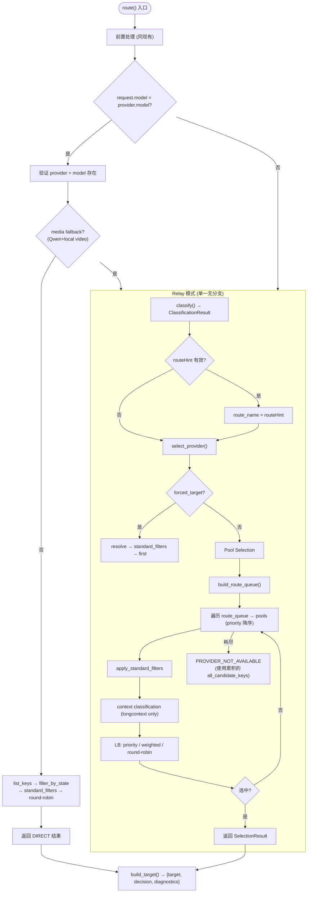

# Virtual Router 路由决策逻辑简化设计

## 目标
消除 4 处冗余/重复逻辑 + 移除 `prefer` 路由指令，使 `route()` → `select_provider()` 的决策流变为单向无分支。

---

## 改动 1：Direct Mode 的双路径合并

### 现状（`route.rs:427-571`）

```
direct_model 匹配?
  ├─ 是 → media fallback?
  │    ├─ 否 → DIRECT 选择 (直接返回)
  │    └─ 是 → classify + route_hint + select_provider  ← 重复块 A
  └─ 否 → classify + route_hint + select_provider       ← 重复块 A (相同)
```

重复块 A 在 `if` 和 `else` 中完全一致：`classify()` → `routeHint` 覆盖 → `select_provider()`。

### 简化后

```rust
if let Some((provider_id, model_id)) = direct_model {
    if !should_fallback_direct_model_for_media(...) {
        // DIRECT: 验证 → 过滤 → round-robin → 直接返回
        return direct_selection_result(...);
    }
    // media fallback: fall through to relay
}

// RELAY: 单一无分支
let mut classification = self.classifier.classify(&features);
classification.reasoning = append_reasoning_tag(&classification.reasoning, marker_reason);
let requested_route = resolve_route_hint(...).unwrap_or(classification.route_name);
let selection = self.select_provider(&requested_route, ...);
```

### 效果
- 消除 `route.rs:518-571`（~53 行）
- classify + route_hint + select_provider 在代码中只出现一次

---

## 改动 2：移除 Prefer 路由指令

### 现状
`prefer` 是用户消息 `<**prefer:provider.model**>` 或 `!provider.model` 语法设置的软偏好，介于 `force`（硬性）和 pool 选择（动态）之间。它在选择路径中占据独立分支，且有自动清除逻辑。

### 理由
- `force` 已覆盖"锁定到指定 provider"的场景
- pool selection 已通过 priority 排序、round-robin 等覆盖"偏好"场景
- prefer 的自动清除逻辑（`should_auto_clear_prefer_target`）增加了隐性状态管理
- prefer 的分支提前截断了 pool 的 fallback 链，违反"完整 fallback"设计

### 需要修改的 16 处

| # | 文件 | 改动 |
|---|------|------|
| 1 | `instructions/types.rs:10` | 删除 `prefer_target: Option<InstructionTarget>` 字段 |
| 2 | `instructions/state.rs:354-357` | 删除 `"prefer" =>` 分支 |
| 3 | `instructions/state.rs:443` | 从 `"clear"` 分支删除 `prefer_target = None` |
| 4 | `instructions/parse/parse_instructions.rs:255-256` | 删除 `parse_named_target_instruction(instruction, "prefer")` |
| 5 | `instructions/parse/parse_instructions.rs:284` | 删除 `!` 前缀生成 `kind: "prefer"` 的逻辑 |
| 6 | `engine/selection.rs:212-251` | 删除 prefer 选择块（~40 行） |
| 7 | `engine/route.rs:149` | 删除 `"prefer" => "prefer"` 标记摘要 |
| 8 | `engine/route.rs:208-226` | 删除 `should_auto_clear_prefer_target` 方法 |
| 9 | `engine/route.rs:287` | 删除 `selection_routing_state.prefer_target = None` |
| 10 | `engine/route.rs:390-394` | 删除 2 处 `should_auto_clear_prefer_target` 调用 |
| 11 | `routing/selection.rs:222` | 从 `resolve_instruction_process_mode_for_selection` 中删除 `prefer_target` 检查 |
| 12 | `routing_state_store.rs:271` | 从 `is_state_empty` 删除 `prefer_target` 检查 |
| 13 | `routing_state_store.rs:313-317` | 删除 `preferTarget` 序列化 |
| 14 | `routing_state_store.rs:589-590` | 删除 `preferTarget` 反序列化 |
| 15 | `engine/selection.rs:18` (导入) | 删除不再需要的 `InstructionTargetMatchMode` 导入（需确认） |

**保留**：`InstructionTargetMatchMode` / `ResolvedInstructionTarget` / `resolve_instruction_target` —— 这些被 `force` 逻辑使用，不能删除。

### 关于 `!` 前缀语法
当前 `!provider.model` 映射为 `kind: "prefer"`。移除 prefer 后此语法无意义——删除解析。用户若需锁定应用 `force:` 显式写出。

### 效果
- 消除 ~70 行代码
- 消除一个完整的选择分支（提前返回）
- 消除 auto-clear 状态管理
- 选择路径简化为纯线性：**Forced → Pool Selection**
- `resolve_instruction_process_mode_for_selection` 只检查 `forced_target`

---

## 改动 3：消除 Route Queue 二次重建

### 现状（`selection.rs:455-480`）

主 pool 遍历耗尽后，为了收集 `candidate_keys` 用于 `PROVIDER_NOT_AVAILABLE` 错误，全部重新构建 route_queue 并重新遍历：

```rust
// 主遍历: for route_name in route_queue { ... }  ← 一次
// ...
// 重建: for route_name in build_route_queue(...) {  ← 二次
//         for pool in self.routing.get(&route_name) {
//           for key in filter_candidates_by_state(...) { ... }
```

### 简化

在主 pool 遍历过程中，顺便把遇到的所有 pool target key 累积到一个 `all_candidate_keys: Vec<String>` 中：

```rust
let mut all_candidate_keys: Vec<String> = Vec::new();

for route_name in route_queue {
    let pools = ...;
    for pool in pools {
        // 累积（仅首次遇到）
        for key in &pool.targets {
            if !all_candidate_keys.contains(key) {
                all_candidate_keys.push(key.clone());
            }
        }
        // ... 现有过滤+选择逻辑 ...
    }
}

// 错误路径直接使用 all_candidate_keys
Err(build_provider_not_available_error(self, env, &all_candidate_keys, ...))
```

### 效果
- 消除 `build_route_queue` 的第二次调用
- 消除第二次 route_queue 遍历循环
- 消除 `filter_candidates_by_state` 的重复调用

---

## 改动 4：合并 Feature Turn-State 提取

### 现状（`features.rs`）

两个平行的 turn-state 分析函数：
- `get_message_turn_state()` — 解析 `request.messages[]`
- `get_responses_context_turn_state()` — 解析 `request.semantics.responses.context.input[]`

然后复杂合并（`features.rs:365-379`，4 路分支）：

```rust
let (has_tool_call_responses, last_assistant_tool) = if current_user_from_messages {
    (message_..., message_...)     // 源 1
} else if current_user_from_responses {
    (responses_..., responses_...) // 源 2
} else if responses_latest_role.is_some() {
    (responses_..., responses_...) // 源 2 再次
} else {
    (message_..., message_...)     // 源 1 再次
};
```

### 简化

定义统一数据结构：

```rust
struct TurnSegmentState {
    latest_role: Option<String>,
    latest_message: Option<Value>,
    has_tool_call_responses: bool,
    last_assistant_tool: Option<ToolClassification>,
}
```

写一个 `extract_turn_state()` 统一处理：

```rust
fn extract_turn_state(request: &Value) -> TurnSegmentState {
    let messages = request.get("messages").and_then(|v| v.as_array());
    let responses_input = request.get("semantics")
        .and_then(|v| v.get("responses"))
        .and_then(|v| v.get("context"))
        .and_then(|v| v.get("input"))
        .and_then(|v| v.as_array());

    // 优先从 messages 提取，回退到 responses context
    if let Some(msgs) = messages {
        let state = analyze_messages_turn(msgs);
        if state.latest_role.as_deref() == Some("user") || responses_input.is_none() {
            return state;
        }
    }
    if let Some(input) = responses_input {
        return analyze_responses_turn(input);
    }
    // 都没有 active user → 使用 messages 状态（continuation）
    analyze_messages_turn(messages.unwrap_or(&[]))
}
```

### 效果
- 消除 `features.rs:320-379` 的复杂 4 路合并
- 消除 ~50 行分支逻辑
- 统一的数据结构使下游更易读

---

## 最终简化后的完整决策流



### 选择路径：3 层 → 2 层

```
改动前: Forced → Prefer → Pool Selection
改动后: Forced → Pool Selection
```

### 与现有流程的关键差异

| 方面 | 改动前 | 改动后 |
|------|--------|--------|
| Direct/Relay 公共代码 | 重复 2 次 classify + route_hint + select_provider | 1 次，direct 早期返回 |
| Prefer 分支 | 独立 40 行 + auto-clear | 不存在 |
| Route queue | 主遍历 + 重建共 2 次 | 1 次，顺便累积 keys |
| Feature turn-state | 2 套分析 + 4 路合并 | 1 个 extract 函数，回退即可 |
| Forced process_mode | 检查 forced + prefer | 只检查 forced |

---

## 变更清单总结

### 需修改的 Rust 文件

| 文件 | 改动类型 | 删除行数 | 新增行数 |
|------|----------|----------|----------|
| `engine/route.rs` | 合并 Direct 路径 + 删除 prefer | ~70 | ~15 |
| `engine/selection.rs` | 删除 prefer 块 + 累积 candidate_keys | ~45 | ~10 |
| `instructions/types.rs` | 删除 `prefer_target` 字段 | 1 | 0 |
| `instructions/state.rs` | 删除 `"prefer"` handler + clear 引用 | 5 | 0 |
| `instructions/parse/parse_instructions.rs` | 删除 `"prefer:"` 解析 + `!` 前缀 | ~15 | 0 |
| `routing/selection.rs` | 从 process_mode 删除 prefer 检查 | ~5 | 0 |
| `routing_state_store.rs` | 删除 serialize/deserialize + is_state_empty 检查 | ~10 | 0 |
| `features.rs` | 合并 turn-state 提取 | ~50 | ~30 |
| `hub_pipeline_blocks/process_mode.rs` | 删除 `"prefer"` 检查 | 1 | 0 |

### 删除的净代码估算
约 **200 行** 删除，**55 行** 新增，净减少约 **145 行**。

### 不修改的文件
- `classifier.rs` — 无需改动
- `routing/config.rs` — `build_route_queue` 等保持
- `load_balancer.rs` — 保持
- `health.rs` / `quota.rs` — 保持
- TSD 层 — `prefer` 没有暴露到 TS，无需改动

---

## 改动 5：移除 VR 热路径中的 Provider 特判

### 原则声明

**Virtual Router 的职责边界**：
- 基于**通用特征**（capability、priority、health、quota）做路由决策
- 不识别任何 provider 名字（qwen、gemini、claude 等）
- 不做 provider-specific 的 fallback、黑名单、优先级调整

**Hub Pipeline 的职责边界**：
- 协议转换（openai ↔ anthropic ↔ gemini）
- Header 注入（user-agent、api-version 等）
- Max tokens 策略

**Provider 配置的职责边界**：
- 显式声明 capabilities（`multimodal`、`web_search`、`video` 等）
- 显式声明 `series` / `authFamily`（用于系列冷却、认证家族黑名单）
- 显式声明协议类型（`providerProtocol` / `outboundProfile`）

### 5a. VR 热路径特判（必须移除）

以下 5 处硬编码在 VR 的**运行时决策路径**中，违反了职责边界：

#### 5a-1. Qwen 媒体回退特判

**位置**：`routing/direct_model.rs:48-71`

```rust
// 当前：检查 provider_id == "qwen" && model == "qwen3.5-plus"
if provider_id.trim().to_lowercase() != "qwen" { return false; }
let is_qwen35_plus = model == "qwen3.5-plus" || ... ;
```

**问题**：VR 知道"qwen"这个 provider 名字和"qwen3.5-plus"这个 model 名字。

**替代方案**：
- Provider 配置中声明 `directModelMediaFallback: true` 或 `mediaHandling: "relay_fallback"`
- VR 读取该声明做通用决策
- 或者在 Hub Pipeline 层做：如果 direct model 不满足 media capability，由 pipeline 重新请求 VR

#### 5a-2. 系列冷却特判（Series Cooldown）

**位置**：`engine/events.rs:631-677`

```rust
// 当前：只允许三个系列名，且从 model_id 通过字符串匹配反推系列
let series = match series_raw.as_str() {
    "gemini-pro" | "gemini-flash" | "claude" => series_raw,
    _ => return None,
};
// resolve_model_series: 通过模型名含 "claude"/"gemini"/"flash"/"pro" 等推断
```

**问题**：
- 系列名称硬编码在代码中
- 通过模型名字符串匹配推断系列（脆弱）

**替代方案**：
- Provider 配置显式声明 `series: "gemini-pro"`（同一个系列的 provider key 使用相同 series 值）
- VR 只读已声明的 series 做冷却传播，不做字符串匹配
- 所有 provider 都能使用 series 冷却，不限于 3 个

#### 5a-3. Qwen 认证家族黑名单

**位置**：`engine/events.rs:147-169`

```rust
// 当前：检查 provider_key 是否以 "qwen." 开头
if !provider_key.starts_with("qwen.") { return false; }
// 然后黑名单所有 qwen.* 的 key
for key in self.provider_registry.list_provider_keys("qwen") { ... }
```

**问题**：VR 知道"qwen"这个 provider ID。

**替代方案**：
- Provider 配置中声明 `authFamily: "qwen-oauth"`（或类似）
- 当认证错误发生时，黑名单所有同 `authFamily` 的 provider
- 通用的 "auth error family blacklist" 机制

#### 5a-4. Multimodal 优先级特判（responses/gemini）

**位置**：`routing/config.rs:198-212`

```rust
// 当前：硬编码检查 provider key 是否含 "responses" 或 "gemini"
if key.contains("responses") || key.contains("gemini") {
    prioritized.push(key.clone());
}
```

**问题**：VR 看 provider key 名字来区分优先级。

**替代方案**：
- `build_route_candidates()` 函数仅 `build_route_queue` + `build_primary_target_groups` 使用
- 废弃 `build_route_candidates()`，改用通用的分组选择（已有 `build_primary_target_groups` 按 providerId.modelId 分组）
- 不同 providerId 的优先级已经由 pool priority 和 LB 策略控制

#### 5a-5. 默认能力推断（Responses/CRS）

**位置**：`provider_registry.rs:310-334`

```rust
// 当前：从 providerType/outboundProfile/compatibilityProfile 推断 capability
match capability {
    "multimodal" => {
        provider_type == "responses"
            || outbound.contains("responses")
            || compatibility.contains("crs")
    }
    "web_search" => compatibility.contains("crs"),
    _ => false,
}
```

**问题**：VR 通过字符串匹配推断能力，而不是直接读取配置。

**替代方案**：
- Capability 必须在 provider 配置中**显式声明**
- 移除所有推断逻辑：`has_default_capability` 变为纯配置查找
- 配置示例：
  ```json
  {
    "providerKey": "qwen.key1.qwen3.5-plus",
    "capabilities": ["multimodal", "video"]
  }
  ```

### 5b. Hub Pipeline / 非 VR 热路径（可保留或重构）

以下代码虽然包含 provider 特判，但不在 VR 的运行时决策路径中：

| 位置 | 内容 | 建议 |
|------|------|------|
| `provider_bootstrap.rs` | Header 注入、Windsurf 特判、provider type 检测 | **保留**。这是 config bootstrap 阶段，不在请求热路径。但应移出 `virtual_router_engine/` 到独立的 `bootstrap/` 模块 |
| `hub_pipeline_blocks/protocol.rs` | 协议别名映射、endpoint 推断 | **保留**。这是 pipeline 的协议层职责 |
| `hub_pipeline_blocks/process_mode.rs` | "sticky"/"force" 指令透传 | **保留**。这是指令透传机制，与 provider 无关 |
| `text_harvest_detection.rs` | DeepSeek/Qwen text tool family | **保留**。这是 tool governance 层职责 |
| TS: `hub-pipeline-max-tokens-policy.ts` | Qwen max output tokens cap | **可保留**。但建议改为配置驱动 |
| TS: `responses-openai-bridge.ts` | forceWebSearch 注入 | **可保留**。bridge 层行为 |
| `provider-resolution-config.json` | Keyword → providerType 映射 | **保留**。这是配置，是正确的方式 |

### 5c. 移除/重构路线图

| # | 改动 | 文件 | 类型 | 优先级 |
|---|------|------|------|--------|
| 1 | 移除 Qwen 名字特判，改为 `directModelMediaFallback` 配置声明 | `routing/direct_model.rs` | **VR 热路径** | P0 |
| 2 | 移除 series 名称硬编码和 model_id 推断，改为配置显式 `series` | `engine/events.rs:631-677` | **VR 热路径** | P0 |
| 3 | 移除 `qwen.` 前缀黑名单，改为 `authFamily` 配置 | `engine/events.rs:147-169` | **VR 热路径** | P0 |
| 4 | 废弃 `build_route_candidates()` 替代为通用分组 | `routing/config.rs:171-214` | **VR 热路径** | P1 |
| 5 | 移除 `has_default_capability` 推断，改为纯配置声明 | `provider_registry.rs:310-334` | **VR 热路径** | P1 |
| 6 | 将 `provider_bootstrap.rs` 移出 `virtual_router_engine/` | — | 模块重组 | P2 |

### 5d. 架构示意图

```
改动前:
                                        ┌─────────────────────┐
  Hub Pipeline ──request──►  Virtual Router                    │
                                        │  • classify (通用)     │
                                        │  • select (通用)       │
                                        │  • ❌ Qwen 特判        │ ← 不该在这里
                                        │  • ❌ series 硬编码     │ ← 不该在这里
                                        │  • ❌ authFamily 推断   │ ← 不该在这里
                                        │  • ❌ 能力推断          │ ← 不该在这里
                                        └─────────────────────┘

改动后:
                                        ┌─────────────────────┐
  Hub Pipeline ──request──►  Virtual Router                    │
                                        │  • classify (通用)     │
  (provider 配置显式声明)                   │  • select (通用)       │
   • capabilities                         │  • series             │ ← 从配置读取
   • authFamily                           │  • authFamily         │ ← 从配置读取
   • directModelMediaFallback             │  • 能力检查           │ ← 从配置读取
                                        └─────────────────────┘
                                              ▲
                                              │ 配置驱动
                                        ┌─────┴────────┐
                                        │ provider.json  │
                                        └──────────────┘
```

### 5e. Provider 配置新增字段建议

```json
{
  "providerKey": "qwen.key1.qwen3.5-plus",
  "capabilities": ["multimodal", "video", "web_search"],
  "series": "qwen-max",
  "authFamily": "qwen-oauth",
  "directModelMediaFallback": true,
  "maxOutputTokens": 65536
}
```

所有 VR 的 provider 特判都将改为读取这些通用字段，不再识别 provider 名字。
