# Virtual Router 路由决策流程图

```mermaid
flowchart TB
    START(["route() 入口"]) --> PRE2["清理异常路由指令标记<br/>(clean_malformed_routing_instruction_markers)"]
    PRE2 --> PRE3["确定 routing_state_key<br/>(continuation→session, 否则 request scope)"]
    PRE3 --> PRE4["加载路由指令状态<br/>(load_routing_state_for_scope)"]
    PRE4 --> PRE5["解析 metadata 指令<br/>(allowedProviders, force/prefer)"]
    PRE5 --> PRE6["处理重试场景<br/>(excludedProviderKeys)"]
    PRE6 --> PRE7["解析用户消息 &lt;**...**&gt; 指令标记<br/>(parse_routing_instructions_from_request)"]
    PRE7 --> PRE8["构建路由特征<br/>(build_routing_features)"]
    PRE8 --> PRE9["拆分指令: core vs stop<br/>应用 core 指令到 routing_state"]
    PRE9 --> PRE10["自动清除不可用的 prefer<br/>(should_auto_clear_prefer_target)"]
    PRE10 --> PRE11["持久化路由状态"]
    
    PRE11 --> DETECT{"parse_direct_provider_model<br/>request.model 含 provider.model?"}
    
    %% ===== DIRECT MODE =====
    DETECT -->|"是, 例如 sdfv.gpt-5.4"| DM_VALIDATE["验证 provider + model 存在"]
    DM_VALIDATE --> DM_MEDIA{"should_fallback_direct_model_for_media<br/>Qwen qwen3.5-plus + local video?"}
    DM_MEDIA -->|"否"| DM_LIST["列出 provider 下所有匹配 model 的 key"]
    DM_LIST --> DM_FILTER["filter_candidates_by_state<br/>(allowed/disabled providers)"]
    DM_FILTER --> DM_FILTER2["apply_standard_filters<br/>(health + quota + concurrency)"]
    DM_FILTER2 --> DM_SELECT{available 非空?}
    DM_SELECT -->|"有可用"| DM_LB["load_balancer.select<br/>round-robin 选择 direct key"]
    DM_LB --> DM_RET["返回 DIRECT 结果<br/>{route: direct, pool: direct}"]
    DM_SELECT -->|"无可用"| DM_ERR["PROVIDER_NOT_AVAILABLE 错误"]
    
    %% ===== DIRECT → RELAY FALLBACK (media) =====
    DM_MEDIA -->|"是"| CLASSIFY["RoutingClassifier.classify()<br/>按优先级评估路由"]
    
    %% ===== RELAY MODE =====
    DETECT -->|"否"| CLASSIFY
    
    CLASSIFY --> CLASSIFY_PRIO{"优先级顺序:<br/>multimodal → web_search<br/>→ thinking → coding<br/>→ search → longcontext<br/>→ tools → background<br/>→ default"}
    
    CLASSIFY_PRIO -->|"multimodal"| CR_MULTI["有图片/远程视频附件"]
    CLASSIFY_PRIO -->|"web_search"| CR_WS["用户输入 search intent<br/>或 websearch tool continuation"]
    CLASSIFY_PRIO -->|"thinking"| CR_THINK["fresh user input<br/>且未达 longcontext 阈值"]
    CLASSIFY_PRIO -->|"coding"| CR_CODE["continuation +<br/>last_tool_category == coding"]
    CLASSIFY_PRIO -->|"search"| CR_SEARCH["continuation +<br/>last_tool_category == search"]
    CLASSIFY_PRIO -->|"longcontext"| CR_LC["estimated_tokens >= 180k"]
    CLASSIFY_PRIO -->|"tools"| CR_TOOLS["continuation + last_tool == other<br/>或有工具活动"]
    CLASSIFY_PRIO -->|"background"| CR_BG["关键词匹配"]
    CLASSIFY_PRIO -->|"default"| CR_DEF["兜底"]
    
    CR_MULTI & CR_WS & CR_THINK & CR_CODE & CR_SEARCH & CR_LC & CR_TOOLS & CR_BG & CR_DEF --> CLASSIFY_OUT["输出 ClassificationResult<br/>{ route_name, confidence, reasoning, candidates }"]
    
    CLASSIFY_OUT --> HINT{"routeHint 存在且有效?"}
    HINT -->|"是"| HINT_OVERRIDE["用 routeHint 覆盖 route_name"]
    HINT -->|"否"| SKIP
    
    HINT_OVERRIDE --> SKIP
    
    %% ===== SELECT_PROVIDER =====
    SKIP --> SELECT["select_provider() 入口"]
    
    SELECT --> FORCED{"routing_state 有 forced_target?<br/>&lt;**force:**&gt;"}
    FORCED -->|"是"| F_RESOLVE["resolve_instruction_target<br/>解析出所有匹配 key"]
    F_RESOLVE --> F_FILTER["apply_standard_filters"]
    F_FILTER --> F_PICK["取第一个可用 key"]
    F_PICK --> F_RET["返回 { route: forced }"]
    
    FORCED -->|"否"| PREFER{"routing_state 有 prefer_target?<br/>&lt;**prefer:**&gt;"}
    PREFER -->|"是"| P_RESOLVE["resolve_instruction_target<br/>按 default pool 排序"]
    P_RESOLVE --> P_FILTER["apply_standard_filters"]
    P_FILTER --> P_MODE{"匹配模式?"}
    P_MODE -->|"Exact (单 key)"| P_EXACT["取第一个可用"]
    P_MODE -->|"Filter (多 key)"| P_RR["load_balancer 选择<br/>round-robin / peek"]
    P_EXACT & P_RR --> P_RET["返回 { route: prefer }"]
    
    PREFER -->|"否"| POOL["进入 Pool 选择阶段"]
    
    %% ===== BUILD ROUTE QUEUE =====
    POOL --> QUEUE["build_route_queue()"]
    QUEUE --> QUEUE_INIT["初始: [requested_route] + candidates (去重)"]
    QUEUE_INIT --> QUEUE_VIDEO{"有远程视频<br/>+ video route 有 target?"}
    QUEUE_VIDEO -->|"是"| QUEUE_PRE_VIDEO["头部插入 video"]
    QUEUE_VIDEO -->|"否"| QUEUE_MULTI
    QUEUE_PRE_VIDEO --> QUEUE_MULTI
    
    QUEUE_MULTI{"有图片附件<br/>+ multimodal route 有 target?"}
    QUEUE_MULTI -->|"是"| QUEUE_PRE_MULTI["头部插入 multimodal"]
    QUEUE_MULTI -->|"否"| QUEUE_TOOLS
    QUEUE_PRE_MULTI --> QUEUE_TOOLS
    
    QUEUE_TOOLS{"工具类 route (thinking+tools/<br/>search/web_search)<br/>+ tools route 有 target?"}
    QUEUE_TOOLS -->|"是"| QUEUE_INS_TOOLS["在 route 后插入 tools"]
    QUEUE_TOOLS -->|"否"| QUEUE_DEFAULT
    QUEUE_INS_TOOLS --> QUEUE_DEFAULT
    
    QUEUE_DEFAULT["末尾追加 default (若不在队列中)"]
    
    %% ===== ITERATE ROUTE QUEUE =====
    QUEUE_DEFAULT --> ITER["遍历 route_queue"]
    
    ITER --> RESOLVE_POOLS["resolve_route_pools_for_selection<br/>按 per-port isolation (group prefix)"]
    RESOLVE_POOLS --> CAP_FILTER{"web_search 或 multimodal 路由<br/>需 capability 过滤?"}
    CAP_FILTER -->|"是"| CAP_FILTER_DO["filter_pools_by_capability"]
    CAP_FILTER -->|"否"| SORT_POOLS
    CAP_FILTER_DO --> SORT_POOLS
    
    SORT_POOLS["pool 按 priority DESC 排序"]
    SORT_POOLS --> POOL_ITER["遍历 pools"]
    
    POOL_ITER --> P_CHECK{"pool_matches_route_policy_group?<br/>以及 targets 非空?"}
    P_CHECK -->|"不匹配/空"| POOL_NEXT["continue 下一个 pool"]
    P_CHECK -->|"通过"| STD_FILTERS["apply_standard_filters<br/>1. filter_candidates_by_state<br/>2. 排除 excludedProviderKeys<br/>3. is_provider_available (health+quota+concurrency)<br/>4. singleton 软可用回退"]
    
    STD_FILTERS --> BOUND_ALIAS{"有 bound_alias_prefix?"}
    BOUND_ALIAS -->|"是"| BOUND_FILTER["只保留前缀匹配的 key"]
    BOUND_ALIAS -->|"否"| CONTEXT_CHECK
    BOUND_FILTER --> CONTEXT_CHECK
    
    CONTEXT_CHECK{"longcontext 候选活跃?"}
    CONTEXT_CHECK -->|"是"| CONTEXT_CLASSIFY["classify_context_candidates<br/>safe / risky / overflow"]
    CONTEXT_CLASSIFY --> CONTEXT_DECISION{"结果?"}
    CONTEXT_DECISION -->|"有 safe"| CTX_SAFE["使用 safe"]
    CONTEXT_DECISION -->|"无 safe 有 risky"| CTX_RISKY["使用 risky"]
    CONTEXT_DECISION -->|"只有 overflow<br/>+ context_hard_limit"| CTX_SKIP["跳过此 pool"]
    CONTEXT_DECISION -->|"只有 overflow<br/>+ 无 hard limit"| CTX_OVERFLOW["使用 overflow"]
    CTX_SAFE & CTX_RISKY & CTX_OVERFLOW --> AVAIL_CHECK
    CTX_SKIP --> POOL_NEXT
    
    CONTEXT_CHECK -->|"否"| AVAIL_CHECK
    
    AVAIL_CHECK{"available 非空?"}
    AVAIL_CHECK -->|"空"| UNAVAIL_COLLECT["收集不可用细节<br/>→ continue 下一 pool"]
    AVAIL_CHECK -->|"有可用"| LB_STRATEGY
    
    UNAVAIL_COLLECT --> POOL_NEXT
    
    %% ===== LOAD BALANCING =====
    LB_STRATEGY["resolve_tier_load_balancing<br/>优先级: pool.loadBalancing > 全局 policy"]
    LB_STRATEGY --> BUILD_GROUPS["build_primary_target_groups<br/>按 providerId.modelId 分组"]
    BUILD_GROUPS --> SELECT_STRATEGY{"load_balancing strategy?"}
    
    SELECT_STRATEGY -->|"priority"| LB_PRIORITY["取第一个 key"]
    SELECT_STRATEGY -->|"weighted"| LB_WEIGHTED["加权分组选择<br/>(smooth weighted RR)"]
    SELECT_STRATEGY -->|"round-robin / 默认"| LB_RR["分组 round-robin"]
    
    LB_PRIORITY & LB_WEIGHTED & LB_RR --> LB_SELECTED{"选中了 provider?"}
    LB_SELECTED -->|"是"| LB_RET["返回 SelectionResult<br/>{ provider_key, route_used, pool, pool_id }"]
    LB_SELECTED -->|"否"| POOL_NEXT
    
    POOL_NEXT -->|"还有 pool"| POOL_ITER
    POOL_NEXT -->|"pool 遍历完"| NEXT_ROUTE{"还有 route?"}
    NEXT_ROUTE -->|"是"| ITER
    NEXT_ROUTE -->|"全部 route 耗尽"| ALL_ERR["PROVIDER_NOT_AVAILABLE<br/>含详细诊断信息"]
    
    %% ===== RETURN =====
    DM_RET & F_RET & P_RET & LB_RET --> BUILD_TARGET["build_target()<br/>构造 provider target"]
    BUILD_TARGET --> ATTACH_PARAMS["附加 routeParams<br/>forceWebSearch<br/>processMode"]
    ATTACH_PARAMS --> RETURN["返回 { target, decision, diagnostics }"]
    
    DM_ERR & ALL_ERR --> ERR_RET["返回 error"]
    
    %% ===== STYLING =====
    classDef start fill:#1a73e8,color:#fff
    classDef preproc fill:#e8f0fe,color:#1967d2
    classDef decision fill:#fff3cd,color:#856404
    classDef direct fill:#d4edda,color:#155724
    classDef classify fill:#cce5ff,color:#004085
    classDef select fill:#f8d7da,color:#721c24
    classDef result fill:#e2e3e5,color:#383d41
    classDef error fill:#f5c6cb,color:#721c24
    
    class START start
    class PRE1,PRE2,PRE3,PRE4,PRE5,PRE6,PRE7,PRE8,PRE9,PRE10,PRE11 preproc
    class DETECT,DM_MEDIA,CLASSIFY_PRIO,HINT,FORCED,PREFER,P_MODE,QUEUE_VIDEO,QUEUE_MULTI,QUEUE_TOOLS,CAP_FILTER,P_CHECK,CONTEXT_CHECK,CONTEXT_DECISION,AVAIL_CHECK,SELECT_STRATEGY,LB_SELECTED,NEXT_ROUTE decision
    class DM_VALIDATE,DM_LIST,DM_FILTER,DM_FILTER2,DM_SELECT,DM_LB,DM_RET direct
    class CLASSIFY,CR_MULTI,CR_WS,CR_THINK,CR_CODE,CR_SEARCH,CR_LC,CR_TOOLS,CR_BG,CR_DEF,CLASSIFY_OUT,HINT_OVERRIDE classify
    class SELECT,F_RESOLVE,F_FILTER,F_PICK,F_RET,P_RESOLVE,P_FILTER,P_EXACT,P_RR,P_RET,POOL,QUEUE,QUEUE_INIT,QUEUE_PRE_VIDEO,QUEUE_PRE_MULTI,QUEUE_INS_TOOLS,QUEUE_DEFAULT,ITER,RESOLVE_POOLS,CAP_FILTER_DO,SORT_POOLS,POOL_ITER,STD_FILTERS,BOUND_ALIAS,BOUND_FILTER,CONTEXT_CLASSIFY,CTX_SAFE,CTX_RISKY,CTX_SKIP,CTX_OVERFLOW,UNAVAIL_COLLECT,LB_STRATEGY,BUILD_GROUPS,LB_PRIORITY,LB_WEIGHTED,LB_RR,LB_RET,POOL_NEXT select
    class BUILD_TARGET,ATTACH_PARAMS,RETURN,ERR_RET result
    class DM_ERR,ALL_ERR error
```

## 流程说明

### 1. 前置处理 (Pre-processing)
- 刷新 health 状态、清理指令标记、确定 state key 作用域
- 加载/解析/应用路由指令 (force/prefer/allow/disable/enable/clear)
- 构建特征集 (RoutingFeatures): 消息轮次、工具分类、媒体附件、token 估算

### 2. 模式分支: Direct vs Relay
- **Direct 模式**: `request.model = "provider.model"` → 直接选指定 provider+model，跳过分类
  - 特例: Qwen qwen3.5-plus + 本地视频 → 回退 Relay 模式走 multimodal default pool
- **Relay 模式**: 分类器按优先级判定 → 构建 fallback 路由队列 → 池选择

### 3. 路由分类 (Relay 模式)
优先级顺序: `multimodal > web_search > thinking > coding > search > longcontext > tools > background > default`
- 每个优先级有独立触发条件（用户输入 / tool continuation / 附件 / token 量）
- 输出 `ClassificationResult{ route_name, candidates }`

### 4. Provider 选择（三层决策）
1. **Forced** (`<**force:**>`): 硬性指定，取第一个可用
2. **Prefer** (`<**prefer:**>`): 软偏好，round-robin 或 exact
3. **Pool Selection**: 遍历 route_queue → pool (priority 降序) → standard filters → LB 策略

### 5. 池内过滤链
`candidates_by_state → excluded_keys → health + quota + concurrency → singleton 软可用 → alias_prefix → context_classification`

### 6. 负载均衡策略
按 `providerId.modelId` 分组后选择:
- **priority**: 取列表第一个（pool 已按 priority 排序）
- **weighted**: 加权分组选择
- **round-robin**: 分组轮询
