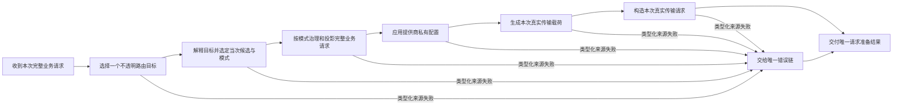
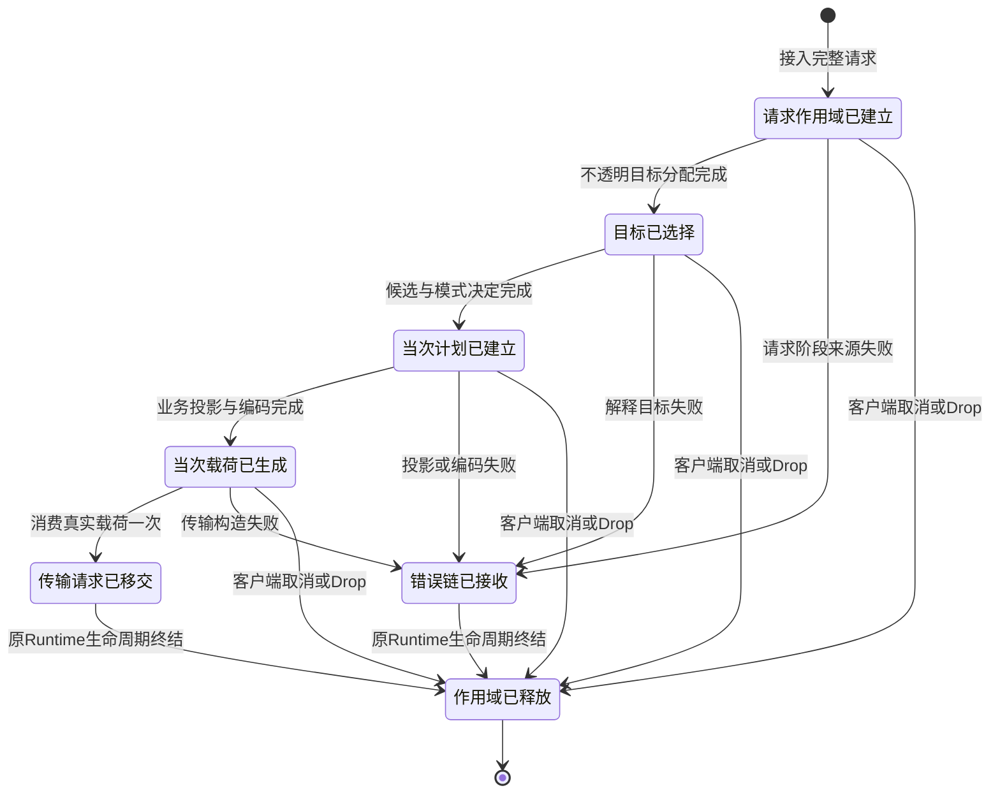
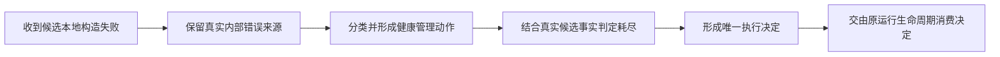

# DAGPipe REQ03–09：typed 控制与真实 wire 交接修订
状态：设计准入 R3 PASS（独立 oauth/gpt-6.1-sol 设计 review：controller completed/pass、final findings=[]）；不是实现或生产接线证明。
R1设计review FAIL（2项P1）：调用map资源边未同步、必需typed读取未声明。R2同步现有call/resource map并补资源读取，不改变locked节点或运行接线；已修订。
R2设计review FAIL（1项P1）：REQ09现有transport dispatcher先将typed来源转为String，外层无法恢复。R3将原owner的typed返回改造列为前置依赖；已修订。
owner：当前并发基础编排者。原始输入：origin/main a19eb55565e971f32a1ddba978a19abf6ee60854；R3审定基线934ebe939f2e6ede0c7156f2097299cccb5106c8（PR349）；已移植到最新origin/main 9bd47a7e344190fe6282b5e004ff02963807ef27（PR350），保留SSE350新增，不宣称节点已交付。
最新main移植review R1发现execution_mode资源缺少REQ07/REQ09读取授权；已在唯一资源条目补声明V3OperationRunnerCompatRequest和V3OperationRunnerConstructTransport，当前修订等待独立复审，不新增协议或scope真源。
范围：修正 operation_runner 的资源/参数合同；不改 locked V3 大骨架，不改 REQ02 活动候选。
原请求/响应配对契约、typed Error 链、remote continuation 保留。

## 1. 已证实缺口
1. 旧 resolve_target 调用完整 resolve_v3_relay_target_outcome，选中 concrete provider，跨越 Virtual Router 的 opaque target owner。
2. 当前 field_profiles 给 resolve_target 声明 provider_health/request_local_exclusions 参数，同样将 Target 职责提前。
3. 旧 plan_execution 用 Option<Value> 保存 mode，旧 wire/transport 把 protocol/provider/auth/identity 序列化成 JSON 再取回；这不是 typed control resource。
4. REQ08 首稿新增 provider_wire_to_value/from_value，并从 JSON 重建 wire；parent 已拒收、停止作者并回收该稿树。
5. request graph 的 resolve_target writes=resolved_target，REQ08 不声明真实 wire 产物、REQ09 读取旧 semantic body；资源边与目标责任不一致。

## 2. 必需能力和现有 owner
- Virtual Router、Target Interpreter、typed protocol decision、wire builder、transport builder 已有真实公开接口。
- REQ03/04 当前接口 consumer：7 PASS。证据：
  /Volumes/Intel/playground/routecodex/.worker-runs/dagpipe-parallel-foundation-20261005/req03-04-contract/logs/req03_04_routing_foundation.stdout.log
- REQ07 实际 DAGPipe consumer：3 PASS。证据：
  /Volumes/Intel/playground/routecodex/.worker-runs/dagpipe-parallel-foundation-20261005/req07-compat/focused-test.log
- REQ08/09 Provider 公共 HTTP 入口黑盒：parent loopback 5 PASS。证据：
  /Volumes/Intel/playground/routecodex/.worker-runs/dagpipe-parallel-foundation-20261005/provider-blackbox/parent-loopback.log
- 上述证明接口现有行为；不证明本设计已实现或生产改造完成。
- SDK Value ARC + OperatorContext 已有；typed控制由注入的项目scope资源承载，不能靠payload、日志或snapshot补回。
- 当前 main 无 REQ02 request context store；它在未交付的R49候选。正式接线先等该依赖交付。不能从老分支搬第二store消除依赖。

## 3. 唯一控制承载和数据 ARC
请求只使用 REQ02 的 V3RequestContextHandle / RequestInvocationContext；
新节点为该唯一scope增加typed槽或引用，不新建平行request store/全局map/每协议store。
实际槽在独立接口实现任务中位于 operation_runner/request_context_store.rs；不得编辑活跃R49树。
生命周期最终仍由同一 V3RequestFinalizerGuard 释放，不引入第二finalizer。
按 request_id + invocation_id + attempt_id 绑定当次控制；请求原始 inverse/history pair 不可覆盖。
REQ03的路由hit按一次路由分配的真实owner生命周期保留；同target新provider attempt复用hit，不重新分配Router目标。
REQ04/08/09的当次plan/wire/transport按实际attempt隔离；失败attempt不得污染成功attempt映射。

资源引用仅用于配置/编译绑定。数据ARC只包含该阶段业务JSON或符合当前schema的固定阶段标记。
固定arc_id标记不是模式/目标/身份真相。选目标/wire/transport控制产物通过typed槽传递；
selected-target/provider-wire/transport-request数据ARC不得携带provider、auth、mode、protocol、health或retry真相。
如阶段数据需携带request，保留整个业务Value；不能裁剪用户同名字段。stage标记不写回业务body。
Operator只能读取注入的typed配置/资源；不能从标记ARC反序列化控制。
派生slice按canonical graph编译，禁止第二图/自建执行器。

## 4. 逐节点合同
参数到资源的绑定如下；名称只是配置引用，不能从业务JSON取值。

| 参数 / 节点 | 唯一资源 ID / 类型 |
| --- | --- |
| published_manifest / REQ03、REQ04 | v3.config.published_manifest，V3Config05ManifestPublished |
| route_target / REQ03 | 当前manifest中的server/entry routing选择，受v3.config.published_manifest控制；请求身份只取OperatorContext及当前RequestInvocationContext |
| opaque_target / REQ03写、REQ04读 | v3.route.opaque_target，V3Router07OpaqueTargetHitOnce |
| provider_health / REQ04 | 已有V3ProviderFailureRuntimeHealth对v3.provider.health_state、v3.provider.key_health_state、v3.provider.availability_projection的typed组合；不复制健康truth |
| request_local_exclusions / REQ04 | v3.operation_runner.request_local_exclusions，引用已有Error action consumer维护的请求局部BTreeSet；不建新store |
| selected_target / REQ04写、REQ08/REQ09读 | v3.hub.resolved_target，V3Target10ConcreteProviderSelected |
| execution_mode / REQ04写、REQ09读 | v3.operation_runner.execution_mode，V3Execution11ProtocolDecision |
| provider_wire / REQ08写、REQ09读 | v3.provider.responses_wire_payload，V3Provider12ResponsesWirePayload |
| auth_handle、transport_kind / REQ09 | resolved_target中的既有typed认证引用和execution decision的协议配置，不来自payload；真实鉴权解析仍由Provider owner执行 |
| transport_request / REQ09写 | v3.provider.transport_request，V3Transport13ResponsesRequest |
| selected_provider_compat_profile / REQ07 | v3.hub.resolved_target中的compatibility_profile，provider protocol来自v3.operation_runner.execution_mode；不建平行profile资源或从业务payload恢复 |

新增exclusion资源ID仅为现有控制引用补声明，binding_status=design_pending；不改变当前Error mutation owner或立刻写产品代码。
现有call map req-03/req-07/req-08同步目标合同，保持binding_pending，不宣称caller已运行。
REQ06标准投影与REQ07Compat的target/protocol读取也同步声明；REQ07读标准semantic产物、写兼容payload，不读取自己尚未产出的payload。

| 节点 | 输入和已有调用owner | 唯一输出与资源 |
| --- | --- | --- |
| REQ03 resolve_target | canonical业务+既有typed路由入口/facts；V3VirtualRouter::classify_request_with_facts → resolve_route_pool_plan → hit_opaque_target_plan_once | V3Router07OpaqueTargetHitOnce 写 v3.route.opaque_target。无provider health、候选展开或具体provider选择。 |
| REQ04 plan_execution | typed opaque hit + published manifest + health/请求局部排除 +入口/allowed modes | V3TargetInterpreter::classify_kind → expand_candidates →现有健康选择owner → build_v3_execution_11_protocol_decision_from_v3_target_10。typed concrete target写 v3.hub.resolved_target，typed decision写 v3.operation_runner.execution_mode，保留expanded/protocol_candidate_keys/route_policy_pending的现有控制。业务canonical原值不变。 |
| REQ05 govern_chat_request | 同request canonical、typed execution decision、原pair | Relay由Chat Process治理；Direct仅registered hook，绝不推入Relay改写。具体治理行为复用当前owner，历史图片清理一次。 |
| REQ06 project_standard_provider_request | governed业务+typed目标和原pair | 标准投影+真实emission observer；typed actual-attempt declaration map。沿现有walker，不引入第二mapper或model规则。 |
| REQ07 adjust_provider_private_request | 标准provider JSON + typed candidate/protocol/profile | 现有apply_v3_provider_req_compat_to_provider_payload。输出compatible业务；不承担标准投影/路由/健康。 |
| REQ08 encode_provider_wire | compatible业务+typed目标、当次request/attempt | 只调用build_v3_provider_12_responses_wire_payload，保存真实V3Provider12ResponsesWirePayload到v3.provider.responses_wire_payload。不得序列化后重构。 |
| REQ09 construct_transport_request | 直接take同attempt的真实typed wire，协议来自typed decision | 先完成下述原transport owner的typed返回改造，再调用build_v3_provider_transport_request_for_protocol消费一次wire，保存真实V3Transport13ResponsesRequest到v3.provider.transport_request。projection仅只读观测，不能当真实transport。 |

### REQ09前置：原transport owner保留typed错误

已读源码：`hub_v1/provider_compat_shared.rs`的dispatcher、Anthropic和OpenAI Chat transport helper当前返回`Result<_, String>`；Responses分支也执行`error.to_string()`。`build_v3_gemini_transport_09`还把Provider构造错误转成`V3GeminiRelayRuntimeError::Target(String)`。在这些转换之后才保存错误已经太晚。

唯一改动owner仍是上述已有transport构造函数，不新增第二dispatcher：

1. 将dispatcher及其协议构造helper的构造失败返回改为现有`V3ProviderError`，保留`InvalidBaseUrl`、`MissingAuthSecret`、`AuthSecretRead`等原variant和原request/provider/auth身份。Gemini底层同样返回原`V3ProviderError`；既有Relay调用者在自身边界通过已有`Provider(#[from] V3ProviderError)`包装，禁止再转`Target(String)`。所有调用者按新的typed签名适配；不保留String平行入口。
2. REQ09在同一个REQ02 request scope的当次attempt失败槽中移动保存原错误及typed节点/attempt身份，再向SDK返回仅用于显示的String。此槽是已有scope的一部分，不是全局错误map、payload、metadata或日志。取消/Drop仍由同一个finalizer释放。
3. Runtime收到SDK失败后从该scope移动取出一次原typed来源，调用现有Error owner的typed分类入口，产生`v3.error.source`并进入唯一Error链。SDK的String不提供状态码、来源kind、provider身份或重试决策；禁止从显示文本反解析这些控制值。SDK自身compile/runtime失败由Runtime按该阶段的typed失败variant处理。
4. 传输构造没有上游HTTP响应时不得捏造externalStatus或归因为network502；分类复用现有Error owner。真正的HTTP400/401/502沿原provider transport typed来源处理，不属于这个纯构造节点。

编码和接线的完成条件：原helper和所有调用者已适配typed返回、公开构造consumer通过、SDK→Runtime→Error真实consumer保留原variant及attempt身份，之后REQ09才可接线。必须覆盖四协议合法构造、非法URL、缺失auth、两个attempt交错失败/成功、错误只消费一次、取消/Drop释放；断言typed来源，不比较或解析错误文案。REQ09不得发网络请求或自行切provider。

旧合成resolve_v3_relay_target_outcome暂用于当前既有生产owner；新REQ03不能把整个协调器包成算子。
待节点独立验收cutover时，在同一owner拆出/复用所需部分，物理删除被替代的同义分支；
不复制调度、route policy、health/probe逻辑。Target前序tier恢复probe和现有switch策略必须保留。
四协议差异由typed config、现有注册算子/profile选择。无按model命名猜协议、工具种类、参数内容或namespace。

## 5. SESE 与失败/取消/清理终点
请求、响应、错误为三张独立graph，本次不改节点/拓扑。

图中来源失败是Runtime在SDK失败出口捕获的执行结果；并非宣称抛错后下游operator继续执行。
Error chain负责分类/管理provider/耗尽/是否启动新attempt，不能从字符串JSON重建来源身份。
SDK String错误是接口限制；先在原owner消除typed→String丢失，再在operator→Runtime typed边界保留原typed source资源，不靠错误文本重建control。REQ09前置改造和唯一scope接口缺一不可。
客户端取消、失败、正常成功及Drop都释放同一request scope；move的wire/transport不跨attempt重用。
本图只准备request，不在operator发网络请求、不retry、不提交客户端帧。

恢复新attempt由原Runtime生命周期发起新的graph执行，不在这张DAG回边。

## 6. 独立实现与串行接线
- typed scope/interface owner：唯一worker修改request_context_store接口，等待REQ02依赖冻结/交付。
- REQ03基础owner只写resolve_target算子，复用Router owner；与REQ07基础可并发。
- REQ04算子读取REQ03合同后实施；需要共享slot则等待唯一interfaceowner。
- REQ08/09目前只开发现有typed边界consumer；真实Operator适配在scope合同PASS后实施，不重新包装JSON。
- REQ09 transport helper的typed返回可在设计PASS后独立实现并以原consumer验收；这是现有owner前置改造，不等于REQ09生产接线。scope桥接依赖REQ02唯一接口交付。
- 生产接线仍REQ02→REQ03→REQ04→REQ05→REQ06→REQ07→REQ08→REQ09。
- 每节点在最新main候选上作者开发测试、真实consumer/E2E、适用工具黑盒、独立实现review后交付。
- REQ02未交付不得把旧context store整份导入最新main；本修订不隐含生产接线授权跳步。

## 7. 验收
设计准入：graph validate三链；operation-runner静态gate；独立设计review通过。
每节点实现：真实SDK compile精确operator/resource effects；构造control独立与业务保真；
失败typed Error、同attempt成功映射、失败attempt隔离、取消/Drop释放、wire只消费一次。
串行接线前必须真实HTTP/WS JSON/SSE/Direct/Relay及gpt-5.5/gpt-5.6的exec/native apply_patch/MCP执行和follow-up。
当前已通过的consumer只是基础能力证据，不替代新节点acceptance。

## 8. REQ09 前置：候选本地构造失败的唯一错误来源

本节设计已通过独立准入：`req09-provider-local-source-design-20261006-r1`，
`oauth / gpt-6.1-sol`，controller PASS、exit0。实现、黑盒与最终架构审查仍须完成；
设计准入不代表节点注册、生产接线或交付完成。
输入：main `ac92527a3a3c2c4974a778e54c1ca2bf81ab1e8c`；已复现的前置候选
`0f518a56d296e86f2fc152874023ff104a2dddc2` 及其 R1 review 两项 P1。

### 8.1 已确认断边与边界

- shared Relay core 的 transport construction 错误被通用 Display builder 转成字符串。
  typed Provider variant 没有抵达原 shared failure owner。这条 caller 边由 core worker 修复。
- Responses/Anthropic 对 InvalidBaseUrl、MissingAuthSecret、AuthSecretRead 提前生成终态，
  使用没有候选事实的 `None/0`，跳过健康的后续候选。
- 唯一 mapper `hooks.rs::build_v3_provider_error_source` 将这三个本地变体归为 RuntimeFailure。
  Error02 将 RuntimeFailure 定为 already_terminal；Error05 不允许其候选恢复。
- 当前 policy 把错误重建成 external ProviderFailure。不能用这条路径恢复后再交换回
  RuntimeFailure。那会产生两个错误来源，并且伪造外部来源。

这三个失败发生在已选 provider 候选的本地构造边界。它们不是上游 HTTP 失败，
也不是任意 Runtime 基础设施失败。InternalTransport、控制字段泄漏、模型绑定错误和
ClientDisconnect 保持原契约。不能放开全部 RuntimeFailure，也不能按消息文本猜类型。

### 8.2 唯一 typed 表达

在现有 `V3ErrorSourceKind` 增加精确变体 `ProviderLocalFailure`。它只用于上述三个
`V3ProviderError` 变体，由现有唯一 mapper 产生。source 保留原 code/message、原 stage、
原 request-lane internal envelope；external link 必须为 None。
不允许 ProviderFailure 携带 internal envelope，也不改变其现有外部语义。

复用现有 `V3Error01SourceRaised` 和 `v3.error.chain` 控制资源。
不增加第二 store、额外分类器、错误文本解析、业务 metadata 或 JSON control wrapper。
同一 source 在分类、health/action、耗尽、恢复决定和终态诊断之间原样传递。
协议只渲染其表示，不能决定本地错误是否允许切 provider。

选定精确 source kind 的原因：现有 RuntimeFailure 明确代表终态基础设施错误；
ProviderFailure 明确禁止 internal envelope。只改 scope 或用代码字符串豁免，会将
本地来源身份与恢复决策分散到第二处。新变体让该区别由 Error owner 一次表达。

### 8.3 按 owner 改动

| owner | 必须操作 | 禁止操作 |
| --- | --- | --- |
| Runtime source mapper | 只把三个真实本地 Provider 变体映射为 ProviderLocalFailure；其他变体不变 | 猜消息、伪造 upstream HTTP、改业务 payload |
| Error source/classification | internal envelope 允许精确新变体；external envelope 禁止新变体；分类为可由候选事实管理的本地 provider 失败 | 放开全部 RuntimeFailure，复用 external ProviderFailure 冒充本地来源 |
| Error action/health | 新变体使用现有选中身份 scope 与共享 health/action 契约；无 scope 不更新 health | 在 Error crate 选择候选、读取配置或从日志重建身份 |
| Error exhaustion/decision | 使用真实 remaining/default/recovery witness；有健康候选则返回现有 WaitThenReselect；真实耗尽才允许 typed terminal | 在协议 helper 提前写 None/0；复制第二恢复策略 |
| Error terminal guard/projection | 新变体的 ProjectTerminal 必须有真实耗尽证明；内部诊断保持原 request lane 598 和原 code；不进入 pool-exhausted network_error 的外部分类 | 换回另一 source、把 598 当上游 status、成功包装错误 |
| Runtime failure carrier | 在现有 shared/Responses failure 类型中保存 optional original typed source，供尚未迁移的外部 wire failure caller 保持当前契约 | 将新控制来源镜像到 client_response 再读取 |
| Runtime failure policy | typed source 存在时直接送同一 Error center；旧 wire-only caller 仍由原 source builder 建其真正外部来源；只有一套 exclusion/health/recovery 实现 | 对同一次本地失败再次制造 external source；终点补回原 source |
| 协议 failure helpers | local variant 不预造 terminal_projection；交同一 handler/policy；typed code/message 直接取 carrier，error_type_fn 只提取旧 wire 形状 | 各协议独立分类或恢复，提取 payload control |
| shared core | Provider variant 直接交原 typed failure builder，非 Provider variant 保持原通用分支；共用一个 handle_provider_failure caller | 复制 handler、文本分类、跨节点恢复 shortcut |
| Server/SSE | 消费原 typed disposition；有候选时保持会话直到成功尝试完成；耗尽保持现有 NoResponse，不返回 provider 错误 JSON | 从 debug 或 payload 判路由；新增终态响应伪装成功 |

Error 改动范围：`routecodex-v3-error/src/lib.rs` 中 source enum、envelope guard、
Error02/03/04/05/06、terminal guard 和现有 center/post-commit 公共边界；
`src/subscription.rs` 的唯一 provider health action classifier。
新增 variant 的所有实际 exhaustive consumer 必须明确处理，不能用 wildcard 隐藏缺口。
对 `handle` 等不携恢复事实的便捷入口，任何已选候选本地失败必须迁移到携带真实事实的
`decide_provider` 路径。无 provider attempt 的观测入口没有候选可恢复时，明确使用其
真实无候选上下文完成 internal 诊断；不把它计入 Provider 业务尝试。

Runtime 改动范围：`hooks.rs` 的唯一 mapper；`provider_failure_runtime_policy.rs`
的原 failure policy/source 决策边；shared/Responses failure types/helpers/handlers；
Anthropic failure helper 和现有 caller；新增 typed field 的 struct literal 初始化。
Direct 中所有使用该 mapper 的 caller 必须按真实 selected/availability 交原 Direct policy，
不能因新 variant 的 exhaustive match 或便捷 projection 入口导致 panic/提前终态。
只允许修这条 typed 交接；不改 Direct payload hook 或重写其路由策略。
OpenAI Chat/Gemini shared core 由独立 worker 负责上述 caller 边。Provider、Compat、
Inbound/Outbound 业务语义、REQ02 scope store、REQ03/04 helper 和注册均不在本切片范围。

### 8.4 DAG 与生命周期

继续使用项目现有 `v3.operation_runner.error.graph.json` 的单源单汇 Error graph。
该 graph 的 ARC/resource 合同已经承载 typed source 和 execution decision；本切片
改变 source schema 的精确 variant 与原 owner 实现，不改变拓扑、operator 顺序或资源 owner。
request graph 失败只产生 typed 来源；Error graph 只产出决定；Runtime 消费决定并启动
新的 attempt。重选不在 request/error graph 之间增加回边。

出口 F 消费同一 typed outcome。重选分支由原 Runtime 接收 recovery witness，
开始新 attempt；成功分支返回实际 provider 成功业务响应。耗尽分支保留内部诊断并
交原 NoResponse disposition。客户端取消分支交原 ClientDisconnected，health neutral。
各分支复用原 attempt/request scope 释放和取消终点；不新增需要独立回收的状态。

### 8.5 编码前准入与作者验收

设计准入：三链 graph validation；独立 oauth/gpt-6.1-sol 设计 review PASS。
本节只有设计，无产品测试/安装要求；不能将设计 PASS 当作实现或接线 PASS。

实现后必须提供以下作者证据，再进入实现架构 review：

1. Error crate 公开 consumer：三个 mapper local 变体保留 source/internal/no-external；
   remaining>0 的真正 witness 返回重选且 source 未交换；真实 0 候选返回 terminal598；
   RuntimeFailure 与 ClientDisconnect 原行为不变；假的 terminal witness 被原 guard 拒绝。
2. shared core 实际 caller 红绿，不能仅直接调用 mapper 或断言任意错误 status。
3. 四协议真实 aggregate HTTP：bad first candidate 的本地构造失败不发网络请求；
   healthy second candidate 接收实际请求并成功，客户端得到成功业务输出；单候选
   typed 诊断为598、external status为空、原 NoResponse；Direct/Relay受影响caller均覆盖。
4. 完整命令/patch/MCP namespace、call ID、结果、follow-up 保真；隔离正式构建、安装、
   restart 后 GCM gpt-5.5 与 gpt-5.6 真实工具运行和请求样本闭环。
5. 最新 main 组合、所有受影响 gate、独立实现 review、集成及自有资源回收按原交付流程。

取消和上游 HTTP 错误的控制用例必须保留。没有真实样本时使用上述同入口最小复现，
不能按最终 502 猜来源。测试只围绕这条断边，不添加源码摘要或私人结构锁死断言。
