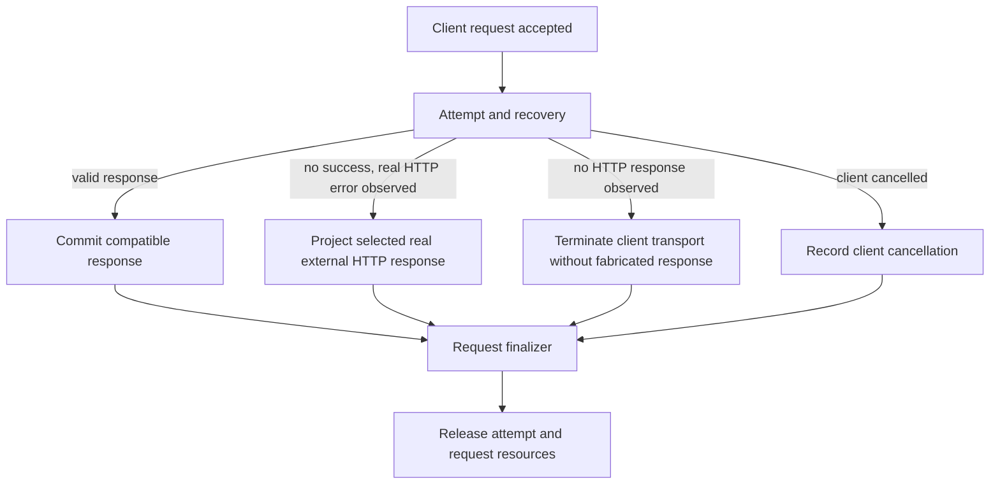

# Provider terminal response DAG (2026-09-30)

## Goal and evidence

Bug `705d624` owns this repair and its worktree.

The 4444 `/v1/responses` requests ending `574079-8453` and `574080-8454` received real upstream HTTP 429 with `rate_limit_error`, yet the client received `502 network_error`. Request `574024-8398` had a transport failure with no upstream HTTP response and also produced client 502. The source artifacts are in the corresponding `~/.rcc/codex-samples/openai-responses/ports/4444/` request directories.

The proxy must preserve a real upstream status and compatible error payload. A transport failure with no upstream response cannot be invented as HTTP 502 or successful completion. On a streaming client boundary it may end the stream without a completed response. Do not reinterpret an upstream no-response as a client disconnect.

## Single-entry, single-exit model

Candidate selection, provider attempts, Error01-05, cooldown, and recovery are internal to B. B retains the last compatible real upstream HTTP error response across all attempts; a later transport failure does not erase it. Only if no candidate returned any real HTTP response does B choose no-response. Each request enters at A and leaves at L once. Client cancellation is independent of upstream no-response. The typed failure side channel owns source attribution, candidate decision and health effects. Provider owns wire and health mutation. Runtime owns attempt buffering and finalizer. Server/SSE owns only transport framing or termination. Debug records evidence and does not decide outcomes.

## Current breaks and repair boundary

1. `routecodex-v3-error` Error06 currently overwrites every exhausted provider failure with `502 network_error`, including real 429. Preserve the source's actual external HTTP status and compatible error response at the terminal HTTP branch.
2. `provider_failure_runtime_policy` currently records synthesized transport 502 as `external_error.status`. Carry upstream HTTP presence as a typed distinction so no-response never acquires a fake external status.
3. Server's existing SSE disconnect detector searches for `V3Error04TargetPoolExhaustion`, which is absent from the real Error chain (`V3Error04TargetExhaustionDecision`). Remove status/body/node-name heuristics. Carry a typed terminal disposition from Error/Runtime to Server; for no-response, close only the current Front connection by its `V3FrontConnectionIdentity` before Hyper writes headers. The existing SSE body-error primitive sends HTTP 200 headers first and cannot implement this outcome.
4. Keep successful responses and admitted candidate recovery unchanged. A selected HTTP 429 must not be converted to a disconnect; a final no-response must not be converted to HTTP 200, 502, `response.failed` or `response.completed`.

## Acceptance evidence

- Controlled upstream HTTP 429 through the real Responses SSE and JSON entrances retains HTTP 429 and compatible error semantics, with no `502 network_error`.
- Controlled upstream transport failure with no real HTTP response across all candidates closes the exact Front HTTP connection before response headers. Streaming and nonstreaming clients must observe EOF/transport error with zero HTTP status and no 502, completion, or failed event. The Server front broker's `front_socket(identity)` maps the current `V3FrontConnectionIdentity` to one `V3StableFrontSocket`; use its `close()` for this connection only. Do not use `close_active_client_transports` or an unbound connection lease. Prove zero header bytes through the real HTTP/1 entry, including a reused socket, and prove the pending restart closeout frame cannot write `503` on this no-response path. Product code for this branch waits for that capability proof.
- A failed provider followed by a successful candidate returns the latter's real response, once.
- Client cancellation and provider no-response remain distinct; each finalizer runs once and releases resources.
- The old sample shapes above are replayed through the installed 4444 entry after candidate validation. Exact candidate, binary hash, restart identity and post-restart sample window are recorded separately.
