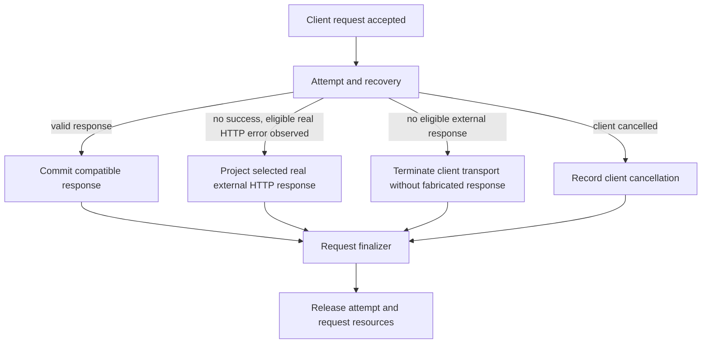

# Provider terminal response DAG (2026-09-30)

## Goal and evidence

Bug `705d624` owns this repair and its worktree.

The 4444 `/v1/responses` requests ending `574079-8453` and `574080-8454` received real upstream HTTP 429 with `rate_limit_error`, yet the client received `502 network_error`. Request `574024-8398` had a transport failure with no upstream HTTP response and also produced client 502. The source artifacts are in the corresponding `~/.rcc/codex-samples/openai-responses/ports/4444/` request directories.

The proxy must preserve an eligible real upstream status and compatible error payload. HTTP 502 is excluded by this bug's explicit client boundary. A transport failure with no upstream response cannot be invented as HTTP 502 or successful completion. On a streaming client boundary it may end the stream without a completed response. Do not reinterpret an upstream no-response as a client disconnect.

Revision 2026-10-01: a header-less close is read as a normal end of stream by the streaming clients this proxy serves, so the streaming boundary must instead flush the SSE response head and then abort the transfer. The client observes a transport failure, retries the same request, and the session survives provider exhaustion and recovers when a candidate becomes eligible again. The nonstreaming boundary keeps the header-less close.

## Single-entry, single-exit model

Candidate selection, provider attempts, Error01-05, cooldown, and recovery are internal to B. B retains the last compatible real upstream HTTP error response across all attempts as a request-local typed witness containing status, headers, and original body bytes; a later transport failure does not erase it. This is error-side evidence, not business payload or Debug state. HTTP 502 is ineligible for client projection under this bug's explicit no-502 contract. Only if no candidate returned an eligible real response does B choose no-response. Each request enters at A and leaves at L once. Client cancellation is independent of upstream no-response. The typed failure side channel owns source attribution, candidate decision and health effects. Provider owns wire and health mutation. Runtime owns attempt buffering and finalizer. Server owns HTTP framing/connection termination; its WebSocket adapter owns post-upgrade framing/close. Debug records evidence and does not decide outcomes.

## Current breaks and repair boundary

1. `routecodex-v3-error` Error06 currently overwrites every exhausted provider failure with `502 network_error`, including real 429. Provider transport already has status, headers, and body; Responses Relay drops headers/body before Error06, while other relay/direct paths also discard them at terminal projection. Preserve the last eligible real upstream HTTP witness through Error05 to Error06, then project status and compatible error semantics without reconstructing them from diagnostic text.
2. `provider_failure_runtime_policy` currently records synthesized transport 502 as `external_error.status`. Carry upstream HTTP presence as a typed distinction so no-response never acquires a fake external status.
3. Server's existing SSE disconnect detector searches for `V3Error04TargetPoolExhaustion`, which is absent from the real Error chain (`V3Error04TargetExhaustionDecision`). Remove status/body/node-name heuristics. Carry a typed terminal disposition from Error/Runtime to Server; for no-response, close only the current Front connection by its `V3FrontConnectionIdentity` before Hyper writes headers. The broker resolves this identity from either `front_sockets` or a bound `connection_leases` entry and its `client_sockets` key. This requires one scoped broker operation; a plain `front_socket(identity)` lookup fails after lease binding. The socket operation must clear a pending restart closeout frame before signaling close, and the connection task must remove its registry entries at termination. Revision 2026-10-01: the header-less close is correct only for a nonstreaming client. On the streaming boundary the SSE transport-break primitive is restored, because a header-less close there is indistinguishable from a normal end of stream. The response head plus one SSE comment frame are flushed, then the body fails, so the transfer never carries a valid final chunk and the client observes an aborted transfer. No client payload, fabricated status, `response.failed`, or `response.completed` is sent; the typed Error chain keeps the real cause.
4. Keep successful responses and admitted candidate recovery unchanged. A selected HTTP 429 must not be converted to a disconnect; a final no-response must not be converted to HTTP 200, 502, `response.failed` or `response.completed`.

## Acceptance evidence

- Controlled upstream HTTP 429 through the real Responses SSE and JSON entrances retains HTTP 429 and compatible error semantics, with no `502 network_error`.
- Controlled upstream transport failure or upstream HTTP 502 with no eligible response across all candidates terminates the client boundary without a fabricated response. A nonstreaming client observes a header-less close: zero HTTP status bytes and no 502, completion, or failed event. A streaming client observes an aborted SSE transfer: `HTTP/1.1 200` with `content-type: text/event-stream` and one flushed SSE comment frame, then an unterminated body that never carries the final chunk, so a retrying client classifies a transport failure and recovers when a candidate becomes eligible again. The broker must resolve the current identity in both unbound and bound socket registries, clear a pending restart frame, close only that socket, then release identity/lease socket entries after the connection task ends. Do not use `close_active_client_transports`, affect a second client, or leave a stale socket entry. Prove zero header bytes through the real HTTP/1 entry for the nonstreaming boundary, including a reused socket, and prove no restart `503` frame is written. The capability baseline currently fails bound lookup, pending-frame suppression, and registry cleanup; the nonstreaming branch of product code waits for corrected capability proof.
- A failed provider followed by a successful candidate returns the latter's real response, once.
- Client cancellation and provider no-response remain distinct; each finalizer runs once and releases resources.
- Through the real Responses WebSocket entry, a terminal eligible upstream HTTP error preserves its status, header bytes and body in a WebSocket error event because HTTP status and headers cannot be sent after upgrade. A JSON body retains the complete JSON value and a UTF-8 body retains its complete text; the outer error event framing does not reduce either to `/error/message`. `provider_headers` is an ordered array of `{name: string, value: [octets]}` so duplicate headers and non-UTF-8 values survive. A non-UTF-8 body uses a lossless octet array with `provider_body_encoding: "bytes"` to distinguish it from an upstream JSON array. A binary body must not turn an otherwise eligible 429 into no-response. Terminal no-response closes only the current WebSocket without fabricated `network_error`, `response.failed`, or completed content; connection and request resources release once.
- The old sample shapes above are replayed through the installed 4444 entry after candidate validation. Exact candidate, binary hash, restart identity and post-restart sample window are recorded separately.
