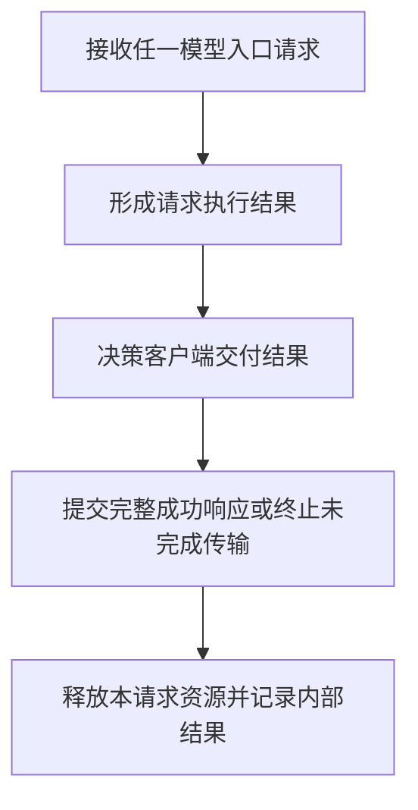
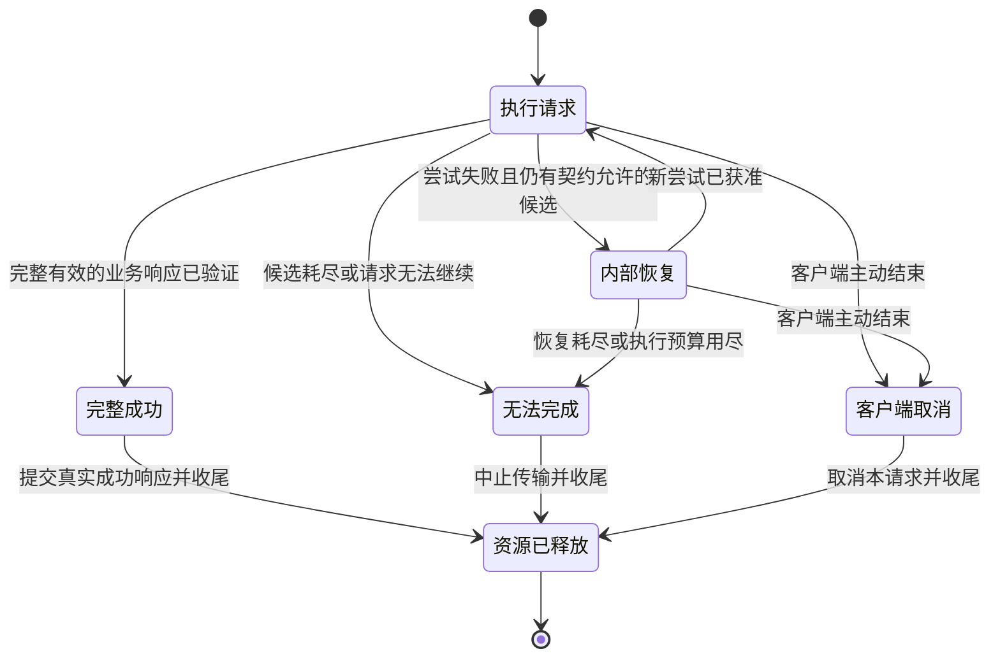

# All model entries: internal failure and client transport boundary

## Authoritative contract

The current rule is **AGENTS.md: Mandatory: No Client Error Responses, Across Every Model Entry**. It supersedes this document's 2026-09-30 permission to forward selected upstream HTTP errors. The old restriction on fabricated 502 was insufficient: real upstream 4xx/5xx and internal 598/599 are forbidden at the model-client boundary as well.

The rule applies equally to DSH `/v1/chat/completions`, Codex `/v1/responses` (HTTP and WebSocket) and `/v1/responses/compact`, Claude Code `/v1/messages`, and enabled Gemini `generateContent` entries; JSON, SSE, Direct, and Relay have the same semantics. No source of failure, including invalid client input, admission failure, provider errors, timeouts, cooldown, unavailable routes, or complete pool exhaustion, authorizes a client error response. Management and diagnostic APIs are separate control-plane entries; they are not model requests.

HTTP error statuses, error JSON/chunks, Responses `error`/`response.failed` or failed objects, Anthropic `event: error`, and WebSocket error messages/application error codes are forbidden. HTTP 200 does not make an error payload acceptable. No fabricated completion, normal success terminator, or `[DONE]` may conceal an unsuccessful request. A transport abort can remain observable to the client; this rule does not promise that failed requests always succeed or that clients never observe a connection failure.

## One request, one finalizer

Attempt/recovery is internal to B; a new attempt has a distinct identity and never adds a cross-node back edge. C consumes typed execution facts, never payload fields or logs. D consumes a typed successful response or transport outcome; it has no client-error variant. E is the single exit for success, exhausted/uncompletable failure, and client cancellation. Failure before provider execution still reaches C/D/E; it cannot escape through a Server error response helper.

## Owner and representation boundaries

| Responsibility | Unique owner | Required boundary |
| --- | --- | --- |
| Failure cause/classification, action, exhaustion | Error | Retain upstream status/body/header evidence internally; never authorize client error projection. |
| Eligible candidate selection/reselection | Target, coordinated by Runtime | Follow typed routing/execution policy; a failed attempt cannot close a recoverable request. |
| Wire attempts and health mutation | Provider | Cool the exact provider/auth-key/model identity; client cancellation is health-neutral. |
| Attempt buffering and request finalizer | Runtime | Deliver only complete successful data or a typed transport outcome; release each request/attempt permit once. |
| HTTP and WebSocket connection framing | Server/Front | Close only the affected transport; no HTTP error, stale restart error frame, or WebSocket error message. |
| Client streaming framing | SSE | Successful protocol data only; an unsuccessful transfer has no semantic terminal or clean final chunk. |
| Samples and logs | Debug | Observe truthful causes with identities; never decide routing or reconstruct lifecycle truth. |

For a nonstreaming uncompletable request, close without status/header/body bytes. For SSE, use the existing transport-break primitive: a success-class transport head and an SSE comment establish framing, then abort without error payload or semantic terminal. That framing is never business success. For an upgraded WebSocket, end the affected transport without an application error message/code or fabricated completion. Independent sessions and the listener remain live.

## Confirmed implementation divergence and provenance

Issue `797e1b2` covers provider/runtime errors escaping to clients; `2630112` covers exhausted pools. Original evidence remains in runtime samples, including the 2026-09-30 Responses requests ending `574079-8453`, `574080-8454`, and `574024-8398`. These samples establish observed failures; they do not authorize forwarding them.

- Commit `ed9cc3be7` (2026-09-30) changed AGENTS.md from forbidding Provider status/body forwarding to permitting eligible real upstream errors, while retaining internal 598/599 projection.
- Commit `054ea0333` (2026-10-01) maintained the server Responses `response.failed` path while fixing its framing. Correct framing does not make a failure event an allowed response.
- `V3ProviderTerminalDisposition::ExternalHttp`, Error06 client-error candidates, server error-frame builders, and WebSocket error senders still implement the obsolete permission. Existing tests requiring real 429/error events also encode it.

This is a confirmed contract/implementation conflict, not proof of every DSH disconnection's cause. The `dsh-plugins` fast `TRANSPORT` retries require separate ingress/lifecycle correlation. This document and source checks do not prove the installed runtime fixed.

Reuse the existing registered request, response, and error SESE graphs at `docs/architecture/dagpipe/v3.operation_runner.{request,response,error}.graph.json`. The Error graph's legacy-named projection candidate is internal evidence only, as specified in `docs/design/v3-unified-operation-runner-design.md`; it cannot enter a client body. Runtime consumes that control outcome and Server terminates the affected transport. The Server-owned typed `v3.server.model_transport_outcome` records no-response intent and is consumed by `commit_model_transport_outcome`; its writer and caller edges are declared in the existing maps. This repair adds no orchestration Operator or second lifecycle graph. The semantic lifecycle diagram above maps the existing owners; it does not claim a new executable graph cutover.

## Required blackbox regression and release gate

### HTTP framing failure before admission

The installed 0.90.4830 candidate still sent Hyper's automatic `400 Bad Request`
for `Content-Length: invalid`. This failure occurs before the application service
is called; it bypasses the model transport-outcome consumer. The same boundary
must cover a malformed request after a successful keep-alive request.

Server/Front owns `v3.server.http_parse_error_policy`, a typed per-connection
HTTP parser policy. The only automatic-error producer is Hyper's
`Conn::on_parse_error`, which calls `T::on_error` and buffers an HTTP error head
before any application service is involved. The proposed repair disables that
producer for Front connections, rather than filtering serialized output.

Hyper 1.10.1 exposes no public switch for this behavior. Vendor the exact already
locked 1.10.1 crate under `v3/vendor/hyper`, preserving MIT licensing and upstream
source/provenance, with one narrow native API addition:
`http1::Builder::automatic_error_responses(bool)`. Its default stays true for
unchanged dependency consumers. The builder copies that typed flag into Conn;
`on_parse_error` with false returns the original typed error without calling
`T::on_error` or buffering any synthetic response. Preserve the existing HTTP/2
preface error classification. The production Front builder always sets false;
this is not a user-configurable exception to the no-client-error contract.

Cargo uses one patched Hyper owner via a V3-local `[patch.crates-io]` path;
exclude the dependency from workspace membership and prove resolution with
locked Cargo metadata. No global registry edits, second HTTP implementation,
fallback, body-prefix scan, body/frame wrapper, or flush-permission state machine
is introduced. The parser's acceptance domain, keep-alive/backpressure, upgrade,
100 Continue, and application response serialization stay unchanged. Only the
two native API/implementation files differ from imported upstream Rust source.

The error returns through the existing connection Result and teardown, with
the original cause retained internally. Teardown releases broker/socket senders;
the existing writer drains previously queued application bytes before shutdown.
It must not signal the biased immediate-close branch just to suppress a parser
error, which could discard a preceding queued successful response.

The existing lifecycle DAG's delivery node includes this framing boundary;
the registered request/response/error graphs retain their existing business
ARC boundaries. This is Server's HTTP transport implementation, not a new
business Operator or a new lifecycle graph. The semantic path is:
`接收连接 → 按禁止自动错误响应的策略解析请求 → 交付真实响应或无响应关闭 → 释放连接资源`.
Application-authorized management error responses remain valid control-plane
responses. Failure before application admission cannot be reliably assigned
to a management endpoint and closes without a response.

Required raw-TCP regression: invalid request line/header/content length on all
model paths, both first-request and after keep-alive success; assert EOF/reset
with zero new response bytes, not a timeout. Preserve ordinary management
errors, Expect/100-continue, opaque response body prefixes, multi-flush bodies,
SSE, and WebSocket upgrade/frame success. Reverting the Front policy to true must
restore the automatic error response in the same public testcase.

#### Design proof obligations (before implementation)

The rejected coarse flush-authority proposal is preserved only in task evidence.
It is not implemented or retained as an alternative runtime path. The native
producer switch must prevent automatic400/431/414 at every parse-failure state,
including partial writes and buffered pipelined requests; it must not need to
attribute or predict Hyper's encoded header/chunk bytes. Default-true dependency
behavior must remain intact for controlled upstreams and other consumers.

`Content-Length: invalid` is confirmed automatic400 by the saved installed wire
and both public red runs. Locked Hyper `error.rs:638` maps it to
`Parse::Header(Header::ContentLengthInvalid)`; `role.rs:466-481` includes every
`Parse::Header(_)` in automatic400. It is not the `_ => None` case. Resource/caller
bindings are anchored to the authored native API; installed behavior requires
separate candidate and merged-runtime acceptance.
Import integrity must identify exactly the two changed upstream source files,
and the V3 installer/isolation checks must consume the local patched dependency.
Author validation must prove all 60 malformed-entry cases (fresh, reused, and
pipelined) plus multi-flush opaque bodies, control errors, 100 Continue, SSE,
and successful WebSocket frames. No design PASS substitutes for those results.

Use real public HTTP/stream/WebSocket consumers with controlled upstreams. Mock private state and source-pattern assertions cannot substitute for behavior. Cover each HTTP entry in JSON/SSE, Responses WebSocket, and supported Direct/Relay combinations. Bind results to the candidate SHA, input/config, upstream observations, and client wire capture.

| Case | Required external result and side effects |
| --- | --- |
| Valid success | Preserve complete text, tools/history, and real protocol terminal; no false abort. |
| Failed attempt, eligible candidate succeeds | Only the latter's complete real response reaches the client; no premature close/error or duplicate response. |
| Provider HTTP 400/401/403/413/429/500/502/503, including binary bodies | Errors remain internal; declared recovery continues; terminal failure has no client error response. |
| Network/TLS EOF, header/body timeout, malformed provider JSON/SSE, internal request/response failure | Same client boundary; truthful typed cause; no success-wrapped error. |
| Empty/unavailable/cooled pool and full attempt/residence exhaustion | No exception: no HTTP error, failure event, normal terminal, or fabricated completion; assert incomplete transfer. |
| Invalid JSON/input or pre-provider admission/debug failure | No model-entry error helper bypasses typed transport outcome; trust-boundary rejection remains internal. |
| Client cancellation and independent session | Request-local, health-neutral cancellation; resources release once; the other session succeeds and listener stays live. |
| Reused connection and concurrent managed lifecycle | No stale restart 503/error frame, no registry leak; only the affected transport ends. |

Replace tests expecting forwarded 429, Error06 SSE errors, `response.failed`, or WebSocket provider-error envelopes. Cases must run in the mapped required gate and CI before merge. Delivery order is author debug/development tests and real-entry E2E plus applicable CI PASS -> merge/push to main -> rebuild/install from main -> managed restart, health, real-entry replay and sample audit -> complete independent Codex and AGY architecture reviews -> defect and owned-resource closeout. Review pending must not block main rebuild/restart, but the defect stays open. Bind reviews to the final validated candidate and prove main content equivalence and remote receipt; do not claim full closure while review is pending. Blocking findings require repair and affected revalidation; a confirmed delivered regression follows traceable revert/rebuild/restart/replay recovery.
