# Apply Patch feedback parity: business DAG

Bug: `5a763cb`. Baseline: `origin/main` at `e054c22ac8a1b1d7f026cca8d11e4369a8ff448e`.

## Business contract and boundary

RouteCodex is a proxy. It may convert a provider tool call to the client's declared `apply_patch` freeform call and pair the later tool output by `call_id`. It does not execute the patch, inspect the filesystem, or decide whether the patch succeeded. The client executor's output string is business data and must reach the next provider request unchanged. Pairing identity and routing state remain typed control resources, separate from that string.

`Add File` overwriting an existing file and modifying CRLF or terminal newline occur in the client executor, outside this proxy DAG. This task must neither reproduce those writes inside RouteCodex nor add a proxy filesystem guard.

## Single source, single sink

The graph describes one tool round trip across two client HTTP turns. Each turn traverses the fixed request/response skeleton once. The client's second HTTP request is the only continuation edge; no graph node loops into an earlier RouteCodex node.

```mermaid
flowchart LR
  S[Source: client request with declared apply_patch] --> I0[Server ingress and lossless Req02]
  I0 --> G0[Req04: govern declaration and current-turn identity]
  G0 --> O0[Outbound protocol projection]
  O0 --> P0[Provider attempt]
  P0 --> H0[Resp03: restore client apply_patch freeform call]
  H0 --> C0[SSE/JSON client call with call_id and raw patch]
  C0 --> X[Client-owned apply_patch execution]
  X --> I1[Next client request: tool output with same call_id]
  I1 --> G1[Req04: pair call_id; preserve output string]
  G1 --> O1[Outbound protocol projection]
  O1 --> P1[Provider follow-up]
  P1 --> H1[Response projection]
  H1 --> T[Sink: final client response or typed terminal/no response]
```

The successful and failed client tool executions both enter `I1` with their **actual** output. They converge at `G1`; neither branch creates a RouteCodex-generated `APPLY_PATCH_ERROR` or `APPLY_PATCH_RESULT` string. A missing or mismatched `call_id` enters the existing typed error chain and does not masquerade as a tool execution result. Provider failure uses the separate provider/error chain. Client disconnect has the Server/SSE terminal boundary and does not rewrite the tool output.

## First divergence and unique owner

Current Req04 calls `normalize_apply_patch_tool_output_item_at_req04` after matching `call_id`, for both Responses and Chat-shaped inputs. `normalize_apply_patch_output_text_at_req04` replaces detailed errors, `aborted`, `done`, and JSON status values with fixed advice. It also normalizes CRLF while classifying. This is the first proven proxy-side loss: the exact executor reason is absent from the next provider-bound request. The existing test and verification map assert this wrong behavior.

The unique code owner is `v3/crates/routecodex-v3-runtime/src/hub_v1/relay_request.rs` (Req04). Resp03 owns only provider-call to client-freeform projection. Server owns framing; Provider owns wire transport. Neither should classify or rewrite a client executor result. The caller map and verification map must describe identity pairing plus payload preservation, not feedback normalization.

## Acceptance edges

1. Controlled provider emits an `apply_patch` call. The public `/v1/responses` client sees the original patch and `call_id` through JSON and SSE as applicable.
2. The client returns a detailed failure string in `custom_tool_call_output` on the next public request. The captured provider-bound request has the same `call_id` and exactly the same output string, including path, punctuation and line endings. Repeat with a successful output string. The proxy adds no advice and does not invent success.
3. A wrong `call_id` remains in the typed error path; it is never paired to another call or sent as a successful tool output.
4. Focused tests, mapped architecture gates, real two-turn public-entry E2E, independent review, merge, runtime install/restart and same-entry replay are recorded separately. The stable black-box test ID and command are written to bug `5a763cb` and read back before closure.

No product code change is allowed until this DAG receives independent design review PASS.
