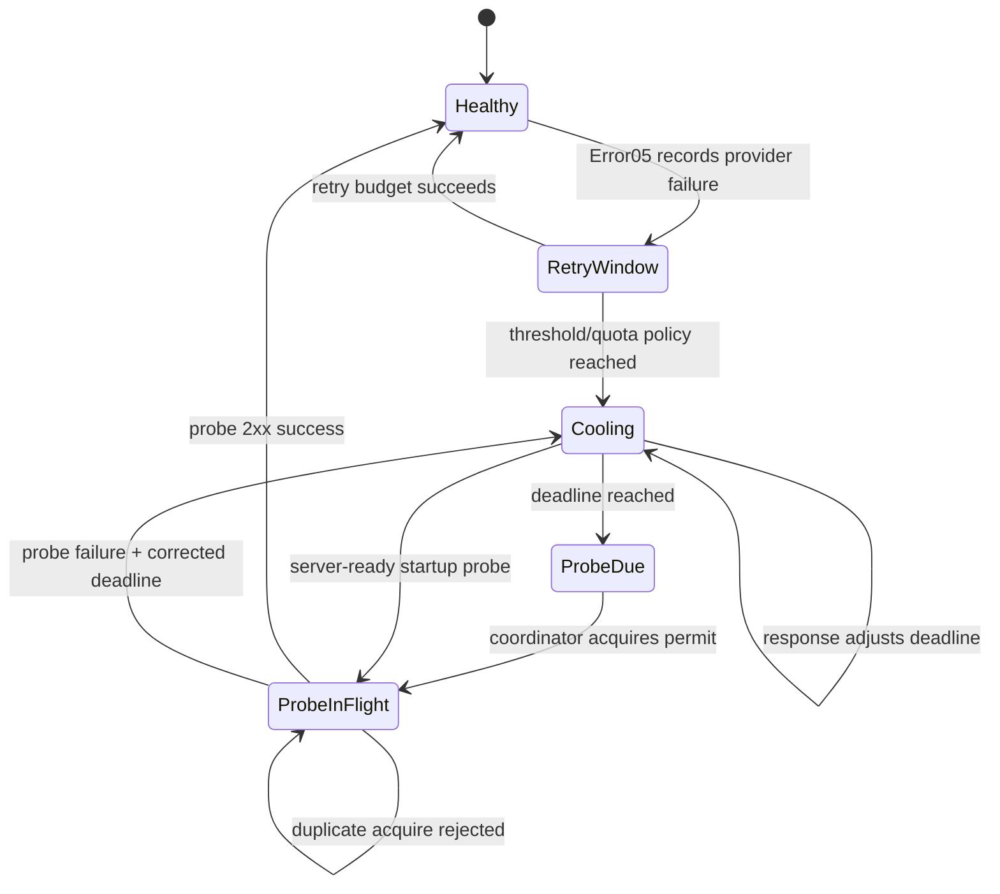

# V3 全局 Provider 冷却统一重构合同

状态：设计阶段。当前不把既有 `health.rs`、`provider_global_health.rs`、
`provider_failure_global_probe.rs` 的任一分支直接扩展为最终实现。

## 1. 根因与现状边界

当前有三套语义并存：

1. `V3ProviderHealthStore`：session cooldown、auth-key cooldown、provider
   cooldown probe 分散在不同 map；部分业务成功路径仍可影响 provider 状态。
2. `V3ProviderGlobalSubscriptionHealthStore`：以 provider/auth/model 为 key，
   单独维护 subscription failure、blocked deadline 和 probe。
3. `V3ProviderFailureRuntimeHealth` / server background loop：分别调用两类
   due-probe API；server 重启时 store 是空的，所以既没有持久化，也没有
   “server ready 后恢复探测全部持久项”的生命周期。

这不是简单增加一个 JSON 文件的问题。若只给其中一套 map 加持久化，会继续
产生“同一 provider 被不同 owner 判定可用/不可用”的竞争真相。因此先统一
状态模型和唯一 owner，再迁移调用边，最后物理删除旧 map/API。

## 2. 顶层资源与唯一 owner

唯一持久资源：`v3.provider.global_cooldown_state`。

- owner：`routecodex-v3-provider-responses` 的
  `V3ProviderGlobalCooldownCoordinator`。
- writer：只有 coordinator 的 `record_failure`、`apply_probe_result`、
  `load`、`persist`。
- readers：runtime 只读取 typed availability/probe permit；server 只负责
  ready 生命周期和调度；config 只提供已编译的 provider policy。
- error crate、virtual router、target、request/response payload、
  MetadataCenter、debug snapshot 都不能写入或重建该状态。
- runtime 不再同时持有三套 cooldown owner；旧 health/global store 只能在
  迁移期间作为适配层，完成迁移后删除。

持久化 key 按可用性覆盖范围定义：

`provider_id + auth_alias + model_id_scope + failure_class`。

其中 `model_id_scope=provider` 表示 auth key/provider 级故障，覆盖该 key
下所有模型；`model_id_scope=model` 表示仅单模型故障。不能把 auth-key 状态
伪装成某个模型状态，也不能把 session id、routing group、request id 写入
持久冷却 key。

## 3. 统一状态机



不变量：

- `Cooling`、`ProbeDue`、`ProbeInFlight` 都不可进入候选池；只有 probe 成功
  才能恢复。
- 业务请求成功不能绕过 probe 恢复持久 provider/auth-key cooldown。
- probe 失败不清除状态；下一次探测由 `max(now + probe_interval,
  corrected_deadline)` 决定。
- startup probe 不要求等待 deadline；server ready 后立即探测所有加载的
  持久项，但成功前仍不可用。
- 同一 key 只能有一个 in-flight permit；恢复、失败、持久化必须是同一
  coordinator 的顺序操作。

## 4. deadline / reset 校正规则

按优先级采用：

1. provider response 的机器字段：`Retry-After`、`Reset`、`X-RateLimit-Reset`
   等已登记字段；绝对时间和 delta 必须统一为 epoch milliseconds。
2. provider body 中可安全解析的 reset 时间，仅作为 provider adapter 产生的
   typed observation；不得由 router 或 payload metadata 猜测。当前 OpenCode Go
   key3 直连只观察到正文 “Resets in 6 days”，没有 reset header，因此只能
   作为“超过默认上限”的观测，不能原样持久化六天。
3. provider 编译配置中的 cooldown/quota policy。
4. 全局默认最大冷却：`5h`。任何来源都必须做
   `deadline <= detected_at + provider_max_cooldown`，未配置时
   `provider_max_cooldown = 5h`。

provider 的特殊时间配额落在 config manifest 的 provider policy 中；配置值
是该 provider 的最大冷却上限/默认恢复窗口，而不是 runtime 里的散落常量。
配置校验拒绝 0、溢出和超过全局硬上限的值。错误类别至少保持
`401 / 403 / 429 / transport / semantic` 区分，不能只存一条 message。

## 5. 生命周期与调用边

```text
Config compile
  -> published provider cooldown policy
  -> Server aggregate constructs coordinator
  -> coordinator loads persistent state before listener wiring
  -> listeners bind and server reports ready
  -> ready hook schedules startup probe for every persisted entry
  -> runtime failure chain records typed failure into coordinator
  -> coordinator persists state and exposes typed availability
  -> periodic scheduler probes due entries and persists result
```

启动加载失败（文件损坏、schema/version 不支持、identity 不匹配）必须显式
失败，禁止静默清空后启动。startup probe 的网络失败不阻塞 listener ready，
但该 provider 不能恢复；错误进入 startup diagnostics/error chain，不进入
client payload。

## 6. 统一迁移与物理删除清单

实施顺序固定：

1. 先补 coordinator 的 red contract：持久化 round-trip、startup probe、
   probe failure、业务 success 不恢复、provider/key 隔离、401/403/429
   reset 校正、5h cap、损坏文件 fail-fast。
2. 将 `V3ProviderHealthStore` 的 auth-key/provider cooldown 和
   `V3ProviderGlobalSubscriptionHealthStore` 的 provider state 投影到
   coordinator；runtime 只调用 coordinator。
3. 将 401/403/429 统一从 Error03/04 的 typed failure classification 进入
   coordinator，不在 runtime policy helper 里另建 cooldown map。
4. 将 server loop 改为唯一 `run_due_probes`，并增加 listener-ready 的
   `run_startup_probes`；两者共享 coordinator permit/result API。
5. 删除旧的 `auth_key_cooldowns`、`provider_cooldown_probes`、
   `global_subscription_store` 独立恢复路径、`reset_after_restart` 清空语义、
   双重 background probe loop 及业务 success 复活分支。
6. 更新 resource/function/mainline/verification map、wiki 和 manifest；再做
   architecture gate，确保不存在旧 owner 引用。

禁止保留“双写但读一边”的过渡实现；若需要迁移历史文件，必须由唯一
coordinator 做一次性 typed migration，并有版本号与红测。

## 7. 必须先红后绿的验证设计

- 状态白盒：同 key round-trip；不同 provider/auth/model/class 不污染。
- 生命周期黑盒：重建 coordinator 后仍不可用；listener ready 后 startup
  probe 成功才恢复；失败 probe 保持不可用；重复 probe 只发一次。
- 正反错误：401/403/429 分别保留 failure class；有 reset 缩短/延长 deadline，
  无 reset 使用 provider policy；正文 “6 days” 被 5h cap；业务 success
  不能复活 pending probe。
- 资源边界：持久状态不进入 provider body、client body、MetadataCenter、
  error payload；旧 API/旧 map 物理不存在。
- 在线：OpenCode Go 使用固定 endpoint 和 `deepseek-v4-flash` 复测 key1–6；
  global install、aggregate restart、所有 listener `/health`、启动 ready
  probe 日志、同入口路由候选池与真实响应样本必须和运行版本一致。
