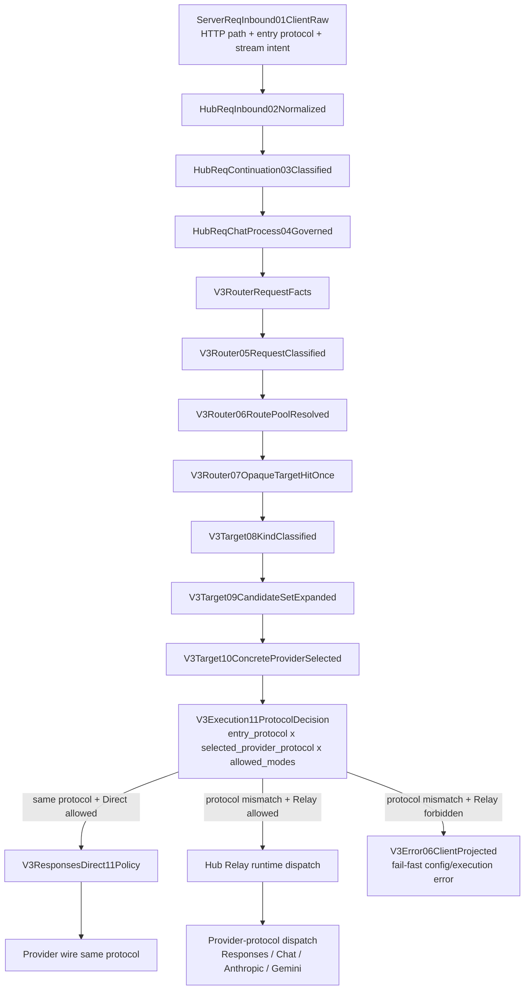

# V3 VR Target Protocol Execution Decision SOP

Status: source and installed 5555 live verified on 2026-07-26; exact old large sample not replayed, but forced tools-pool mismatch live probe reproduced the owner path and completed SSE.

## Goal

Lock the V3 request execution flow so Direct is allowed only after Virtual Router and Target select a concrete provider whose provider protocol matches the client entry protocol. Cross-protocol requests must continue through Hub Pipeline / Relay. All other shortcut flows are forbidden.

## Problem To Close

The observed 5555 `provider_response_sse_empty` was caused by a `/v1/responses` request entering Responses Direct before the selected provider protocol was known. Direct later selected `glmrelay_openai`, whose provider type is `openai_chat`, and sent it to `/v1/responses`. That produced HTTP 200 with an empty SSE body. The failure existed because the Direct/Relay execution decision was bound to Server entry config instead of the VR/Target concrete selected-provider edge.

The live mitigation in commit `9d3195043` moved the decision earlier in Server by scanning possible candidates. That is being removed because it is not the canonical architecture owner.

## Canonical Flow

## Decision Contract

Inputs:
- `entry_protocol`: protocol implied by endpoint and request, for example `responses`.
- `selected_provider_protocol`: derived from the concrete selected target's `provider_type`, not from provider id strings.
- `allowed_modes`: server execution declaration from compiled manifest.
- `continuation_owner`: direct or relay continuation owner, when restoring a continuation.

Rules:
- If `entry_protocol == selected_provider_protocol` and Direct is allowed, choose `SameProtocolDirect`.
- If `entry_protocol != selected_provider_protocol` and Relay is allowed, choose `HubRelay`.
- If `entry_protocol != selected_provider_protocol` and Relay is not allowed, fail fast with an execution/config error.
- If a Direct continuation pins a provider whose current protocol no longer matches the entry protocol, fail fast before Direct policy.
- The decision must happen after `V3Target10ConcreteProviderSelected`; candidate-set scanning is not a valid substitute for selected-provider truth.

## Allowed Paths

- `responses -> responses provider -> Direct -> /responses`
- `responses -> openai_chat provider -> Relay -> /chat/completions -> Responses client projection`
- `responses -> anthropic provider -> Relay -> /messages -> Responses client projection`
- `openai_chat -> openai_chat provider -> Direct or OpenAI Chat relay according to endpoint SOP`
- `anthropic -> anthropic provider -> Direct or Anthropic relay according to endpoint SOP`

## Forbidden Paths

- Server entry binding deciding final Direct/Relay before VR/Target selected-provider truth.
- Server scanning route candidates and changing execution mode as the main owner.
- Responses Direct receiving `openai_chat`, `anthropic`, or `gemini` selected providers.
- Direct response/parser/SSE layer repairing cross-protocol provider output.
- SSE transport or server handler inferring provider protocol or adding fake semantic events.
- Provider runtime deciding route or Direct/Relay policy from response shape.
- Provider-specific branches such as checking `glmrelay` names.
- Failure-after-send fallback from Direct to Relay.

## Required Map / Review Locks

The locked mainline/review surface must contain:

- Resource: `v3.execution.protocol_decision`
- Node: `V3Execution11ProtocolDecision`
- Edge: `V3Target10ConcreteProviderSelected -> V3Execution11ProtocolDecision`
- Edge: `V3Execution11ProtocolDecision -> V3ResponsesDirect11Policy`
- Relay dispatch: `V3Execution11ProtocolDecision -> Hub Relay runtime dispatch`
- Error edge: `V3Execution11ProtocolDecision -> V3Error06ClientProjected`

Update:
- `docs/architecture/v3-resource-operation-map.yml`
- `docs/architecture/v3-function-map.yml`
- `docs/architecture/v3-mainline-call-map.yml`
- `docs/architecture/v3-verification-map.yml`
- Generated wiki review surface and HTML.

## Required Gates

Red tests before implementation:
- `/v1/responses` with selected `openai_chat` provider enters Direct: must fail.
- `/v1/responses` with selected `anthropic` provider enters Direct: must fail.
- Protocol mismatch with Relay not allowed succeeds: must fail.
- Server preplanning/candidate-set scan helper exists: must fail.
- SSE/server handler references provider protocol decision: must fail.

Green tests after implementation:
- Responses selected provider with Responses entry uses Direct.
- OpenAI Chat selected provider with Responses entry uses Relay and sends `/chat/completions` with `messages`.
- Anthropic selected provider with Responses entry uses Relay and sends `/messages`.
- Protocol mismatch with Relay disabled returns explicit Error06 before provider send.
- Direct continuation pin with mismatched provider protocol fails before `V3ResponsesDirect11Policy`.

Source gates:
- `cargo +stable fmt --manifest-path v3/Cargo.toml --all -- --check`
- focused runtime/server protocol decision tests
- `npm run verify:v3-module-boundaries`
- `npm run verify:v3-rust-only`
- `npm run verify:v3-architecture-docs`
- new red fixture gate for forbidden paths
- `git diff --check`

Live gates after source green:
- `RUSTUP_TOOLCHAIN=stable CARGO_NET_OFFLINE=true npm run install:v3`
- `rccv3 config check -c /Volumes/extension/.rcc/config.v3.toml`
- `rccv3 restart -c /Volumes/extension/.rcc/config.v3.toml`
- 4444 and 5555 `/health`
- 5555 `/v1/responses` live probe selecting `glmrelay_openai` proves provider URL `/chat/completions`, client SSE terminal, and zero `provider_response_sse_empty` for the request id.

## Execution Plan After Review

1. Remove the stopgap Server preplanning commit surface.
2. Add the SOP/map/review surface and forbidden-path red fixtures.
3. Implement the Rust protocol decision owner after concrete selected target.
4. Thread the selected target into Direct/Relay without reselecting or scanning candidates.
5. Add Direct hard guard before `V3ResponsesDirect11Policy`.
6. Run source gates.
7. Install/restart and run live probes.
8. Update `note.md`, `MEMORY.md`, and `rcc-dev-skills` only with verified final evidence.
