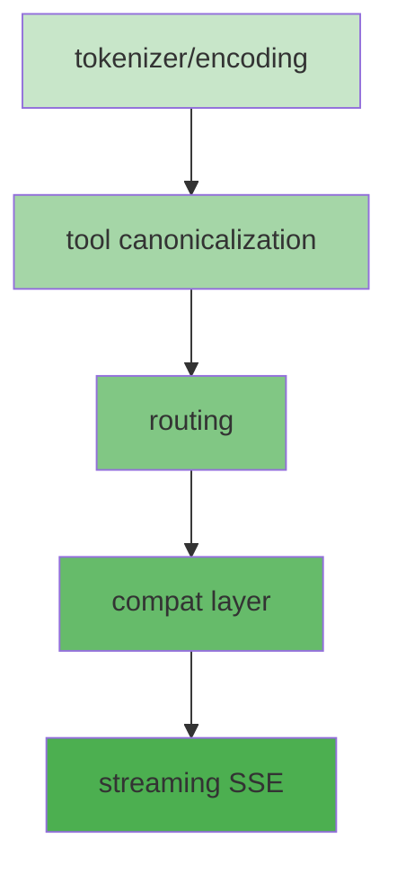

# llms-wasm 模块边界清单

> [!important] 用途
> 本文档用于：
> - 明确替换顺序（低风险 → 高风险）
> - diff 归因（责任归属与修复路径）
> - 验收与回滚（模块级开关与状态）
>
> **责任边界**：Host 只做开关读取/影子分发/指标上报；canonicalization、routing、tools、compat、diff 协议全部在 llmswitch-core。

---

## 核心原则

| 原则 | 说明 | 违反后果 |
|------|------|----------|
| **Host 不做修复** | Host 只做开关读取/影子分发/指标上报；不得做 canonicalization、tool 修复、路由决策或 diff 计算 | 违反架构原则，导致职责混乱 |
| **Core 拥有协议** | 所有 canonicalization、diff ruleset、比较逻辑都在 llmswitch-core | Host 无法复用 diff 能力 |
| **Provider 是传输** | Provider V2 只负责 auth、HTTP、retries；不解读用户 payload 语义 | 导致旁路单执行路径 |
| **Fail fast** | 任何上游错误通过 `providerErrorCenter` + `errorHandlingCenter` 冒泡 | 错误被吞没，难以追踪 |

> [!important] 统一策略（本轮明确）
> 1. **统一 tokenizer**：只保留一个权威实现（单一 source of truth），TS/WASM 对齐该实现；禁止多套 tokenizer 并存。
> 2. **统一 SSE event 协议**：定义唯一 canonical SSE event schema 与对比协议（event + token 级）。
> 3. **统一 compat profile**：compat profile 规则与触发条件在 llmswitch-core 中统一维护（单一版本化来源）。

---

## 统一策略落地

### A. 统一 tokenizer（single source of truth）

> [!important] 目标
> TS 与 WASM 只保留 **一个权威 tokenizer 实现**；其余入口必须代理到该实现。

**建议落地方式**：

- 统一入口（示例）：`llmswitch-core/src/conversion/shared/tokenizer.ts`
- TS 与 WASM 入口都 **调用同一接口**（避免各自维护逻辑）
- 所有 thinking/reasoning 归一规则与 token 化规则 **只定义一次**

**约束**：

- 禁止在 Host/Provider 做 token 修复
- 禁止在 compat/adapter 里做 token 相关逻辑

### B. 统一 SSE event 协议（canonical + diff）

> [!important] 目标
> 统一 SSE event schema 与对比协议，版本化管理（`sse_protocol_vN`）。

**Canonical schema**：

- `event_type`（data/error/done）
- `ordinal_index`（顺序索引）
- `normalized_payload`（稳定化 payload）
- `token_digest`（可选，用于 token 级一致性）

**比较规则**：

- 允许 chunk 拆包差异
- 以 token 序列一致为通过
- diff 结果必须绑定 ruleset 版本

### C. 统一 compat profile

> [!important] 当前实现
> compat profiles 已在 `llmswitch-core/src/conversion/compat/profiles/*.json` 中集中定义，并通过 `compat-engine.ts` 应用。

**约束**：

- Host/Provider 只能选择 profile（通过 `routing.target.compatibilityProfile`），不可定义/修改 profile 规则
- profile 规则与 diff ruleset 一样支持版本化与 audit
- 禁止在 Host/Provider 做 compat 相关逻辑（字段映射、协议转换）

> [!important] 目标
> compat profile 规则集中在 llmswitch-core，确保版本化、可回溯、可审计。

**建议落地方式**：

- 统一 registry（示例）：`llmswitch-core/src/conversion/compat/compat-profile-registry.ts`
- compat profile 与 diff ruleset 一样支持版本化与 audit
- Host/Provider 只能选择 profile，不可定义/修改 profile 规则

---

## 模块清单

> [!note] Contract 定义
> 以下 Contract 为 TypeScript interface 草案，用于明确输入/输出结构。实际实现可能更复杂，但必须兼容这些基本字段。

### 1. tokenizer/encoding（文本与 thinking/reasoning 归一）

| 属性 | 值 |
|------|-----|
| **模块名** | tokenizer/encoding |
| **输入 Contract** | `text` / `messages`（视入口而定） |
| **输出 Contract** | `tokens` / `normalized messages` |
| **归属目录** | `llmswitch-core/src/conversion/shared/*`（reasoning/thinking 归一相关） |
| **依赖** | 无 |
| **Owner** | @team/core |
| **修复路径** | wasm core |
| **责任仓库** | `sharedmodule/llmswitch-core` |
| **入口函数** | `normalizeAnthropicMessage`, `sanitizeThinkingBlock` |
| **替换优先级** | 高（低风险，无依赖） |
| **验收阈值** | diff rate ≤ 0.01%, error rate ≤ 0.01% |

#### Contract 定义

```typescript
// 输入
interface TokenizerInput {
  text?: string;
  messages?: Array<{ role: string; content: string | null }>;
  options?: {
    preserveThinkingBlocks?: boolean;
    stripReasoningTags?: boolean;
  };
}

// 输出
interface TokenizerOutput {
  tokens?: Token[];
  messages?: Array<{ role: string; content: string | null }>;
  metadata?: {
    thinkingBlocksRemoved?: number;
    reasoningTagsStripped?: number;
  };
}

interface Token {
  type: 'text' | 'thinking' | 'reasoning';
  content: string;
  signature?: string; // for thinking blocks
}
```

> [!note] 说明
> tokenizer 负责文本编码、thinking 块清理、reasoning 标签处理等。无外部依赖，适合最先替换。

---

### 2. tool canonicalization

| 属性 | 值 |
|------|-----|
| **模块名** | tool canonicalization |
| **输入 Contract** | `ToolCallRaw[]` |
| **输出 Contract** | `ToolCallCanonical[]` |
| **归属目录** | `llmswitch-core/src/tools/*` |
| **依赖** | tokenizer (args normalization) |
| **Owner** | @team/tools |
| **修复路径** | wasm core |
| **责任仓库** | `sharedmodule/llmswitch-core` |
| **入口函数** | `tool-registry.ts`, `args-json.ts`, `apply-patch/*` |
| **替换优先级** | 高（依赖 tokenizer） |
| **验收阈值** | diff rate ≤ 0.1%, error rate ≤ 0.05% |

#### Contract 定义

```typescript
// 输入
interface ToolCallRaw {
  id: string;
  type: 'function' | 'code_interpreter';
  function?: {
    name: string;
    arguments: string | Record<string, unknown>;
  };
  code_interpreter?: {
    code: string;
  };
}

// 输出
interface ToolCallCanonical {
  id: string; // normalized via ToolCallIdManager
  type: 'function' | 'code_interpreter';
  function?: {
    name: string;
    arguments: Record<string, unknown>; // always object
  };
  code_interpreter?: {
    code: string;
  };
  metadata?: {
    idStyle: 'fc' | 'preserve';
    argsRepaired?: boolean;
  };
}
```

> [!note] 说明
> tool canonicalization 负责工具调用 ID 管理、参数修复、结构化 patch 应用等。依赖 tokenizer 进行参数字符串化。

---

### 3. compat layer

| 属性 | 值 |
|------|-----|
| **模块名** | compat layer |
| **输入 Contract** | `UpstreamResponse` (provider-specific) |
| **输出 Contract** | `CanonicalResponse` (unified) |
| **归属目录** | `llmswitch-core/src/conversion/compat/*` |
| **依赖** | routing (provider config) |
| **Owner** | @team/compat |
| **修复路径** | compat adapter |
| **责任仓库** | `sharedmodule/llmswitch-core` |
| **入口函数** | `*-adapter.ts` (per provider) |
| **替换优先级** | 中（依赖 routing） |
| **验收阈值** | diff rate ≤ 0.5%, error rate ≤ 0.1% |

#### Contract 定义

```typescript
// 输入（provider-specific）
interface UpstreamResponse {
  provider: string; // 'anthropic' | 'openai' | 'gemini' | ...
  raw: {
    body: unknown;
    headers: Record<string, string>;
    statusCode: number;
  };
  compatibilityProfile?: string; // e.g. 'anthropic-v1', 'openai-v1'
}

// 输出（unified）
interface CanonicalResponse {
  id: string;
  object: 'chat.completion' | 'chat.completion.chunk';
  created: number;
  model: string;
  choices: Array<{
    index: number;
    message?: {
      role: 'assistant' | 'user' | 'system' | 'tool';
      content: string | null;
      tool_calls?: ToolCallCanonical[];
    };
    delta?: {
      role?: string;
      content?: string;
      tool_calls?: Array<{
        index: number;
        id: string;
        function?: { name: string; arguments: string };
      }>;
    };
    finish_reason: string | null;
  }>;
  usage?: {
    prompt_tokens: number;
    completion_tokens: number;
    total_tokens: number;
  };
  metadata?: {
    provider: string;
    compatibilityProfile: string;
    fieldsRemapped: string[];
  };
}
```

> [!note] 说明
> compat layer 负责将不同 provider 的响应转换为统一的 canonical 格式。通过 `compatibilityProfile` 触发。

---

### 4. streaming (SSE)

| 属性 | 值 |
|------|-----|
| **模块名** | streaming (SSE) |
| **输入 Contract** | `SSEChunk[]` (raw) |
| **输出 Contract** | `CanonicalSSEEvents[]` (canonicalized) |
| **归属目录** | `llmswitch-core/src/sse/*` |
| **依赖** | compat (response schema) |
| **Owner** | @team/streaming |
| **修复路径** | wasm core |
| **责任仓库** | `sharedmodule/llmswitch-core` |
| **入口函数** | `json-to-sse/*`, `sse-to-json/*` |
| **替换优先级** | 高（依赖 compat） |
| **验收阈值** | diff rate ≤ 0.5%, error rate ≤ 0.1% |

#### Contract 定义

```typescript
// 输入（raw SSE chunk）
interface SSEChunk {
  event: string; // 'data' | 'error' | 'done'
  data: string;  // JSON string
  index?: number;
  timestamp?: number;
}

// 输出（canonicalized）
interface CanonicalSSEEvent {
  event_type: 'data' | 'error' | 'done';
  ordinal_index: number;
  normalized_payload: string;
  token_digest?: string; // for token-level comparison
  metadata?: {
    chunkSplit?: boolean; // true if this is a split chunk
    originalIndex?: number;
  };
}

// Diff result
interface SSEDiffResult {
  request_id: string;
  ts_events: CanonicalSSEEvent[];
  wasm_events: CanonicalSSEEvent[];
  diff_summary: {
    added: CanonicalSSEEvent[];
    removed: CanonicalSSEEvent[];
    reordered: boolean;
    payload_diff: string[];
  };
  final_token_match: boolean; // true if final token sequences match
}
```

> [!note] 说明
> streaming 负责 SSE 流式响应的解码、编码、canonicalization。允许 chunk 拆包差异，但要求最终 token 序列一致。

---

### 5. routing（VirtualRouter 选路与 alias 选择）

| 属性 | 值 |
|------|-----|
| **模块名** | routing |
| **输入 Contract** | `RequestContext` |
| **输出 Contract** | `ProviderTarget` (provider + alias) |
| **归属目录** | `llmswitch-core/src/router/virtual-router/*` |
| **依赖** | tools (tool availability) |
| **Owner** | @team/routing |
| **修复路径** | wasm core |
| **责任仓库** | `sharedmodule/llmswitch-core` |
| **入口函数** | `virtual-router.ts`, `engine-selection/*` |
| **替换优先级** | 低（高风险，影响全局） |
| **验收阈值** | diff rate ≤ 0.01%, error rate ≤ 0.001% |

#### Contract 定义

```typescript
// 输入
interface RequestContext {
  requestId: string;
  tenant: string;
  route: string;
  model: string;
  tools?: {
    names: string[];
    required: string[];
  };
  metadata?: {
    userId?: string;
    sessionId?: string;
    priority?: 'high' | 'normal' | 'low';
  };
}

// 输出
interface ProviderTarget {
  provider: string; // provider key
  alias: string;    // specific provider instance
  configRef?: string; // prefer referencing config rather than embedding secrets
  compatibilityProfile?: string;
  metadata?: {
    selectionReason: string;
    sticky?: boolean;
    priorityTier?: number;
  };
}

// Quota view (for health/cooldown)
interface ProviderQuotaViewEntry {
  providerKey: string;
  inPool: boolean;
  cooldownUntil?: number;
  blacklistUntil?: number;
  priorityTier?: number;
  selectionPenalty?: number;
  lastErrorAtMs?: number;
  consecutiveErrorCount?: number;
}
```

> [!note] 说明
> routing 负责根据请求上下文选择 provider 和 alias。影响所有请求，必须最后替换。

### 1. tokenizer/encoding

| 属性 | 值 |
|------|-----|
| **模块名** | tokenizer/encoding |
| **输入 Contract** | `text: string` |
| **输出 Contract** | `tokens: Token[]` |
| **归属目录** | `llmswitch-core/src/conversion/shared/*` (reasoning-normalizer, etc.) |
| **依赖** | 无 |
| **Owner** | @team/core |
| **修复路径** | wasm core |
| **责任仓库** | `sharedmodule/llmswitch-core` |
| **入口函数** | `normalizeAnthropicMessage`, `sanitizeThinkingBlock` |
| **替换优先级** | 高（低风险，无依赖） |
| **验收阈值** | diff rate ≤ 0.01%, error rate ≤ 0.01% |

> [!note] 说明
> tokenizer 负责文本编码、thinking 块清理、reasoning 标签处理等。无外部依赖，适合最先替换。

---

### 2. tool canonicalization

| 属性 | 值 |
|------|-----|
| **模块名** | tool canonicalization |
| **输入 Contract** | `ToolCallRaw[]` |
| **输出 Contract** | `ToolCallCanonical[]` |
| **归属目录** | `llmswitch-core/src/tools/*` |
| **依赖** | tokenizer (args normalization) |
| **Owner** | @team/tools |
| **修复路径** | wasm core |
| **责任仓库** | `sharedmodule/llmswitch-core` |
| **入口函数** | `tool-registry.ts`, `args-json.ts`, `apply-patch/*` |
| **替换优先级** | 高（依赖 tokenizer） |
| **验收阈值** | diff rate ≤ 0.1%, error rate ≤ 0.05% |

> [!note] 说明
> tool canonicalization 负责工具调用 ID 管理、参数修复、结构化 patch 应用等。依赖 tokenizer 进行参数字符串化。

---

### 3. compat layer

| 属性 | 值 |
|------|-----|
| **模块名** | compat layer |
| **输入 Contract** | `UpstreamResponse` (provider-specific) |
| **输出 Contract** | `CanonicalResponse` (unified) |
| **归属目录** | `llmswitch-core/src/conversion/compat/*` |
| **依赖** | routing (provider config) |
| **Owner** | @team/compat |
| **修复路径** | compat adapter |
| **责任仓库** | `sharedmodule/llmswitch-core` |
| **入口函数** | `*-adapter.ts` (per provider) |
| **替换优先级** | 中（依赖 routing） |
| **验收阈值** | diff rate ≤ 0.5%, error rate ≤ 0.1% |

> [!note] 说明
> compat layer 负责将不同 provider 的响应转换为统一的 canonical 格式。通过 `compatibilityProfile` 触发。

---

### 4. streaming (SSE)

| 属性 | 值 |
|------|-----|
| **模块名** | streaming (SSE) |
| **输入 Contract** | `SSEChunk[]` (raw) |
| **输出 Contract** | `CanonicalSSEEvents[]` (canonicalized) |
| **归属目录** | `llmswitch-core/src/sse/*` |
| **依赖** | compat (response schema) |
| **Owner** | @team/streaming |
| **修复路径** | wasm core |
| **责任仓库** | `sharedmodule/llmswitch-core` |
| **入口函数** | `json-to-sse/*`, `sse-to-json/*` |
| **替换优先级** | 高（依赖 compat） |
| **验收阈值** | diff rate ≤ 0.5%, error rate ≤ 0.1% |

> [!note] 说明
> streaming 负责 SSE 流式响应的解码、编码、canonicalization。允许 chunk 拆包差异，但要求最终 token 序列一致。

---

### 5. routing

| 属性 | 值 |
|------|-----|
| **模块名** | routing |
| **输入 Contract** | `RequestContext` |
| **输出 Contract** | `ProviderTarget` (provider + alias) |
| **归属目录** | `llmswitch-core/src/router/virtual-router/*` |
| **依赖** | tools (tool availability) |
| **Owner** | @team/routing |
| **修复路径** | wasm core |
| **责任仓库** | `sharedmodule/llmswitch-core` |
| **入口函数** | `virtual-router.ts`, `engine-selection/*` |
| **替换优先级** | 低（高风险，影响全局） |
| **验收阈值** | diff rate ≤ 0.01%, error rate ≤ 0.001% |

> [!note] 说明
> routing 负责根据请求上下文选择 provider 和 alias。影响所有请求，必须最后替换。

---

## 依赖顺序



**替换顺序**：

1. tokenizer/encoding（无依赖，低风险）
2. tool canonicalization（依赖 tokenizer）
3. compat layer（依赖 routing）
4. streaming SSE（依赖 compat）
5. routing（最高风险，最后替换）

> [!warning] 注意
> 实际替换顺序可能需要根据依赖图调整。例如，compat layer 依赖 routing，但 routing 可能依赖 tools。需要根据实际代码确认。

---

## 责任归属表

| 模块 | Owner | 修复路径 | 入口函数/文件（示例） |
|------|-------|----------|----------------------|
| tokenizer/encoding | @team/core | wasm core | `llmswitch-core/src/conversion/shared/reasoning-normalizer.ts` |
| tool canonicalization | @team/tools | wasm core | `llmswitch-core/src/tools/tool-registry.ts` |
| compat layer | @team/compat | compat adapter | `llmswitch-core/src/conversion/compat/*-adapter.ts` |
| streaming (SSE) | @team/streaming | wasm core | `llmswitch-core/src/sse/json-to-sse/*` |
| routing | @team/routing | wasm core | `llmswitch-core/src/router/virtual-router/virtual-router.ts` |

> [!important] 修复入口
> 所有 diff 必须能被归因到“修复路径”：`compat` vs `wasm core`（Host 永远不是修复入口）。

---

## 验收阈值（按模块）

| 模块 | diff rate | error rate | latency delta (P95) | 观察期 |
|------|-----------|------------|--------------------|--------|
| tokenizer/encoding | ≤ 0.01% | ≤ 0.01% | ≤ +5ms | 1 周 |
| tool canonicalization | ≤ 0.1% | ≤ 0.05% | ≤ +10ms | 2 周 |
| compat layer | ≤ 0.5% | ≤ 0.1% | ≤ +20ms | 2 周 |
| streaming (SSE) | ≤ 0.5% | ≤ 0.1% | ≤ +50ms | 3 周 |
| routing | ≤ 0.01% | ≤ 0.001% | ≤ +5ms | 4 周 |

> [!note] 统计口径
> 指标必须按 `tenant`、`route`、`module`、`runtime(ts|wasm)` 分维度统计，并支持按 ruleset 版本回溯。

---

## Host 侧职责

Host (`src/server/runtime/http-server/`) 负责以下内容：

- **开关读取**：解析环境变量、config、header，确定运行模式
- **影子分发**：将请求异步复制到影子 runtime（TS 或 WASM）
- **指标上报**：通过 `providerErrorCenter` + `errorHandlingCenter` 上报 diff/error/latency

**Host 不做**：

- canonicalization、tool 修复、路由决策
- diff 计算、diff ruleset 管理
- SSE 协议处理

---

## 相关文档

- [[docs/llms-wasm-migration.md]] - 计划概要
- [[docs/plans/llms-wasm-migration-plan.md]] - 可执行清单
- [[AGENTS.md]] - 架构原则
