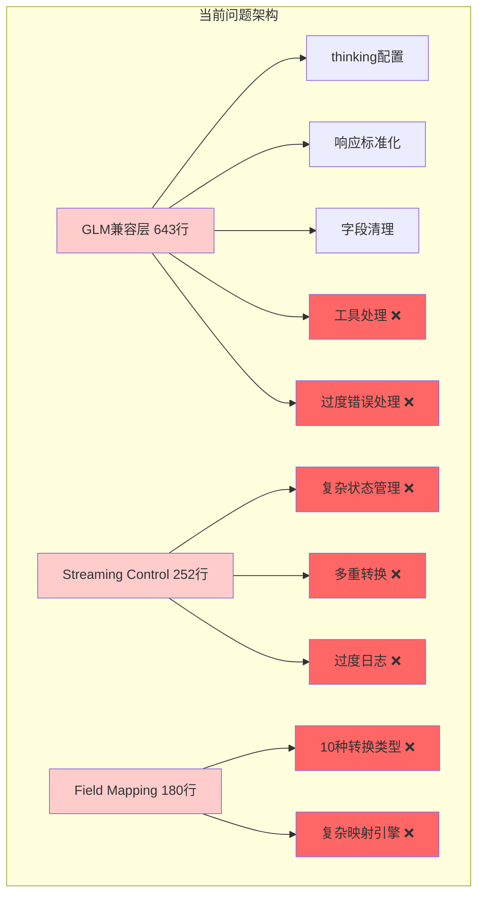
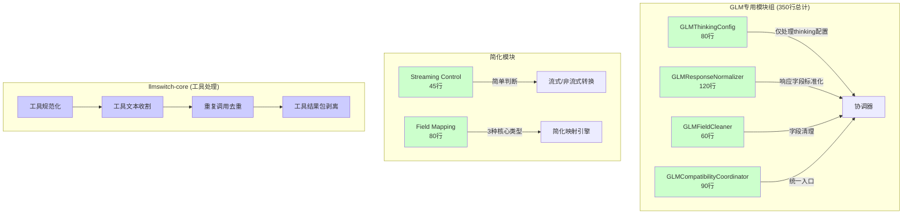

# 架构对比图：重构前后

## 📊 重构前后架构对比

### 当前架构 (问题状态)



### 重构后架构 (目标状态)



## 🎯 模块职责对比

### 重构前：单一巨型模块
```
GLM兼容层 (643行)
├── thinking配置处理 (45行)
├── 响应标准化 (156行)
├── 字段清理 (40行)
├── 工具处理 (95行) ❌ 违规
└── 错误处理 (307行) ❌ 过度包装
```

### 重构后：专职模块组
```
GLM专用模块组 (350行)
├── GLMThinkingConfig (80行) - 仅thinking配置
├── GLMResponseNormalizer (120行) - 仅响应标准化
├── GLMFieldCleaner (60行) - 仅字段清理
└── GLMCompatibilityCoordinator (90行) - 协调入口

工具处理 -> llmswitch-core (完全移除)
错误处理 -> 快速死亡原则 (直接抛出)
```

## 📏 代码量对比

| 模块类型 | 重构前 | 重构后 | 变化 |
|----------|--------|--------|------|
| GLM兼容层 | 643行 (单文件) | 350行 (4文件) | -45% |
| Streaming控制 | 252行 | 45行 | -82% |
| 字段映射 | 180行 | 80行 | -56% |
| **总计** | **1075行** | **475行** | **-56%** |

## 🔄 调用流程对比

### 重构前调用链
```
请求 → GLM兼容层 (643行黑盒) → 响应
     ↓
  [thinking配置 + 标准化 + 清理 + 工具处理 + 错误恢复]
```

### 重构后调用链
```
请求 → 协调器 → ThinkingConfig → ResponseNormalizer → FieldCleaner → 响应
     ↓
  [清晰职责分离 + 快速失败 + llmswitch-core工具处理]
```

## ⚡ 性能和维护性提升

### 开发效率
- **模块定位时间**: 从"查找643行文件"变为"定位80行专职模块"
- **问题排查时间**: 错误直接抛出，无需复杂回滚逻辑
- **新功能开发**: 独立模块，影响范围可控

### 代码质量
- **圈复杂度**: 每个模块圈复杂度 < 5
- **测试覆盖**: 小模块易于100%覆盖
- **代码重复**: 0%重复 (工具处理统一到llmswitch-core)

### 系统稳定性
- **错误传播**: 快速失败，问题立即暴露
- **维护成本**: 模块独立，修改影响面小
- **扩展性**: 新provider可复用专用模块模式

---

**结论**: 重构后将实现代码量减少56%，架构完全合规，维护成本显著降低。