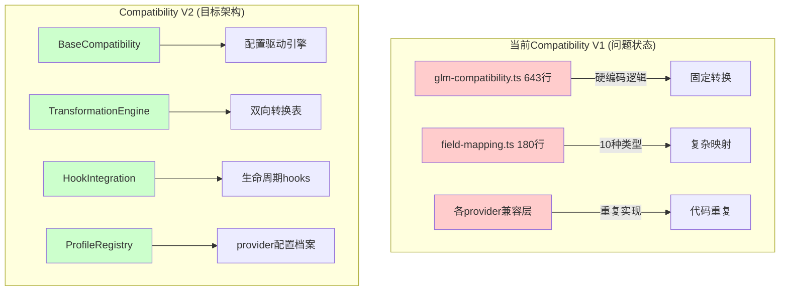

# Compatibility V2 架构设计方案

## 🎯 设计目标

基于Provider V2的成功架构模式，设计全新的Compatibility V2模块，实现：
- **配置驱动的转换引擎** - 输入输出双向转换表驱动
- **Hook系统集成** - 完整的hook生命周期支持
- **模块化架构** - 清晰的职责分离和可扩展性
- **向后兼容** - 与现有系统完全兼容

## 🏗️ 整体架构设计

### 架构对比图



## 📁 目录结构设计

### 完整目录结构
```
src/providers/compat/v2/
├── core/                           # 核心抽象层
│   ├── base-compatibility.ts       # 基础兼容性抽象类
│   ├── compatibility-factory.ts    # 兼容性工厂
│   └── standard-compatibility.ts   # 标准兼容性实现
├── engine/                         # 转换引擎
│   ├── transformation-engine.ts    # 配置驱动转换引擎
│   ├── bidirectional-mapper.ts     # 双向映射器
│   └── field-transformer.ts        # 字段转换器
├── config/                         # 配置系统
│   ├── compatibility-profiles.ts   # Provider配置档案
│   ├── transformation-tables.ts    # 转换表定义
│   └── compatibility-hooks.ts      # Hook配置
├── hooks/                          # Hook系统
│   ├── hooks-integration.ts        # Hook系统集成
│   ├── compatibility-hooks.ts      # 兼容性专用hooks
│   └── hook-executor.ts            # Hook执行器
├── strategies/                     # 转换策略
│   ├── chat-http-provider.ts       # OpenAI Chat 协议 Provider
│   ├── glm-strategy.ts             # GLM特定策略
│   ├── qwen-strategy.ts            # Qwen特定策略
│   └── iflow-strategy.ts           # Iflow特定策略
├── utils/                          # 工具类
│   ├── schema-validator.ts         # Schema验证器
│   ├── type-converter.ts           # 类型转换器
│   └── debug-helper.ts             # 调试助手
├── api/                            # API定义
│   ├── compatibility-types.ts      # 类型定义
│   ├── transformation-config.ts    # 转换配置接口
│   └── hook-config.ts              # Hook配置接口
└── test/                           # 测试文件
    ├── unit/                       # 单元测试
    ├── integration/                # 集成测试
    └── fixtures/                   # 测试数据
```

## 🔧 核心组件设计

### 1. BaseCompatibility 基础抽象类

**文件**: `src/providers/compat/v2/core/base-compatibility.ts`
**职责**: 提供兼容性模块的通用抽象实现

```typescript
export abstract class BaseCompatibility implements ICompatibilityV2 {
  readonly id: string;
  readonly abstract type: string;
  readonly config: CompatibilityConfig;

  protected dependencies: ModuleDependencies;
  protected transformationEngine: TransformationEngine;
  protected hookIntegration: HookIntegration;
  protected profile: CompatibilityProfile;

  constructor(config: CompatibilityConfig, dependencies: ModuleDependencies) {
    this.id = `compatibility-${Date.now()}-${Math.random().toString(36).substr(2, 9)}`;
    this.config = config;
    this.dependencies = dependencies;

    // 初始化核心组件
    this.profile = this.loadCompatibilityProfile();
    this.transformationEngine = new TransformationEngine(this.profile);
    this.hookIntegration = new HookIntegration(dependencies, this.id);
  }

  // 抽象方法 - 子类实现
  protected abstract loadCompatibilityProfile(): CompatibilityProfile;
  protected abstract createStrategy(): TransformationStrategy;

  // 通用实现
  async initialize(): Promise<void> {
    await this.transformationEngine.initialize();
    await this.hookIntegration.initialize();
    await this.onInitialize();
  }

  async processIncoming(request: UnknownObject): Promise<UnknownObject> {
    const context = this.createContext('incoming');

    // Hook: 请求预处理
    const preprocessedRequest = await this.hookIntegration.executeHook(
      'incoming_preprocessing',
      request,
      context
    );

    // 配置驱动转换
    const transformedRequest = await this.transformationEngine.transform(
      preprocessedRequest,
      'incoming',
      this.createStrategy()
    );

    // Hook: 转换后处理
    const finalRequest = await this.hookIntegration.executeHook(
      'incoming_postprocessing',
      transformedRequest,
      context
    );

    return finalRequest;
  }

  async processOutgoing(response: UnknownObject): Promise<UnknownObject> {
    const context = this.createContext('outgoing');

    // Hook: 响应预处理
    const preprocessedResponse = await this.hookIntegration.executeHook(
      'outgoing_preprocessing',
      response,
      context
    );

    // 配置驱动转换
    const transformedResponse = await this.transformationEngine.transform(
      preprocessedResponse,
      'outgoing',
      this.createStrategy()
    );

    // Hook: 响应后处理
    const finalResponse = await this.hookIntegration.executeHook(
      'outgoing_postprocessing',
      transformedResponse,
      context
    );

    return finalResponse;
  }
}
```

> 注：自 ProviderComposite 引入后，生产蓝图不再显式编排 compatibility 节点，兼容处理在 Provider 内部通过 composite 执行；
> 现有兼容模块（GLM/LMStudio/iFlow 等）可被 openai-family 聚合器以“适配器”方式复用，职责保持为最小字段修剪/映射/黑名单，避免工具语义和 SSE 路径改动。

### 2. 配置驱动转换引擎

**文件**: `src/providers/compat/v2/engine/transformation-engine.ts`
**职责**: 基于配置表的双向转换引擎

```typescript
export class TransformationEngine {
  private profile: CompatibilityProfile;
  private bidirectionalMapper: BidirectionalMapper;
  private fieldTransformer: FieldTransformer;

  constructor(profile: CompatibilityProfile) {
    this.profile = profile;
    this.bidirectionalMapper = new BidirectionalMapper(profile.transformationTables);
    this.fieldTransformer = new FieldTransformer(profile.fieldConfig);
  }

  async transform(
    data: UnknownObject,
    direction: 'incoming' | 'outgoing',
    strategy: TransformationStrategy
  ): Promise<UnknownObject> {
    // 1. 获取转换表
    const transformationTable = this.getTransformationTable(direction, strategy.getType());

    // 2. 执行字段映射
    const mappedData = await this.bidirectionalMapper.map(data, transformationTable);

    // 3. 执行类型转换
    const transformedData = await this.fieldTransformer.transform(mappedData, direction);

    // 4. 应用策略特定逻辑
    const strategyProcessedData = await strategy.process(transformedData, direction);

    return strategyProcessedData;
  }

  private getTransformationTable(
    direction: 'incoming' | 'outgoing',
    providerType: string
  ): TransformationTable {
    const tables = this.profile.transformationTables;

    if (direction === 'incoming') {
      return tables.incoming[providerType] || tables.incoming.default;
    } else {
      return tables.outgoing[providerType] || tables.outgoing.default;
    }
  }
}
```

### 3. 双向转换表配置

**文件**: `src/providers/compat/v2/config/transformation-tables.ts`
**职责**: 定义输入输出双向转换配置

```typescript
export interface TransformationTable {
  name: string;
  description: string;
  version: string;
  fieldMappings: FieldMapping[];
  typeConversions: TypeConversion[];
  conditionalRules: ConditionalRule[];
}

export interface FieldMapping {
  sourcePath: string;        // 源字段路径 (如: "usage.prompt_tokens")
  targetPath: string;        // 目标字段路径 (如: "usage.input_tokens")
  direction: 'bidirectional' | 'incoming-only' | 'outgoing-only';
  transform?: string;        // 转换函数名称 (可选)
  required?: boolean;        // 是否必需字段
  defaultValue?: any;        // 默认值
}

export interface TypeConversion {
  sourceType: string;        // 源类型 (如: "string")
  targetType: string;        // 目标类型 (如: "number")
  conversionFunction: string; // 转换函数名称
  conditions?: {             // 转换条件
    field?: string;
    value?: any;
  };
}

// GLM Provider 转换表示例
export const GLM_TRANSFORMATION_TABLES: Record<string, TransformationTable> = {
  incoming: {
    name: 'glm-incoming',
    description: 'GLM请求转换表',
    version: '1.0.0',
    fieldMappings: [
      {
        sourcePath: 'model',
        targetPath: 'model',
        direction: 'bidirectional',
        required: true
      },
      {
        sourcePath: 'thinking',
        targetPath: 'thinking.enabled',
        direction: 'incoming-only',
        transform: 'convertThinkingConfig'
      },
      {
        sourcePath: 'max_tokens',
        targetPath: 'max_tokens',
        direction: 'bidirectional',
        typeConversion: 'ensureNumber'
      }
    ],
    typeConversions: [
      {
        sourceType: 'string',
        targetType: 'number',
        conversionFunction: 'stringToNumber',
        conditions: {
          field: 'max_tokens'
        }
      }
    ],
    conditionalRules: [
      {
        condition: 'model.startsWith("glm-thinking")',
        action: 'enableThinkingMode'
      }
    ]
  },

  outgoing: {
    name: 'glm-outgoing',
    description: 'GLM响应转换表',
    version: '1.0.0',
    fieldMappings: [
      {
        sourcePath: 'usage.prompt_tokens',
        targetPath: 'usage.input_tokens',
        direction: 'outgoing-only'
      },
      {
        sourcePath: 'usage.completion_tokens',
        targetPath: 'usage.output_tokens',
        direction: 'outgoing-only'
      },
      {
        sourcePath: 'usage.total_tokens',
        targetPath: 'usage.total_tokens',
        direction: 'bidirectional'
      },
      {
        sourcePath: 'created_at',
        targetPath: 'created',
        direction: 'outgoing-only',
        typeConversion: 'timestampToUnix'
      },
      {
        sourcePath: 'reasoning_content',
        targetPath: 'reasoning_content',
        direction: 'outgoing-only',
        transform: 'processReasoningContent'
      }
    ],
    typeConversions: [],
    conditionalRules: []
  }
};
```

### 4. Hook系统集成

**文件**: `src/providers/compat/v2/hooks/hooks-integration.ts`
**职责**: 集成兼容性模块的hook系统

```typescript
export class HookIntegration {
  private dependencies: ModuleDependencies;
  private compatibilityId: string;
  private hookSystem: any;
  private registeredHooks: Map<string, CompatibilityHook> = new Map();

  constructor(dependencies: ModuleDependencies, compatibilityId: string) {
    this.dependencies = dependencies;
    this.compatibilityId = compatibilityId;
  }

  async initialize(): Promise<void> {
    // 初始化hook系统 (复用provider v2的hook系统)
    const { createHooksSystem } = require('../../../../hooks/index.js');

    this.hookSystem = createHooksSystem({
      maxConcurrentHooks: 8,
      executionTimeout: 3000,
      enableHealthCheck: true,
      snapshotEnabled: true,
      debugMode: true
    });

    await this.hookSystem.initialize();
    await this.registerDefaultHooks();
  }

  async executeHook(
    hookName: string,
    data: UnknownObject,
    context: CompatibilityContext
  ): Promise<UnknownObject> {
    const hook = this.registeredHooks.get(hookName);
    if (!hook) {
      return data; // 如果hook不存在，直接返回原数据
    }

    try {
      const result = await this.hookSystem.hookManager.executeHook({
        name: hookName,
        stage: hook.stage,
        target: hook.target,
        priority: hook.priority,
        async execute(ctx: any, payload: any) {
          return await hook.execute(payload, context);
        }
      }, 'compatibility-v2');

      return result.data || data;
    } catch (error) {
      this.dependencies.logger?.logModule(this.compatibilityId, 'hook-execution-error', {
        hookName,
        error: error instanceof Error ? error.message : String(error)
      });

      // 快速失败原则 - 不做fallback
      throw error;
    }
  }

  private async registerDefaultHooks(): Promise<void> {
    // 注册默认hooks
    await this.registerHook({
      name: 'request-validation',
      stage: 'incoming_preprocessing',
      target: 'request',
      priority: 100,
      execute: async (data: UnknownObject, context: CompatibilityContext) => {
        return this.validateRequest(data);
      }
    });

    await this.registerHook({
      name: 'response-normalization',
      stage: 'outgoing_postprocessing',
      target: 'response',
      priority: 200,
      execute: async (data: UnknownObject, context: CompatibilityContext) => {
        return this.normalizeResponse(data);
      }
    });

    await this.registerHook({
      name: 'debug-logging',
      stage: 'outgoing_postprocessing',
      target: 'response',
      priority: 999,
      execute: async (data: UnknownObject, context: CompatibilityContext) => {
        this.logTransformation(context, data);
        return data;
      }
    });
  }
}
```

### 5. Provider策略实现

**文件**: `src/providers/compat/v2/strategies/glm-strategy.ts`
**职责**: GLM特定转换策略实现

```typescript
export class GLMStrategy implements TransformationStrategy {
  readonly type = 'glm';

  async process(data: UnknownObject, direction: 'incoming' | 'outgoing'): Promise<UnknownObject> {
    if (direction === 'incoming') {
      return this.processIncoming(data);
    } else {
      return this.processOutgoing(data);
    }
  }

  private async processIncoming(data: UnknownObject): Promise<UnknownObject> {
    // GLM特有的incoming处理
    const processed = { ...data };

    // 处理thinking模式配置
    if ((processed as any).thinking) {
      (processed as any).thinking = this.normalizeThinkingConfig((processed as any).thinking);
    }

    // 处理GLM特有参数
    if ((processed as any).reasoning_content) {
      // 移除GLM特有字段，避免传递到provider
      delete (processed as any).reasoning_content;
    }

    return processed;
  }

  private async processOutgoing(data: UnknownObject): Promise<UnknownObject> {
    // GLM特有的outgoing处理
    const processed = { ...data };

    // 标准化usage字段
    if ((processed as any).usage) {
      (processed as any).usage = this.normalizeUsageFields((processed as any).usage);
    }

    // 标准化时间戳
    if ((processed as any).created_at) {
      (processed as any).created = (processed as any).created_at;
    }

    return processed;
  }

  private normalizeThinkingConfig(thinking: any): any {
    // 标准化thinking配置格式
    if (typeof thinking === 'boolean') {
      return { enabled: thinking };
    }
    if (typeof thinking === 'object') {
      return {
        enabled: thinking.enabled ?? true,
        max_tokens: thinking.max_tokens,
        temperature: thinking.temperature
      };
    }
    return { enabled: false };
  }

  private normalizeUsageFields(usage: any): any {
    // GLM usage字段标准化
    return {
      prompt_tokens: usage.prompt_tokens || usage.input_tokens || 0,
      completion_tokens: usage.completion_tokens || usage.output_tokens || 0,
      total_tokens: usage.total_tokens || 0
    };
  }
}
```

## 🔄 向后兼容性保证

### V1到V2迁移适配器

**文件**: `src/providers/compat/v2/core/v1-adapter.ts`
**职责**: 确保现有V1兼容性模块无缝迁移到V2

```typescript
export class V1CompatibilityAdapter implements ICompatibilityV2 {
  private v1Implementation: CompatibilityModule;
  private v2Wrapper: StandardCompatibility;

  constructor(v1Module: CompatibilityModule, dependencies: ModuleDependencies) {
    this.v1Implementation = v1Module;

    // 创建V2包装器
    const v2Config = this.convertV1ConfigToV2(v1Module.config);
    this.v2Wrapper = new StandardCompatibility(v2Config, dependencies);
  }

  async initialize(): Promise<void> {
    // 初始化V1模块
    await this.v1Implementation.initialize();
    // 初始化V2包装器
    await this.v2Wrapper.initialize();
  }

  async processIncoming(request: UnknownObject): Promise<UnknownObject> {
    // 优先使用V2处理，V1作为fallback
    try {
      return await this.v2Wrapper.processIncoming(request);
    } catch (error) {
      // 如果V2失败，回退到V1
      this.dependencies.logger?.logModule('v1-adapter', 'v2-fallback-to-v1', {
        error: error instanceof Error ? error.message : String(error)
      });
      return await this.v1Implementation.processIncoming(request as any);
    }
  }

  async processOutgoing(response: UnknownObject): Promise<UnknownObject> {
    // 优先使用V2处理，V1作为fallback
    try {
      return await this.v2Wrapper.processOutgoing(response);
    } catch (error) {
      // 如果V2失败，回退到V1
      this.dependencies.logger?.logModule('v1-adapter', 'v2-fallback-to-v1', {
        error: error instanceof Error ? error.message : String(error)
      });
      return await this.v1Implementation.processOutgoing(response);
    }
  }

  private convertV1ConfigToV2(v1Config: ModuleConfig): CompatibilityConfig {
    // 将V1配置转换为V2格式
    return {
      id: v1Config.id,
      type: 'standard',
      config: {
        providerType: this.extractProviderType(v1Config),
        transformationProfile: this.buildTransformationProfile(v1Config),
        hookConfig: this.buildHookConfig(v1Config)
      }
    };
  }
}
```

## 📊 配置驱动转换示例

### GLM Provider完整转换配置

```json
{
  "providerType": "glm",
  "transformationProfile": {
    "name": "glm-standard",
    "version": "1.0.0",
    "transformationTables": {
      "incoming": {
        "fieldMappings": [
          {
            "sourcePath": "model",
            "targetPath": "model",
            "direction": "bidirectional",
            "required": true
          },
          {
            "sourcePath": "thinking.enabled",
            "targetPath": "thinking",
            "direction": "incoming-only",
            "transform": "convertThinkingToGLMFormat"
          },
          {
            "sourcePath": "messages",
            "targetPath": "messages",
            "direction": "bidirectional",
            "transform": "validateMessageFormat"
          }
        ],
        "typeConversions": [
          {
            "sourceType": "boolean",
            "targetType": "object",
            "conversionFunction": "booleanToThinkingConfig",
            "conditions": {
              "field": "thinking"
            }
          }
        ]
      },
      "outgoing": {
        "fieldMappings": [
          {
            "sourcePath": "usage.input_tokens",
            "targetPath": "usage.prompt_tokens",
            "direction": "outgoing-only"
          },
          {
            "sourcePath": "usage.output_tokens",
            "targetPath": "usage.completion_tokens",
            "direction": "outgoing-only"
          },
          {
            "sourcePath": "reasoning_content",
            "targetPath": "reasoning_content",
            "direction": "outgoing-only",
            "transform": "extractReasoningBlocks"
          }
        ]
      }
    }
  },
  "hookConfig": {
    "enabled": true,
    "hooks": [
      {
        "name": "glm-thinking-injector",
        "stage": "incoming_preprocessing",
        "enabled": true,
        "config": {
          "models": ["glm-thinking-*"],
          "defaultThinking": true
        }
      },
      {
        "name": "glm-response-normalizer",
        "stage": "outgoing_postprocessing",
        "enabled": true,
        "config": {
          "normalizeUsage": true,
          "normalizeTimestamps": true
        }
      }
    ]
  }
}
```

## 🎯 实施计划

### 第一阶段：核心架构 (3天)
1. 创建V2目录结构
2. 实现BaseCompatibility抽象类
3. 实现TransformationEngine转换引擎
4. 实现Hook系统集成

### 第二阶段：配置系统 (2天)
1. 设计转换表配置格式
2. 实现双向映射器
3. 创建Provider配置档案
4. 实现配置验证器

### 第三阶段：策略实现 (3天)
1. 实现OpenAI标准策略
2. 实现GLM特定策略
3. 实现Qwen特定策略
4. 实现Iflow特定策略

### 第四阶段：兼容性保证 (2天)
1. 实现V1适配器
2. 测试向后兼容性
3. 性能基准测试
4. 文档和示例

## ✅ 验收标准

### 功能验收
- [ ] 所有现有兼容性功能正常工作
- [ ] 配置驱动的转换引擎正常运行
- [ ] Hook系统完全集成
- [ ] 向后兼容性100%保证

### 架构验收
- [ ] 模块职责清晰分离
- [ ] 配置驱动，无硬编码转换
- [ ] Hook生命周期完整支持
- [ ] 符合9大架构原则

### 质量验收
- [ ] 测试覆盖率 > 95%
- [ ] 性能不低于V1实现
- [ ] 配置验证完整
- [ ] 文档完整清晰

---

**设计完成时间**: 2025-11-01
**架构模式**: 基于Provider V2成功模式
**预计实施时间**: 10天
**向后兼容**: 100%保证
