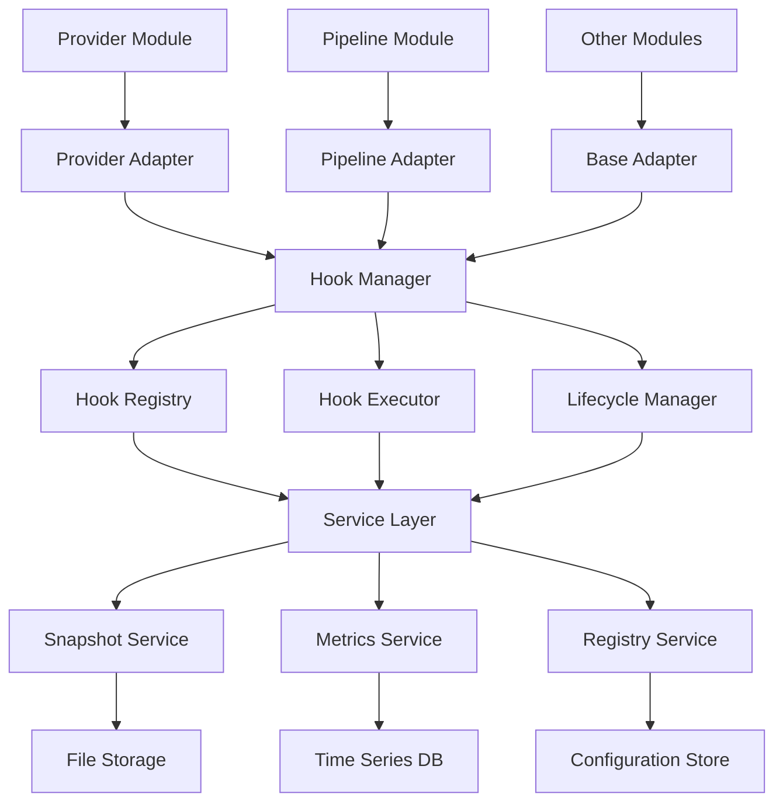

# 独立Hooks模块架构文档

## 架构总览

独立Hooks模块采用分层架构设计，通过依赖注入和适配器模式实现与业务模块的解耦。整个架构围绕以下核心原则构建：

- **单一职责**: 每个组件只负责特定功能
- **依赖倒置**: 高层模块不依赖低层模块，都依赖抽象
- **开闭原则**: 对扩展开放，对修改封闭
- **接口隔离**: 客户端不应依赖它不需要的接口

## 核心组件架构

### 1. Hook执行流程

```
Business Request
       ↓
Hook Manager (入口点)
       ↓
Hook Registry (查找Hooks)
       ↓
Hook Executor (按优先级执行)
       ↓
┌─────────────────────────────────┐
│  Hook 1 │ Hook 2 │ Hook 3 │ ... │  ← 并行执行
└─────────────────────────────────┘
       ↓
Snapshot Service (记录快照)
       ↓
Metrics Service (收集指标)
       ↓
Business Response
```

### 2. 执行时序图

```
时间轴 →
Provider Module     HookSystem     SnapshotService     MetricsService
     |                   |                  |                    |
     |-- request -----→ |                  |                    |
     |                   |-- lookup -->    |                    |
     |                   |                  |                    |
     |                   |-- execute -->   |                    |
     |  Hook 1 ←--------|                  |                    |
     |  Hook 2 ←--------|                  |                    |
     |  Hook 3 ←--------|                  |                    |
     |                   |-- snapshot --> |                    |
     |                   |                  |-- write -->       |
     |                   |-- metrics --->  |                    |
     |                   |                  |                    |-- record -->
     | <-- response ----|                  |                    |
```

### 3. 模块集成时序

```
Provider V2         ProviderAdapter     HookManager       Services
     |                      |                 |               |
     |-- onInitialize --> |                 |               |
     |                      |-- register --> |               |
     |                      |                 |-- init -->   |
     |                      |                 |               |-- start -->
     | <--- ready ---------| <--- ready -----| <--- ready ---|
     |                      |                 |               |
     |-- processRequest -> |                 |               |
     |                      |-- executeHooks ->             |
     |                      |                 |-- process -> |
     |                      |                 |               |-- collect -->
     | <-- response -------| <--- result ----| <--- metrics -|
```

### 4. 数据流架构

```
Input Data → Hook Processing → Output Data
     ↓             ↓              ↓
[Snapshot]    [Transform]    [Snapshot]
     ↓             ↓              ↓
[Metrics]     [Validate]     [Metrics]
     ↓             ↓              ↓
   Storage      Context        Storage
```

### 5. 与Provider v2集成架构

```
Provider V2 Module
     ↓
ProviderAdapter (桥接层)
     ↓
平台统一HookSystem
├── HookManager (统一管理)
├── HookExecutor (执行引擎)
├── HookRegistry (注册中心)
└── LifecycleManager (生命周期)
     ↓
Service Layer
├── SnapshotService (快照服务)
├── MetricsService (指标服务)
└── RegistryService (注册服务)
```

## 模块间依赖关系



## 接口设计

### 核心接口层次

```typescript
// 基础Hook接口
interface IHook {
  readonly name: string;
  readonly stage: HookStage;
  readonly target: HookTarget;
  readonly priority: number;
  execute(context: HookExecutionContext): Promise<HookResult>;
}

// 双向Hook接口
interface IBidirectionalHook extends IHook {
  read?(data: HookDataPacket, context: HookExecutionContext): Promise<ReadResult>;
  write?(data: HookDataPacket, context: HookExecutionContext): Promise<WriteResult>;
  transform?(data: HookDataPacket, context: HookExecutionContext): Promise<TransformResult>;
}

// Hook管理器接口
interface IHookManager {
  registerHook(hook: IBidirectionalHook): void;
  unregisterHook(hookName: string): void;
  executeHooks(stage: HookStage, target: HookTarget, data: unknown, context: HookExecutionContext): Promise<HookExecutionResult>;
}

// 适配器接口
interface IModuleAdapter {
  readonly moduleId: string;
  readonly hooksModule: HooksModule;
  registerHook(hookConfig: HookConfig): void;
  unregisterHook(hookName: string): void;
  enableHooks(): void;
  disableHooks(): void;
}
```

## 生命周期管理

### Hook系统生命周期

```typescript
enum HookSystemState {
  UNINITIALIZED = 'uninitialized',
  INITIALIZING = 'initializing',
  RUNNING = 'running',
  PAUSED = 'paused',
  STOPPING = 'stopping',
  STOPPED = 'stopped',
  ERROR = 'error'
}

interface ILifecycleManager {
  initialize(): Promise<void>;
  start(): Promise<void>;
  pause(): Promise<void>;
  stop(): Promise<void>;
  shutdown(): Promise<void>;
  getState(): HookSystemState;
  onStateChange(callback: (oldState: HookSystemState, newState: HookSystemState) => void): void;
}
```

### Hook执行生命周期

```
1. Hook Discovery (发现阶段)
   └── 从注册表查找匹配的Hook

2. Hook Preparation (准备阶段)
   ├── 验证Hook配置
   ├── 准备执行上下文
   └── 创建执行计划

3. Hook Execution (执行阶段)
   ├── 并行执行独立Hook
   ├── 串行执行依赖Hook
   └── 处理执行结果

4. Result Aggregation (聚合阶段)
   ├── 收集所有Hook结果
   ├── 应用转换规则
   └── 生成最终结果

5. Post-Processing (后处理阶段)
   ├── 记录快照数据
   ├── 收集性能指标
   └── 清理资源
```

## 错误处理架构

### 错误分类和处理策略

```typescript
enum HookErrorType {
  REGISTRATION_ERROR = 'registration_error',
  EXECUTION_ERROR = 'execution_error',
  VALIDATION_ERROR = 'validation_error',
  SNAPSHOT_ERROR = 'snapshot_error',
  METRICS_ERROR = 'metrics_error'
}

interface IErrorHandler {
  handleError(error: HookError, context: HookExecutionContext): Promise<ErrorHandlingResult>;
  shouldRetry(error: HookError): boolean;
  getRetryDelay(attempt: number): number;
}

// 错误处理策略
const errorHandlingStrategies = {
  [HookErrorType.REGISTRATION_ERROR]: {
    strategy: 'fail_fast',
    retryAttempts: 0,
    fallbackEnabled: false
  },
  [HookErrorType.EXECUTION_ERROR]: {
    strategy: 'continue_with_warning',
    retryAttempts: 3,
    fallbackEnabled: true
  },
  [HookErrorType.SNAPSHOT_ERROR]: {
    strategy: 'ignore_and_continue',
    retryAttempts: 1,
    fallbackEnabled: false
  }
};
```

### 性能与容错策略矩阵

#### 错误类型与处理策略矩阵

| 错误类型 | 严重级别 | 处理策略 | 重试次数 | 是否影响主流程 | 日志级别 |
|---------|---------|---------|---------|--------------|---------|
| REGISTRATION_ERROR | Critical | Fail Fast | 0 | ✅ 是 | ERROR |
| VALIDATION_ERROR | Critical | Fail Fast | 0 | ✅ 是 | ERROR |
| LIFECYCLE_ERROR | High | Fail Fast | 1 | ✅ 是 | ERROR |
| EXECUTION_ERROR | Medium | Continue with Warning | 3 | ❌ 否 | WARN |
| SNAPSHOT_ERROR | Low | Ignore and Continue | 1 | ❌ 否 | WARN |
| METRICS_ERROR | Low | Ignore and Continue | 1 | ❌ 否 | WARN |
| TIMEOUT_ERROR | Medium | Continue with Timeout | 2 | ❌ 否 | WARN |

#### 性能阈值配置

```typescript
const performanceThresholds = {
  // Hook执行阈值
  hook: {
    maxExecutionTime: 500,        // 单个Hook最大执行时间(ms)
    maxTotalExecutionTime: 2000,  // 总Hook执行时间(ms)
    maxConcurrentHooks: 10,       // 最大并发Hook数
    maxQueueSize: 100            // 最大队列大小
  },

  // 快照服务阈值
  snapshot: {
    maxWriteTime: 100,           // 快照写入最大时间(ms)
    maxFileSize: 1024 * 1024,    // 单个快照最大大小(1MB)
    maxBatchSize: 10,            // 批量写入最大数量
    writeInterval: 5000          // 写入间隔(ms)
  },

  // 指标服务阈值
  metrics: {
    maxCollectionTime: 50,       // 指标收集最大时间(ms)
    maxAggregationTime: 200,     // 指标聚合最大时间(ms)
    retentionPeriod: 7 * 24 * 60 * 60 * 1000 // 保留期(7天)
  }
};
```

#### 并发控制策略

```typescript
interface ConcurrencyControl {
  // 按优先级分组并发控制
  priorityGroups: {
    high: { maxConcurrent: 5, queueSize: 50 },
    medium: { maxConcurrent: 3, queueSize: 100 },
    low: { maxConcurrent: 2, queueSize: 200 }
  },

  // 全局并发限制
  global: {
    maxConcurrentHooks: 10,
    maxQueueSize: 500,
    timeoutMs: 5000
  },

  // 退避策略
  backoff: {
    strategy: 'exponential',
    baseDelay: 100,
    maxDelay: 5000,
    multiplier: 2
  }
}
```

## 性能优化策略

### 1. Hook执行优化

```typescript
// Hook优先级队列
class HookPriorityQueue {
  private queue: Map<number, IBidirectionalHook[]> = new Map();

  enqueue(hook: IBidirectionalHook): void {
    const priority = hook.priority;
    if (!this.queue.has(priority)) {
      this.queue.set(priority, []);
    }
    this.queue.get(priority)!.push(hook);
  }

  async executeAll(context: HookExecutionContext): Promise<HookResult[]> {
    const priorities = Array.from(this.queue.keys()).sort((a, b) => b - a);
    const results: HookResult[] = [];

    for (const priority of priorities) {
      const hooks = this.queue.get(priority)!;
      const promises = hooks.map(hook => this.executeHookSafely(hook, context));
      const priorityResults = await Promise.allSettled(promises);
      results.push(...this.processResults(priorityResults));
    }

    return results;
  }
}
```

### 2. 内存管理优化

```typescript
// 对象池实现
class HookContextPool {
  private pool: HookExecutionContext[] = [];
  private maxSize = 100;

  acquire(): HookExecutionContext {
    if (this.pool.length > 0) {
      return this.pool.pop()!.reset();
    }
    return new HookExecutionContext();
  }

  release(context: HookExecutionContext): void {
    if (this.pool.length < this.maxSize) {
      context.cleanup();
      this.pool.push(context);
    }
  }
}
```

### 3. 快照优化

```typescript
// 批量快照写入
class BatchSnapshotWriter {
  private batch: SnapshotData[] = [];
  private batchSize = 10;
  private flushInterval = 5000; // 5秒

  async addSnapshot(snapshot: SnapshotData): Promise<void> {
    this.batch.push(snapshot);

    if (this.batch.length >= this.batchSize) {
      await this.flush();
    }
  }

  private async flush(): Promise<void> {
    if (this.batch.length === 0) return;

    const batch = this.batch.splice(0);
    await this.writeBatchToFile(batch);
  }
}
```

## 配置管理架构

### 配置层次结构

```typescript
interface HooksSystemConfig {
  system: {
    enabled: boolean;
    debugMode: boolean;
    maxConcurrentHooks: number;
    defaultTimeout: number;
  };
  snapshot: SnapshotConfig;
  metrics: MetricsConfig;
  registry: RegistryConfig;
  modules: Map<string, ModuleConfig>;
}

// 配置加载策略
class ConfigManager {
  private configs: Map<string, any> = new Map();
  private watchers: Map<string, ConfigWatcher[]> = new Map();

  loadConfig(configPath: string): Promise<HooksSystemConfig>;
  watchConfig(configPath: string, callback: (config: HooksSystemConfig) => void): void;
  validateConfig(config: HooksSystemConfig): ValidationResult;
  mergeConfigs(base: HooksSystemConfig, override: Partial<HooksSystemConfig>): HooksSystemConfig;
}
```

## 监控和可观测性

### 监控指标体系

```typescript
interface HookMetrics {
  execution: {
    totalHooks: number;
    successfulHooks: number;
    failedHooks: number;
    averageExecutionTime: number;
    maxExecutionTime: number;
  };
  system: {
    memoryUsage: number;
    cpuUsage: number;
    activeContexts: number;
    queueSize: number;
  };
  errors: {
    errorCount: number;
    errorRate: number;
    errorsByType: Map<HookErrorType, number>;
    errorsByHook: Map<string, number>;
  };
}

// 指标收集器
class MetricsCollector {
  private timers: Map<string, number> = new Map();
  private counters: Map<string, number> = new Map();
  private histograms: Map<string, number[]> = new Map();

  startTimer(name: string): void;
  stopTimer(name: string): number;
  incrementCounter(name: string, value?: number): void;
  recordHistogram(name: string, value: number): void;
  getMetrics(): HookMetrics;
}
```

## 安全架构

### 安全措施

1. **权限控制**
   - Hook注册权限验证
   - 敏感数据访问控制
   - 文件系统访问限制

2. **数据保护**
   - 敏感数据脱敏
   - 快照数据加密
   - 传输数据安全

3. **资源保护**
   - 内存使用限制
   - 执行时间限制
   - 并发控制

```typescript
interface SecurityConfig {
  permissions: {
    allowedModules: string[];
    allowedHooks: string[];
    restrictedPaths: string[];
  };
  dataProtection: {
    enableEncryption: boolean;
    encryptionKey: string;
    sensitiveFields: string[];
  };
  resourceLimits: {
    maxMemoryUsage: number;
    maxExecutionTime: number;
    maxConcurrentHooks: number;
  };
}
```

## 测试架构

### 测试策略

1. **单元测试**
   - 每个Hook的独立测试
   - Mock依赖和隔离测试
   - 边界条件和异常测试

2. **集成测试**
   - Hook系统与业务模块集成
   - 端到端执行流程测试
   - 性能和负载测试

3. **契约测试**
   - Hook接口契约验证
   - 向后兼容性测试
   - API变更影响测试

```typescript
// 测试工具类
class HookTestUtils {
  createMockHook(overrides?: Partial<IBidirectionalHook>): IBidirectionalHook;
  createMockContext(overrides?: Partial<HookExecutionContext>): HookExecutionContext;
  executeHookWithAssertions(hook: IBidirectionalHook, context: HookExecutionContext, assertions: HookAssertions): Promise<void>;
  assertHookExecutionResults(results: HookExecutionResult[], expectedResults: Partial<HookExecutionResult>[]): void;
}
```

## 部署架构

### 部署模式

1. **嵌入式部署**
   - Hook系统作为业务模块的一部分
   - 共享进程和资源
   - 低延迟，高集成度

2. **独立部署**
   - Hook系统作为独立服务
   - 通过API与业务模块通信
   - 高可扩展性，便于维护

3. **混合部署**
   - 核心Hook嵌入式部署
   - 扩展功能独立部署
   - 平衡性能和灵活性

```typescript
// 部署配置
interface DeploymentConfig {
  mode: 'embedded' | 'standalone' | 'hybrid';
  service: {
    host: string;
    port: number;
    protocol: 'http' | 'grpc';
  };
  discovery: {
    enabled: boolean;
    serviceRegistry: string;
    healthCheckInterval: number;
  };
  scaling: {
    minInstances: number;
    maxInstances: number;
    autoScaling: boolean;
  };
}
```

## 扩展点注册规范

### 模块扩展注册流程

#### 1. Provider模块扩展

```typescript
// Provider模块Hook注册规范
interface ProviderHookRegistration {
  moduleId: 'provider-v2';
  adapter: 'provider-adapter';
  hooks: [
    {
      stage: 'REQUEST_PREPROCESSING',
      targets: ['request', 'headers'],
      priority: 100,
      required: false
    },
    {
      stage: 'AUTHENTICATION',
      targets: ['auth'],
      priority: 90,
      required: true // 认证Hook为关键路径
    },
    {
      stage: 'HTTP_REQUEST',
      targets: ['request'],
      priority: 80,
      required: false
    },
    {
      stage: 'HTTP_RESPONSE',
      targets: ['response'],
      priority: 70,
      required: false
    },
    {
      stage: 'RESPONSE_POSTPROCESSING',
      targets: ['response'],
      priority: 60,
      required: false
    },
    {
      stage: 'ERROR_HANDLING',
      targets: ['error'],
      priority: 50,
      required: true // 错误处理为关键路径
    }
  ];
  config: {
    snapshot: { enabled: true, sampleRate: 0.2 },
    metrics: { enabled: true, collectionInterval: 5000 }
  };
}
```

#### 2. Pipeline模块扩展

```typescript
// Pipeline模块Hook注册规范
interface PipelineHookRegistration {
  moduleId: 'pipeline-compat';
  adapter: 'pipeline-adapter';
  hooks: [
    {
      stage: 'PIPELINE_PREPROCESSING',
      targets: ['pipeline-request'],
      priority: 100,
      required: false
    },
    {
      stage: 'PIPELINE_PROCESSING',
      targets: ['pipeline-data'],
      priority: 90,
      required: false
    },
    {
      stage: 'PIPELINE_POSTPROCESSING',
      targets: ['pipeline-response'],
      priority: 80,
      required: false
    }
  ];
  config: {
    snapshot: { enabled: true, sampleRate: 0.1 },
    metrics: { enabled: true, collectionInterval: 10000 }
  };
}
```

#### 3. Server模块扩展

```typescript
// Server模块Hook注册规范
interface ServerHookRegistration {
  moduleId: 'server-chat' | 'server-responses';
  adapter: 'server-adapter';
  hooks: [
    {
      stage: 'REQUEST_RECEIVING',
      targets: ['http-request'],
      priority: 100,
      required: false
    },
    {
      stage: 'RESPONSE_SENDING',
      targets: ['http-response'],
      priority: 90,
      required: false
    }
  ];
  config: {
    snapshot: { enabled: false }, // Server端不记录详细快照，避免性能影响
    metrics: { enabled: true, collectionInterval: 30000 }
  };
}
```

### 注册约束和验证

#### 扩展点约束
1. **命名约束**: Hook名称必须符合`[module]-[stage]-[target]`格式
2. **优先级约束**: 0-1000范围，数字越小优先级越高
3. **依赖约束**: 不允许循环依赖，依赖链最大深度为5层
4. **性能约束**: 单个Hook执行时间不超过500ms，总执行时间不超过2000ms

#### 验证规则
```typescript
interface ExtensionValidationRules {
  // Hook名称验证
  namePattern: /^[a-z][a-z0-9-]*[a-z0-9]$/;
  nameMaxLength: 50;

  // 优先级验证
  priorityRange: { min: 0, max: 1000 };

  // 性能验证
  maxExecutionTime: 500; // ms
  maxMemoryUsage: 10 * 1024 * 1024; // 10MB

  // 依赖验证
  maxDependencyDepth: 5;
  forbidCircularDependency: true;

  // 配置验证
  requiredConfigFields: ['moduleId', 'adapter', 'hooks'];
  optionalConfigFields: ['config', 'metadata'];
}
```

### 生命周期管理

#### 扩展点生命周期
```
1. 注册阶段 (Registration)
   ├── 验证扩展配置
   ├── 创建适配器实例
   └── 注册到HookRegistry

2. 初始化阶段 (Initialization)
   ├── 加载Hook实现
   ├── 配置执行参数
   └── 建立依赖关系

3. 运行阶段 (Runtime)
   ├── 接收执行请求
   ├── 调度Hook执行
   └── 处理执行结果

4. 清理阶段 (Cleanup)
   ├── 注销Hook注册
   ├── 释放资源
   └── 保存最终状态
```

### 监控和诊断

#### 扩展点监控指标
- 注册指标: 扩展数量、注册成功率、注册失败原因
- 性能指标: 执行时间、内存使用、错误率
- 健康指标: 活跃扩展数、异常扩展数、恢复时间

#### 诊断工具
- 扩展状态检查: `hooks status --module <module-id>`
- 性能分析: `hooks profile --duration <seconds>`
- 依赖分析: `hooks deps --module <module-id> --graph`

这个架构文档为独立Hooks模块的设计和实现提供了全面的指导，确保系统的可维护性、可扩展性和高性能。